# 游戏引擎及原理应用\Unity引擎学习

## 游戏引擎基础

### 游戏引擎类型

狭义的游戏引擎只包含渲染器

广义的游戏引擎是一整套可视化游戏开发工具，其包含渲染引擎、物理引擎、碰撞检测系统、音效、脚本编辑工具、电脑动画、网络引擎以及场景管理等

### Unity工作界面布局

主要由六部分组成

Project窗口

Hierarchy窗口

Inspector窗口

Scene视图

Game视图

工具栏

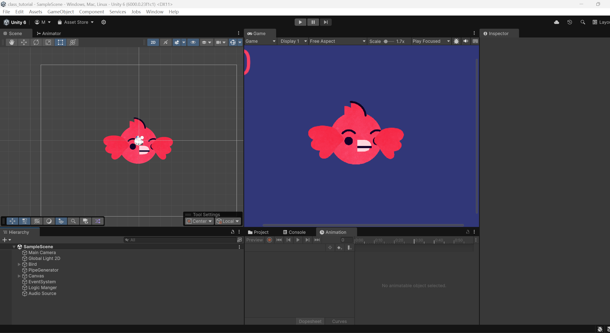

### 地形系统

#### 高程图与地形构建

三维游戏场景中的地形的基本组成其实是高程图：只包含一个颜色通道（灰度值）的像素图

高程图的每个像素的灰度数值的意义是：该位置从地面或者高出海平面的高度，黑色是地面，白色为最高点

#### eg：使用俯视图高程图和卫星图构建地形

1.新建一个地形terrain

2.将卫星图转换为材质贴到地形上

3.将俯视图高程图裁剪到长宽均为2的n次方转换为只包含一个颜色通道（灰度值）的raw格式图

4.使用地形设置的导入高程图按钮导入raw格式高程图

效果如图：

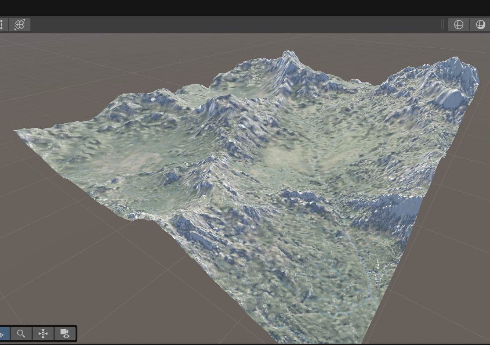

#### Unity构造地形的操作

升高/降低地形

绘制纹理

设置地形高度

平滑地形

对地形进行印章操作

#### eg: 给地形添加纹理、树木、草皮、湖泊

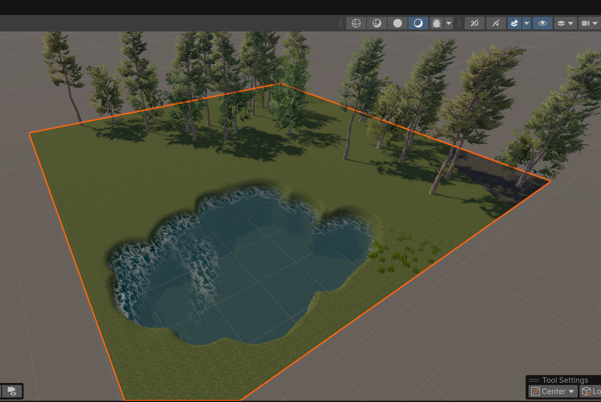

### 游戏对象GameObject

游戏对象类似于容器，不具备任何功能

#### 组件Component

类似与面向对象编程中实例属性

Unity中的组件是实现游戏功能的零件

可以给原始的游戏对象添加各种组件从而组成特定的游戏物体，如人物，灯光，声音，摄像机等。

#### Transform组件

每个对象都会至少有一个Transform组件，用来表示物体的变换

#### 内置游戏对象

游戏引擎内置了一些具备特定组件的游戏物体 

基本几何体、摄像机等

### 脚本

脚本是使用 Unity 开发的所有应用程序中必不可少的组成部分。大多数应用程序都需要脚本来响应玩家的输入并安排游戏过程中应发生的事件。除此之外，脚本可用于创建图形效果，控制对象的物理行为，甚至为游戏中的角色实现自定义的 AI 系统。

Unity使用的脚本语言是C#

**C#**是[微软](https://zh.wikipedia.org/wiki/微软)推出的一种基于[.NET框架](https://zh.wikipedia.org/wiki/.NET框架)和后来的[.NET](https://zh.wikipedia.org/wiki/.NET)的、[面向对象](https://zh.wikipedia.org/wiki/面向对象程序设计)的高级[编程语言](https://zh.wikipedia.org/wiki/编程语言)。C#衍伸自C和C++，继承了C和C++的强大功能，同时去掉了一些复杂特性，使其成为C语言家族中高效强大的编程语言。

#### 脚本作为组件起作用

可以将脚本作为组件拖拽到对象的属性窗口中，这样该脚本可以作为该对象的一个组件

在脚本中声明的Public变量可以暴露在属性窗口中，方便非编程技术人员进行调整

为了使非编程技术人员:游戏策划人员可以快速高效开发游戏，暴露在属性窗口的变量名应该尽可能清晰明了

#### eg：简单使用脚本的案例: 旋转一个物体

1.在资产里面新建一个C#脚本文件，并编写

```c#
using UnityEngine;

public class Aircraft : MonoBehaviour
{
    public float rotate_speed = 360f; //每秒旋转角度
    
    void Start()
    {
        
    }
    
    void Update()
    {
        float rotate_angle = rotate_speed * Time.deltaTime; // 每帧旋转的角度
        transform.RotateAround(Vector3.zero, Vector3.up, rotate_angle);
    }
}
```

2.保存脚本并将它拖拽的期望起作用的游戏对象的inspector窗口里，作为这个游戏对象的一部分

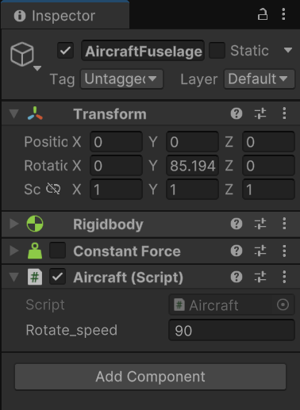

3.点按game窗口的play按钮预览效果

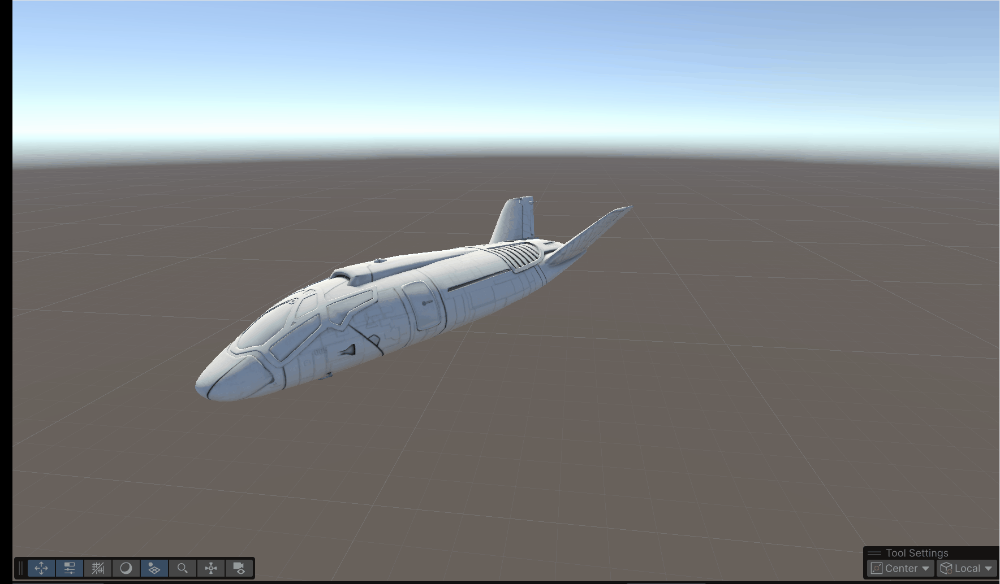

## 动画系统

### 场景动画/关键帧动画

游戏中的动画主要分为两种类型：场景动画和角色动画

场景动画又可以称为关键帧动画，在游戏当中任何可变的的属性都可以成为场景动画的变化元素。


### eg: 创建关键帧动画的简单示例

1.选择一个游戏物体，点击Window菜单选择Animation-Animation-create新建一个动画文件并命名


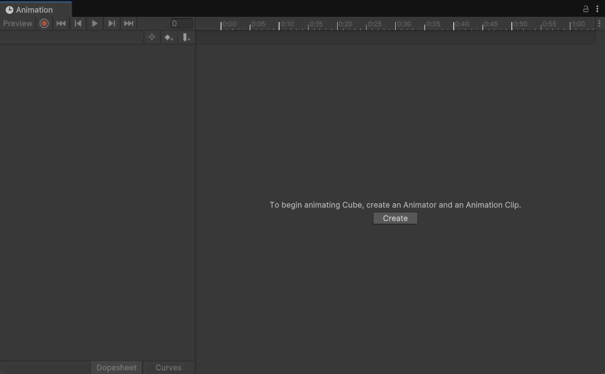

2.添加想要变化的属性，点击红色的按钮，选择时间位置改变属性插入关键帧，游戏引擎会自动插值补全中间帧的游戏物体的状态

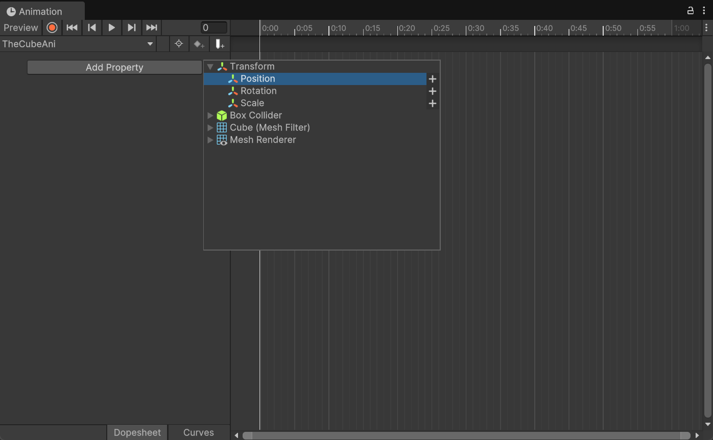

3.可以点击Animator Controller设置多段动画播放的先后顺序，点击动画文件可以选择是否循环播放。

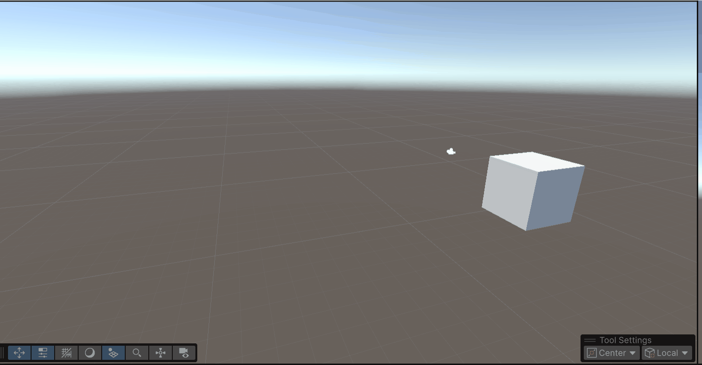

### 骨骼动画

#### 关键帧动画存在一些问题

当游戏对象模型由很复杂的网格组成时，需要保存大量的数据

和游戏环境交互较少

难于控制

#### 骨骼动画的原理

因为其动画数据和模型网格数据是分离的，骨骼动画也叫做隐式动画

骨骼动画文件保存的是每一帧骨架的姿态，而非网格信息，因此保存的数据较少

在播放阶段时

1.利用骨骼结构以及每帧的骨架信息可以得到角色的姿态

2.再利用骨骼和网格顶点的关系可以将模型按照这种姿态绘制出来

#### 骨骼动画优势

利用骨骼这一特殊结构来保存角色姿态

只需要很少的数据量就可以表示角色的动画

控制灵活

容易和环境交互

 能够得到实时计算的姿态

由于脊柱动物天然就是用骨架来支撑身体，所以很适合用骨架来模拟运动

#### 骨骼动画的重定向

骨骼动画可以实现动画数据的重新利用，一个骨骼动画可以驱动不同骨架相同的角色的运动

#### eg1:骨骼动画的初步尝试

1.选绑定好骨骼的人物拖入场景中

2.新建一个animator controller拖到人物的animator组件上

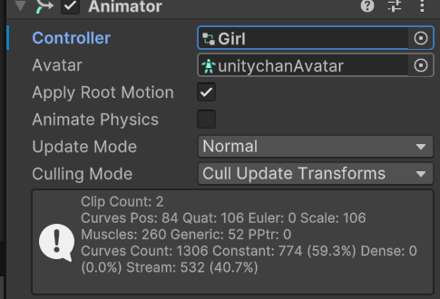

3.双击打开animator controller添加两个简单的等待和行走的动画并连起来，新建一个trigger，用于从静止切换的行走

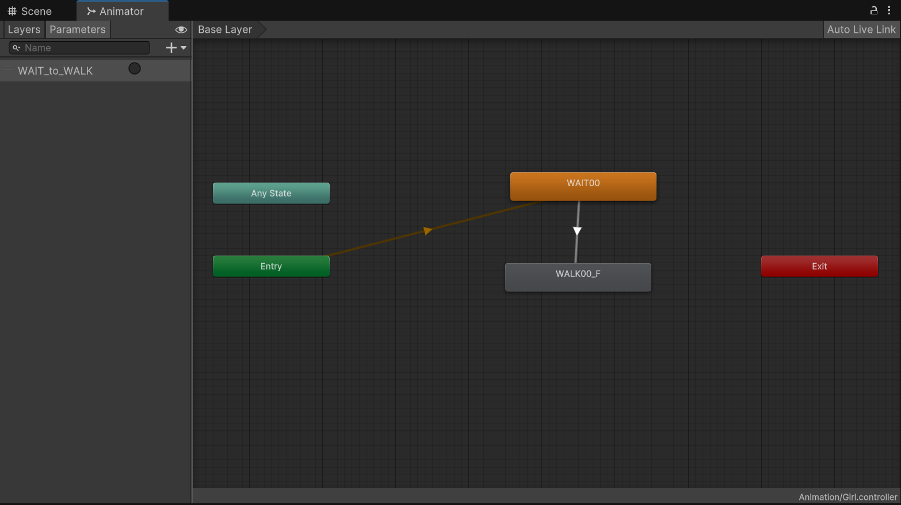

4.新建一个使用空格键切换运动状态的C#脚本

```c#
using UnityEngine;

public class move : MonoBehaviour
{
    private Animator anima;
    void Start()
    {
        anima = GetComponent<Animator>();  // 获取animator组件
    }

    void Update()
    {
        if(Input.GetKeyDown(KeyCode.Space))
        {
            anima.SetTrigger("WAIT_to_WALK");
            Debug.Log("ok");
        }
    }
}
```

效果如图：默认动作为等待，按下空格键后变为行走


### eg2: 骨骼动画的重定向

1.拖拽同类型骨架的animator controller到该人物

2.将控制人物移动的C#脚本拖入

效果如图

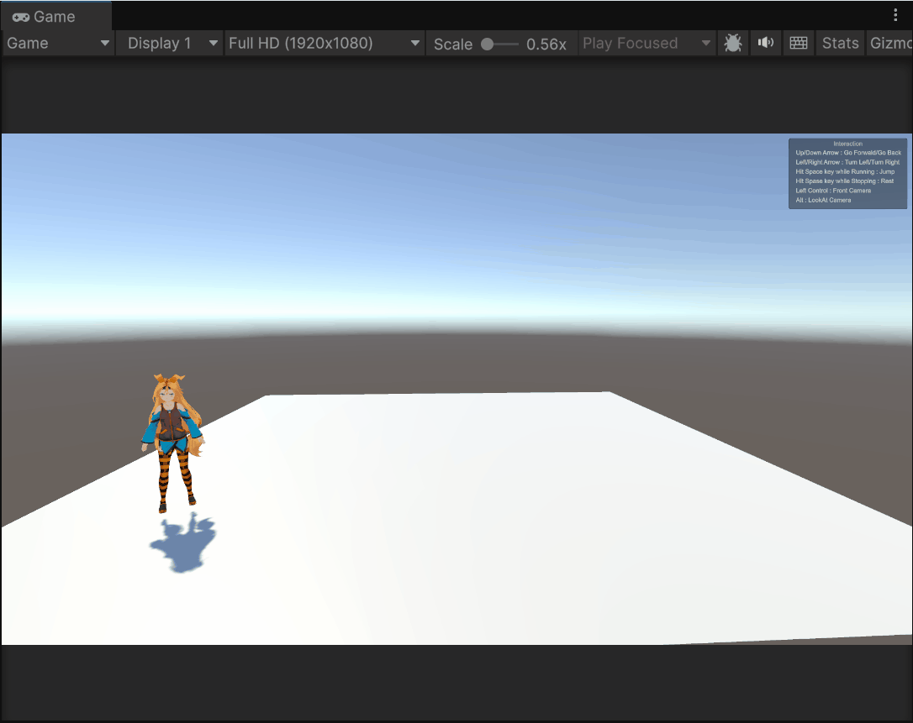

### 动画曲线 Animation Curve

#### 动画曲线的用途

在动画片段上增加额外的运动数据

可以基于动画状态来控制其他物体，例如控制角色在冷天气的呼气

#### eg：使用动画曲线

1.新建一个animator controller，拖拽到游戏角色inspector窗口

2.在animator controller中打开动画的inspector窗口，创建动画曲线命名为CurveValue

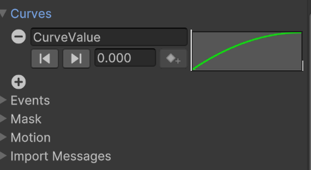

3.在Animator窗口的parameter列表中新建一个float参数,命名为CurveValue（需与2中同名）

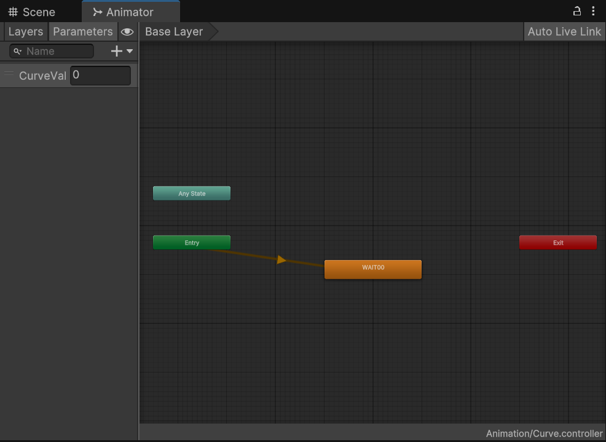

4.创建脚本使用CurveValue参数控制一个球体的缩放

```c#
using UnityEngine;

public class Curve : MonoBehaviour
{
    public Transform bubble;
    public Vector3 original_scale;
    void Start()
    {
        original_scale = bubble.localScale;
    }

    void Update()
    {
        var Curve = GetComponent<Animator>().GetFloat("CurveValue");
        bubble.localScale = new Vector3(original_scale.x + Curve, original_scale.y + Curve, original_scale.z + Curve);
    }
}
```

效果如图：

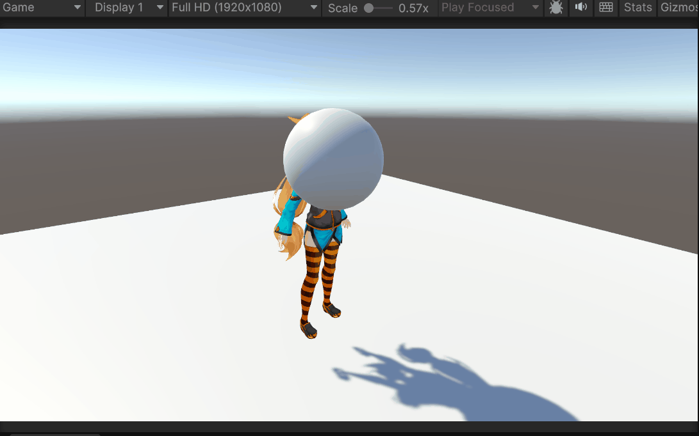

### 动画层 Animation Layer

#### 动画层的作用

为游戏角色不同身体部位使用不同的动作，比如下半身是跑步，而上半身在射击

在不同层间复用动画状态机，比如角色受伤之后所有运动变化，但动画逻辑不变

走路，跑步，空闲（idle）等动作之间切换的逻辑，称为动画状态机

#### 遮罩 Mask

可以为动画层设定受该层动画影响的部位，其中绿色代表受影响，红色是不受影响。

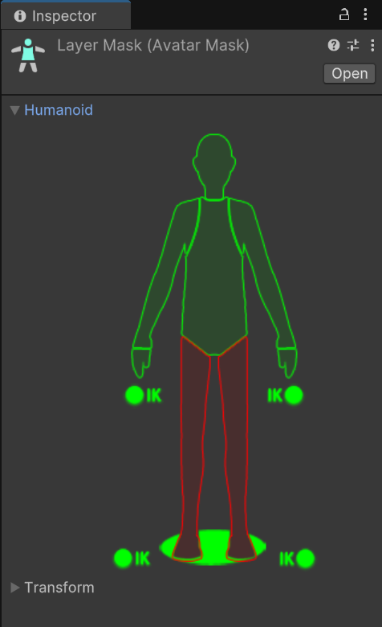

### eg: 动画层和Avatar Mask的初步尝试

1.新建一个animator controller命名为Layer，拖拽到游戏角色inspector窗口

2.拖拽一个动画到Base Layer中

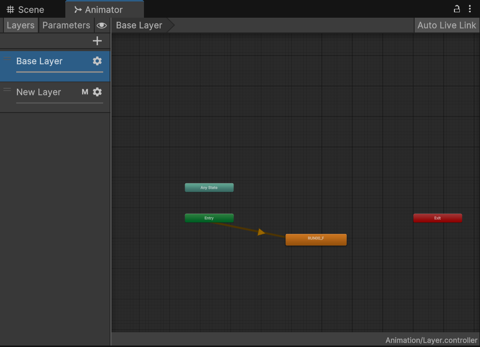

3.新建一个动画层，并拖拽一个动画到该动画层中

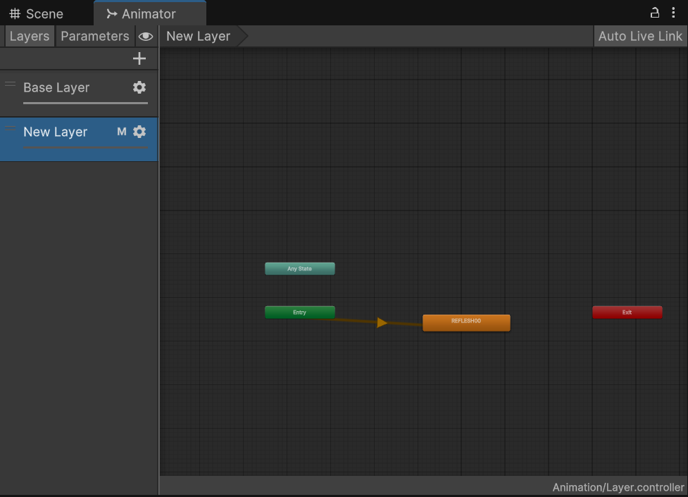

4.点击设置按钮，调整第二个动画层的权重，当权重为0时，仅播放第一个动画层的动作，当权重为1时，仅播放第二个动画层的动作，当权重为0到1之间时，播放两个动作融合后的动作


5.在assets中新建一个Avatar Mask将双腿点为红色，表示为应用该Avatar Mask的动画层的动画只影响游戏角色的上半身


6.点击设置按钮，将该Avatar Mask应用到第二个动画层，并编写一个用鼠标左键改变第二个动画层权重的C#脚本

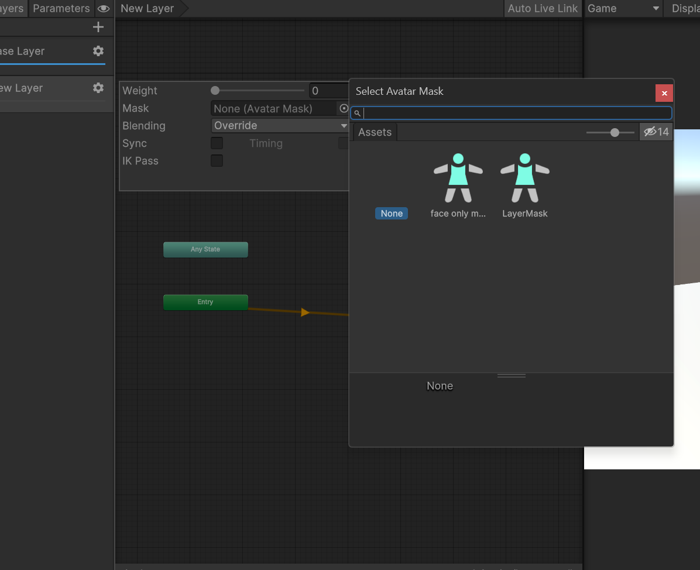

```c#
using UnityEngine;

public class NewMonoBehaviourScript : MonoBehaviour
{
    Animator anima  = null;
    public float speed = 1;

    void Start()
    {
        anima = GetComponent<Animator>();
    }

    void Update()
    {
        if(Input.GetMouseButton(0))
        {
            float w = anima.GetLayerWeight(1) > 1 ? 1 : anima.GetLayerWeight(1) + speed * Time.deltaTime;
            anima.SetLayerWeight(1,w);
        }
        else
        {
            float w = anima.GetLayerWeight(1) < 0 ? 0 : anima.GetLayerWeight(1) - speed * Time.deltaTime;
            anima.SetLayerWeight(1,w);
        }
            
    }
```

效果如图：


