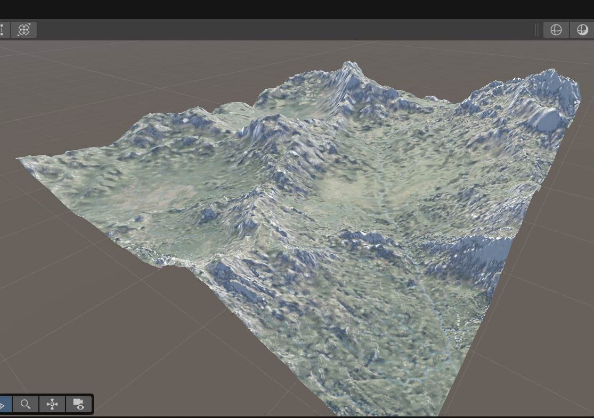
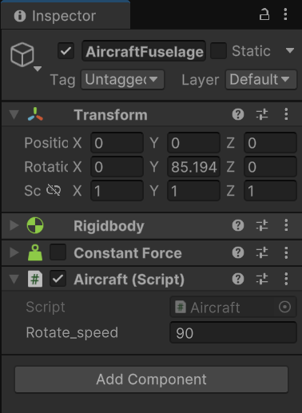
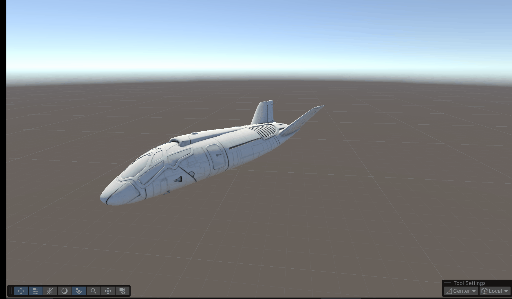

# 游戏引擎基础

## 游戏引擎类型

狭义的游戏引擎只包含渲染器

广义的游戏引擎是一整套可视化游戏开发工具，其包含渲染引擎、物理引擎、碰撞检测系统、音效、脚本编辑工具、电脑动画、网络引擎以及场景管理等

## Unity工作界面布局

主要由六部分组成

Project窗口

Hierarchy窗口

Inspector窗口

Scene视图

Game视图

工具栏


## 地形系统

### 高程图与地形构建

三维游戏场景中的地形的基本组成其实是高程图：只包含一个颜色通道（灰度值）的像素图

高程图的每个像素的灰度数值的意义是：该位置从地面或者高出海平面的高度，黑色是地面，白色为最高点

### eg：使用俯视图高程图和卫星图构建地形

1.新建一个地形terrain

2.将卫星图转换为材质贴到地形上

3.将俯视图高程图裁剪到长宽均为2的n次方转换为只包含一个颜色通道（灰度值）的raw格式图

4.使用地形设置的导入高程图按钮导入raw格式高程图

效果如图：



### Unity构造地形的操作

升高/降低地形

绘制纹理

设置地形高度

平滑地形

对地形进行印章操作

### eg: 给地形添加纹理、树木、草皮、湖泊


## 游戏对象GameObject

游戏对象类似于容器，不具备任何功能

### 组件Component

类似与面向对象编程中实例属性

Unity中的组件是实现游戏功能的零件

可以给原始的游戏对象添加各种组件从而组成特定的游戏物体，如人物，灯光，声音，摄像机等。

### Transform组件

每个对象都会至少有一个Transform组件，用来表示物体的变换

### 内置游戏对象

游戏引擎内置了一些具备特定组件的游戏物体 

基本几何体、摄像机等

## 脚本

脚本是使用 Unity 开发的所有应用程序中必不可少的组成部分。大多数应用程序都需要脚本来响应玩家的输入并安排游戏过程中应发生的事件。除此之外，脚本可用于创建图形效果，控制对象的物理行为，甚至为游戏中的角色实现自定义的 AI 系统。

Unity使用的脚本语言是C#

**C#**是[微软](https://zh.wikipedia.org/wiki/微软)推出的一种基于[.NET框架](https://zh.wikipedia.org/wiki/.NET框架)和后来的[.NET](https://zh.wikipedia.org/wiki/.NET)的、[面向对象](https://zh.wikipedia.org/wiki/面向对象程序设计)的高级[编程语言](https://zh.wikipedia.org/wiki/编程语言)。C#衍伸自C和C++，继承了C和C++的强大功能，同时去掉了一些复杂特性，使其成为C语言家族中高效强大的编程语言。

### 脚本作为组件起作用

可以将脚本作为组件拖拽到对象的属性窗口中，这样该脚本可以作为该对象的一个组件

在脚本中声明的Public变量可以暴露在属性窗口中，方便非编程技术人员进行调整

为了使非编程技术人员:游戏策划人员可以快速高效开发游戏，暴露在属性窗口的变量名应该尽可能清晰明了

### eg：简单使用脚本的案例: 旋转一个物体

1.在资产里面新建一个C#脚本文件，并编写

```c#
using UnityEngine;

public class Aircraft : MonoBehaviour
{
    public float rotate_speed = 360f; //每秒旋转角度
  
    void Update()
    {
        float rotate_angle = rotate_speed * Time.deltaTime; // 每帧旋转的角度
        transform.RotateAround(Vector3.zero, Vector3.up, rotate_angle);
    }
}
```

2.保存脚本并将它拖拽的期望起作用的游戏对象的inspector窗口里，作为这个游戏对象的一部分



3.点按Game窗口的Play按钮预览效果



