# 联网

### 10.1网络基础

#### 网络基础

**局域网**

**局域网**（英语：Local area network，简称**LAN**）是连接住宅、学校、实验室、大学校园或办公大楼等有限区域内电脑的[计算机网络](https://zh.wikipedia.org/wiki/電腦網路) [[1\]](https://zh.wikipedia.org/wiki/局域网#cite_note-1)。

在历经使用了[链式局域网](https://zh.wikipedia.org/w/index.php?title=链式局域网&action=edit&redlink=1)、[令牌环](https://zh.wikipedia.org/wiki/令牌环)与[AppleTalk](https://zh.wikipedia.org/wiki/AppleTalk)技术后，[以太网](https://zh.wikipedia.org/wiki/以太网)和[Wi-Fi](https://zh.wikipedia.org/wiki/Wi-Fi)（无线网络连接）是现今局域网最常用的两项技术。

**广域网**

**广域网**（英语：Wide Area Network，[缩写](https://zh.wikipedia.org/wiki/縮寫)：**WAN**），又称**广域网**、**外网**、**公网**。是连接不同地区[局域网](https://zh.wikipedia.org/wiki/局域网)或[城域网](https://zh.wikipedia.org/wiki/城域网)计算机通信的远程网。通常跨接很大的物理范围，所覆盖的范围从几十公里到几千公里，它能连接多个地区、城市和国家，或横跨几个洲并能提供远距离通信，形成国际性的远程网络。[互联网](https://zh.wikipedia.org/wiki/互联网)可以考虑为一个广域网。[[1\]](https://zh.wikipedia.org/wiki/广域网#cite_note-1)

**互联网协议套件**

**互联网协议套件**（英语：Internet Protocol Suite，缩写IPS）[[1\]](https://zh.wikipedia.org/wiki/TCP/IP协议族#cite_note-1)，是一种网络通信模型，以及用于[网络传输的协议](https://zh.wikipedia.org/wiki/网络传输协议)集合，为[网际网络](https://zh.wikipedia.org/wiki/网际网络)的基础通信架构，被应用于各种网络通信中。

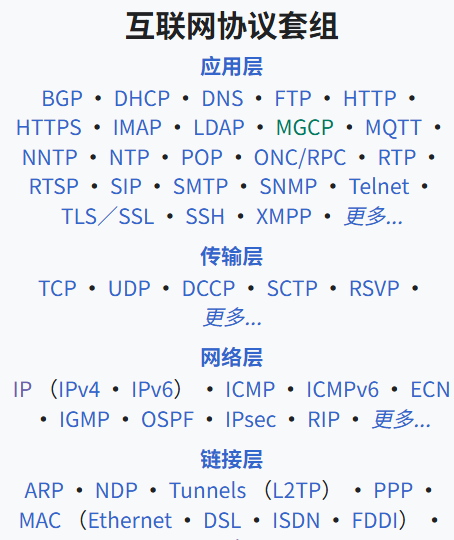

**IP协议**

**网际协议**（internet protocol，**IP**），又称**互联网协议**，是互联网协议包中的网络层通信协议，用于跨网络边界[分组交换](https://zh.wikipedia.org/wiki/封包交換)。它的路由功能实现了互联互通，并从本质上建立了互联网。

IP是在[TCP/IP协议族](https://zh.wikipedia.org/wiki/TCP/IP协议族)中[网络层](https://zh.wikipedia.org/wiki/网络层)的主要协议，任务是仅根据数据包标头中的[IP地址](https://zh.wikipedia.org/wiki/IP地址)将数据包从源主机传递到目标主机。为此，IP协议定义了封装要传递的数据的数据包结构。它还定义了用于用源和目的地信息标记数据报的寻址方法。

第一个架构的主要版本为[IPv4](https://zh.wikipedia.org/wiki/IPv4)，目前仍然是广泛使用的互联网协议，尽管世界各地正在积极部署[IPv6](https://zh.wikipedia.org/wiki/IPv6)。

**UDP协议**

**用户数据报协议**（英语：**U**ser **D**atagram **P**rotocol，缩写：**UDP**；又称**用户数据包协议**）是一个简单的面向[数据包](https://zh.wikipedia.org/wiki/資料包)的[通信协议](https://zh.wikipedia.org/wiki/通信协议)，位于[OSI模型](https://zh.wikipedia.org/wiki/OSI模型)的[传输层](https://zh.wikipedia.org/wiki/传输层)。该协议由[David P. Reed](https://zh.wikipedia.org/w/index.php?title=David_P._Reed&action=edit&redlink=1)在1980年设计且在[RFC 768](https://datatracker.ietf.org/doc/html/rfc768)中被规范。典型网络上的众多使用UDP协议的关键应用在一定程度上是相似的。

在[TCP/IP](https://zh.wikipedia.org/wiki/TCP/IP)模型中，UDP为[网络层](https://zh.wikipedia.org/wiki/网络层)以上和[应用层](https://zh.wikipedia.org/wiki/应用层)以下提供了一个简单的接口。UDP只提供[数据](https://zh.wikipedia.org/wiki/資料)的不可靠传递，它一旦把应用程序发给网络层的数据发送出去，就不保留数据备份（所以UDP有时候也被认为是不可靠的数据包协议）。UDP在IP数据包的头部仅仅加入了复用和数据校验字段。

UDP适用于不需要或在[程序](https://zh.wikipedia.org/wiki/计算机程序)中执行[错误检查和纠正](https://zh.wikipedia.org/wiki/错误检测与纠正)的[应用](https://zh.wikipedia.org/wiki/应用程序)，它避免了[协议栈](https://zh.wikipedia.org/wiki/协议栈)中此类处理的[开销](https://zh.wikipedia.org/w/index.php?title=开销&action=edit&redlink=1)。对时间有较高要求的应用程序通常使用UDP，因为丢弃数据包比等待或重传导致延迟更可取。

**TCP协议**

**传输控制协议**（英语：**T**ransmission **C**ontrol **P**rotocol，缩写：**TCP**）是一种面向连接的、可靠的、基于[字节流](https://zh.wikipedia.org/wiki/字節流)的[传输层](https://zh.wikipedia.org/wiki/传输层)[通信协议](https://zh.wikipedia.org/wiki/通信协议)，由[IETF](https://zh.wikipedia.org/wiki/IETF)的[RFC](https://zh.wikipedia.org/wiki/RFC) [793](https://datatracker.ietf.org/doc/html/rfc793)定义。在简化的计算机网络[OSI模型](https://zh.wikipedia.org/wiki/OSI模型)中，它完成第四层传输层所指定的功能。[用户数据报协议](https://zh.wikipedia.org/wiki/用户数据报协议)（UDP）是同一层内另一个重要的传输协议。

在因特网协议族（Internet protocol suite）中，TCP层是位于[IP](https://zh.wikipedia.org/wiki/网际协议)层之上，[应用层](https://zh.wikipedia.org/wiki/应用层)之下的中间层。不同主机的应用层之间经常需要可靠的、像[管道](https://zh.wikipedia.org/wiki/管道_(Unix))一样的连接，但是IP层不提供这样的流机制，而是提供不可靠的包交换。

应用层向TCP层发送用于网间传输的、用8位字节表示的数据流，然后TCP把数据流分割成适当长度的报文段（通常受该计算机连接的网络的数据链路层的[最大传输单元](https://zh.wikipedia.org/wiki/最大传输单元)（MTU）的限制）。之后TCP把结果包传给IP层，由它来透过网络将包传送给接收端实体的TCP层。TCP为了保证不发生丢包，就给每个包一个序号，同时序号也保证了传送到接收端实体的包的按序接收。然后接收端实体对已成功收到的包发回一个相应的[确认信息](https://zh.wikipedia.org/wiki/確認訊息)（ACK）；如果发送端实体在合理的[往返时延](https://zh.wikipedia.org/wiki/來回通訊延遲)（RTT）内未收到确认，那么对应的数据包就被假设为[已丢失](https://zh.wikipedia.org/wiki/丢包)并进行重传。TCP用一个[校验和](https://zh.wikipedia.org/wiki/校验和)函数来检验数据是否有错误，在发送和接收时都要计算校验和。

**应用层协议**

用于通用应用的数据报结构，其中包括：

- DNS：域名服务； 
- FTP：服务使用的是文件传输协议； 
- POP3：邮局协议； 
- HTTP：所有的Web页面服务都是使用的超级文本传输协议； 
- SMTP：简单邮件传输协议；
- Telnet：远程登陆等。
- Telnet：远程登陆等。

### 10.2网络游戏

#### 网络游戏

**网络游戏**（英语：Online Game），也称**线上游戏**、**网游**，一般指多名[玩家](https://zh.wikipedia.org/wiki/玩家)通过[计算机](https://zh.wikipedia.org/wiki/电子计算机)[互联网](https://zh.wikipedia.org/wiki/網際網路)进行交互[娱乐](https://zh.wikipedia.org/wiki/娛樂)的[电子游戏](https://zh.wikipedia.org/wiki/電子遊戲)，以游戏执行软件分类一般是指客户端下载的大型多人在线游戏。[[1\]](https://zh.wikipedia.org/wiki/网络游戏#cite_note-1)部分游戏能通过连接网络服务器进行联机对战、在线云存档。网络游戏有[战略游戏](https://zh.wikipedia.org/wiki/战略游戏)、[动作游戏](https://zh.wikipedia.org/wiki/动作游戏)、[体育游戏](https://zh.wikipedia.org/wiki/體育遊戲)、[格斗游戏](https://zh.wikipedia.org/wiki/格斗游戏)、[音乐游戏](https://zh.wikipedia.org/wiki/音乐游戏)、[竞速游戏](https://zh.wikipedia.org/wiki/竞速游戏)、[射击游戏](https://zh.wikipedia.org/wiki/射击游戏)[、角色扮演游戏](https://zh.wikipedia.org/wiki/電子角色扮演遊戲)等多种类型，不过也有少数在线网络单人游戏。

相较于单机游戏的优势：和其他玩家进行游戏要比和电脑对战更有挑战性和趣味性

#### 游戏的联网功能

现在的游戏引擎都提供了基本的联网功能，比如LAN（局域网）方式的联网对战

如果需要编写复杂的多人在线游戏的话，可能需要使用底层网络接口自己实现需要的联网功能

**Netcode**是Unity官方最新推出的联网方案，在Unity 6中原先的UNet方案已经被弃用。本篇章的学习中使用的是**Netcode**方案

#### 游戏联网需要基本组件

- 网络管理器
- 联网用户界面
- 具备联网功能的玩家预制件
- 具有联网能力的脚本和游戏物体

#### 客户端和服务器

**客户端**：连接到服务器的游戏实例

**服务器**

- 专用服务器(Server)：多应用于广域网
- 主机服务器（Host）：多应用于局域网

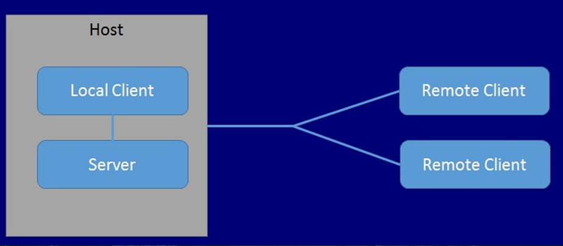

#### 

### 10.2玩家角色和游戏物体联网

#### 联网的玩家角色

联网的玩家角色一般是在客户端被玩家控制，再将玩家角色的状态同步到服务器和其他玩家的客户端中

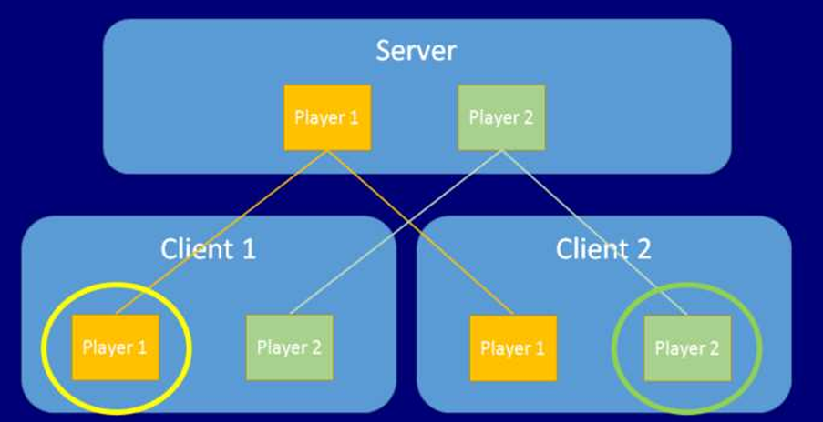

#### 联网的非玩家角色和游戏物体联网

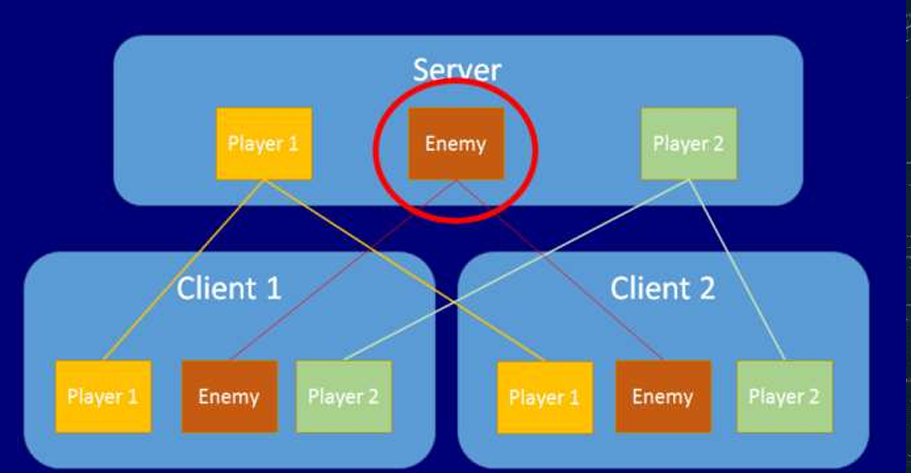

#### 网络权限

网络权限指的是游戏物体如何以及在哪被管理

客户端和服务器端都可控制游戏物体行为，默认是在服务器端，而玩家角色需要获取用户输入，所以比较特殊，在客户端

#### 联网和非联网游戏物体

联网游戏的场景中包含联网和无需联网物体，联网的物体需要在服务器和所有客户端同步状态，无需联网的物体只运行于客户端本地，如：石块、楼梯等静态物体和随风摆动的树木、草丛或者云朵等不会对游戏进程造成影响的动态物体

#### 动态生成游戏物体

非联网物体使用GameObject.Instantiate方法生成物体

而联网物体需要由服务器端使用NetworkObject,Spawn()方法生成，生成的物体交由Network Manager管理

#### 联网游戏物体

需包含Network Object组件，还需要开发人员指定物体的哪些属性需要同步，如玩家或者非玩家角色的位置、朝向；一些数值，比如游戏剩余时长、玩家的能量值等。

包含**Network Transform 组件**可以自动同步物体变换属性

包含**Network Animator组件**可以自动同步物体的动画

无法自动同步的属性，需要开发人员编写脚本使用NetworkVariable变量进行手动同步

### 10.3在Unity游戏引擎中制作一个联机小游戏（基于Netcode）

#### 准备

搭建一个简单的场景，新建一个Cube作为玩家

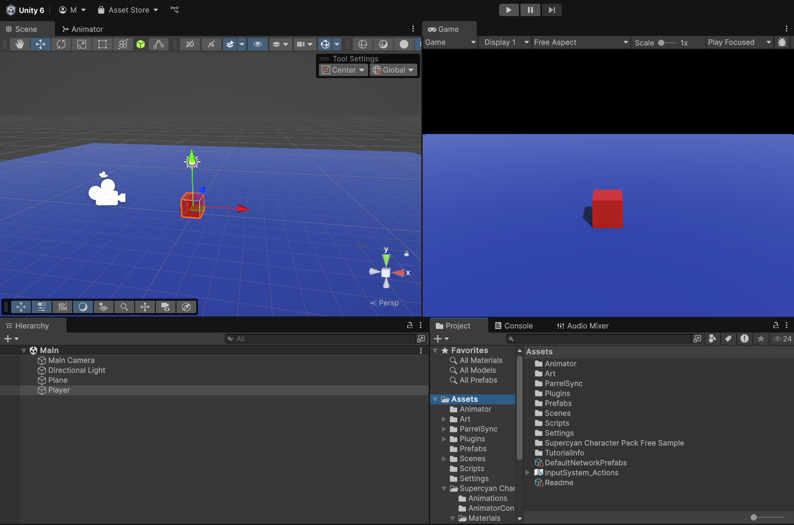

给Player添加材质和Rigidbody组件并勾选`Is Kinematic`选项，勾选`Box Collider`组件上的Is Trigger选项

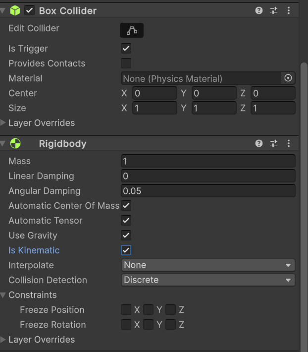

新建一个Cylinder作为金币，为金币添加材质，添加`Rigidbody`组件，将`胶囊碰撞体`组件换为`Box Collider`组件

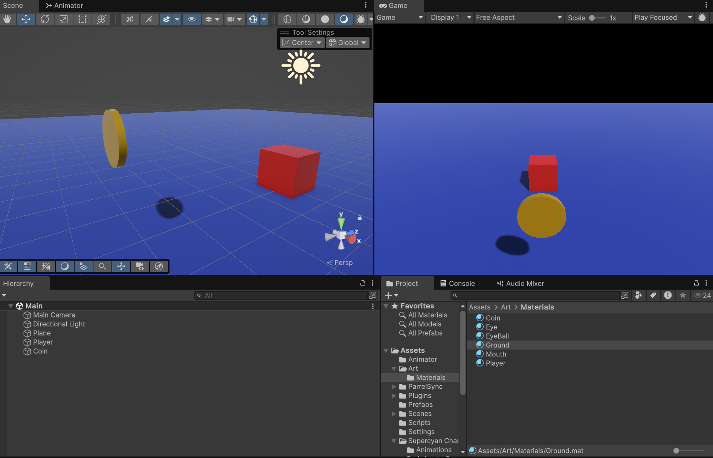

为金币添加一个脚本，使金币可以旋转

```c#
using UnityEngine;

public class Coin : NetworkBehaviour
{   private Rigidbody rb;
    public float rot_speed = 10f;

    // Start is called once before the first execution of Update after the MonoBehaviour is created
    void Start()
    {
        rb = GetComponent<Rigidbody>();
    }

    // Update is called once per frame
    void Update()
    {
        Quaternion tar_rot = rb.rotation * Quaternion.Euler(0, 0, rot_speed * Time.deltaTime);
        Turn(tar_rot);
    }

    public void Turn(Quaternion rotation)
    {
        rb.MoveRotation(rotation);
    }
}
```

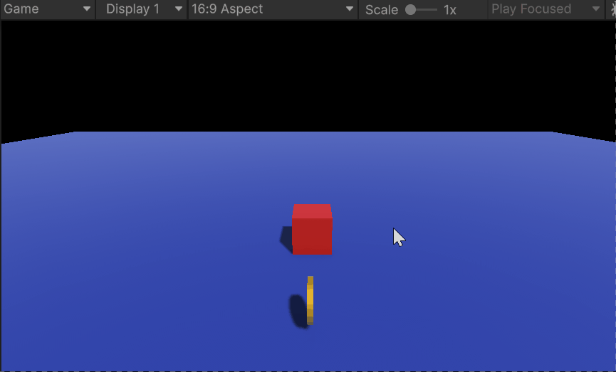

将Coin和Player拖入到Asset文件夹中变为预制体，删除场景中的Coin和Player

#### 导入Netcode for GameObjects软件包

在Package Manager窗口中的Unity Registry中搜索Netcode for GameObjects包，点击安装。

#### 导入ParrelSync插件

调试联网游戏时，通常需要至少两个客户端同时运行。虽然在Unity编辑器中点击播放按钮可以启动一个客户端，但如果将游戏打包到电脑上运行，既费时又不方便调试。为了解决这个问题，我们可以使用ParrelSync插件。ParrelSync是一个第三方插件，它可以将Unity项目克隆成一个副本，并在Unity编辑器中打开。这样，我们就能够同时运行两个客户端，且两个客户端的`Assets`文件夹路径是相同的，因此可以实时同步修改代码和资源。

ParrelSync插件的Github仓库：https://github.com/VeriorPies/ParrelSync

我们可以选择将插件下载到本地导入或者使用git URL导入

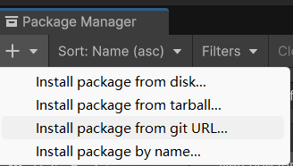

看到在编辑器顶栏出现了ParrelSync选项表示成功导入ParrelSync插件

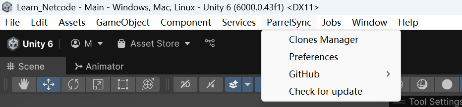

点击Clone Manager - Add new clone 即可创建一个当前项目的副本，然后点击Open in New Editor即可打开副本

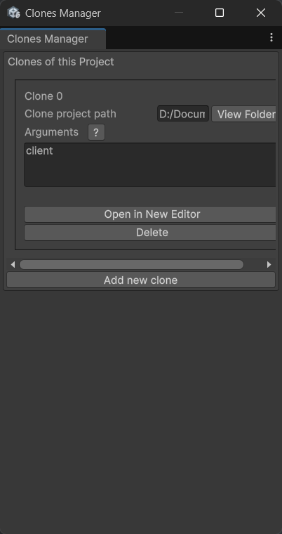

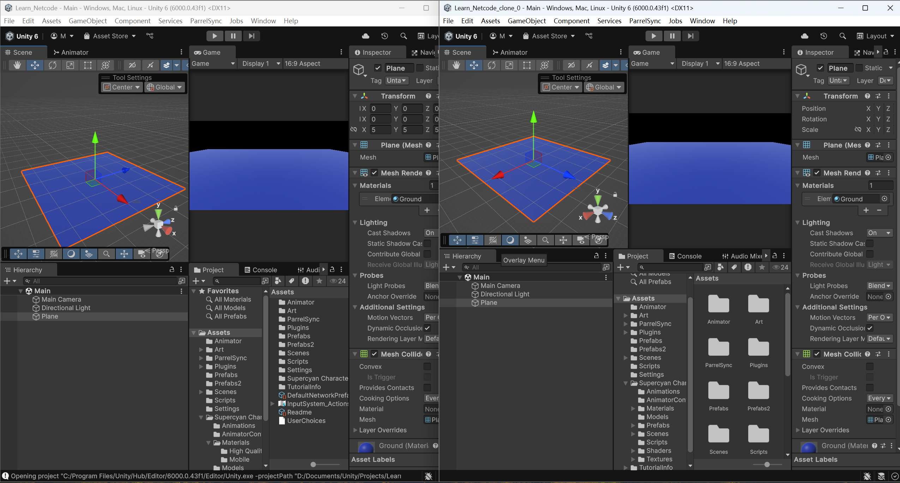

#### 新建Network Manager和服务器、客户端、主机启动UI

新建一个空物体，命名为NetworkManager，挂载Network Manager脚本，选择Network Transport类型为UnityTransport（话说也只有这一个选项）


点击运行游戏，我们可以看到在Network Manager脚本中有三个按钮：Start Host、Start Server、 Start Client，分别对应开启主机、开启服务器、开启客户端。显然当游戏打包导出后我们是无法点击这三个按钮，所以我们需要新建一个UI界面，来是我们可以在游戏界面控制开启主机、开启服务器、开启客户端和退出联网。

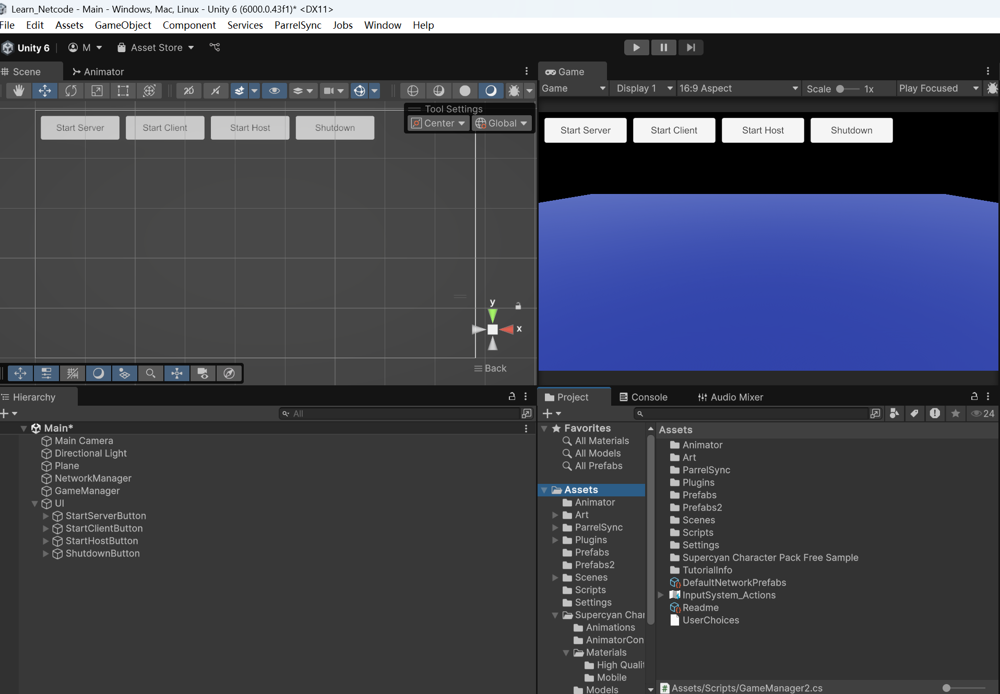

新建一个空物体，命名为GameManager，然后挂载下面的脚本，并将Button组件中选择对应触发的响应函数

```c#
using Unity.Netcode;
using UnityEngine;

public class GameManager2 : MonoBehaviour
{
    public void OnStartServerButtonClick()
    {
        if(NetworkManager.Singleton.StartServer())
        {
            Debug.Log("Start server successfully.");
        }
        else
        {
            Debug.Log("Failed to start server.");
        }
    }

    public void OnStartClientButtonClick()
    {
        if(NetworkManager.Singleton.StartClient())
        {
            Debug.Log("Start client success.");
        }
        else
        {
            Debug.Log("Failed to start client.");
        }
    }

    public void OnStartHostButtonClick()
    {
        if(NetworkManager.Singleton.StartHost())
        {
            Debug.Log("Start host success.");
        }
        else
        {
            Debug.Log("Failed to start host.");
        }
    }

    public void OnShutdownButtonClick()
    {
        NetworkManager.Singleton.Shutdown();
        Debug.Log("Shutdown network.");
    }
}
```

现在我们已经搭好了联网游戏的基本框架了

#### Player的创建和同步

在单机游戏中，我们常使用GameObject.Instantiate方法来实例化预制件创建Player。但是在使用Netcode框架的联网游戏中，我们需要为Player预制件添加Network Object脚本

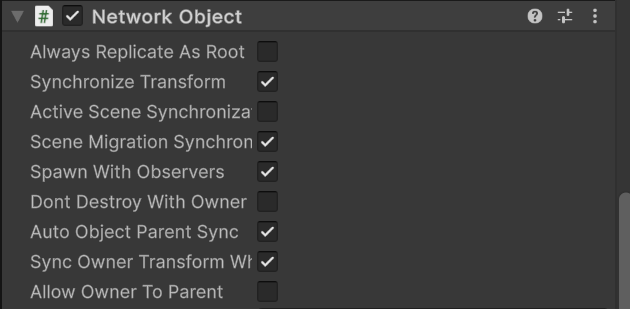

并将Player预制件拖拽给Network Manager脚本Default Player Prefab选项

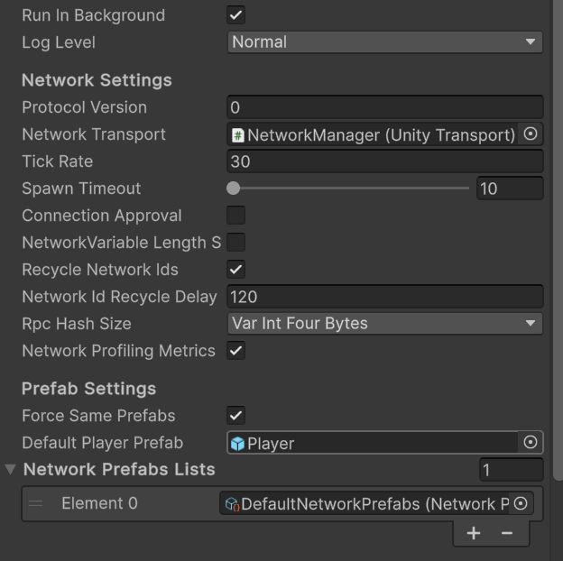

此时运行两个游戏，一个作为主机端，一个作为客户端，我们可以看到Player已经可以正确地生成

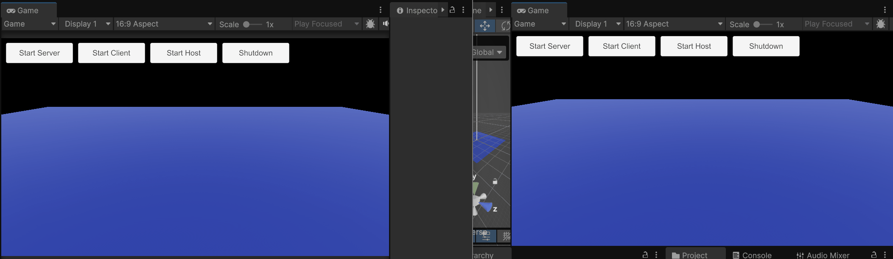

但是运行一个主机端和一个客户端应该有两个Player，画面中却只有一个。这是其实是两个主机端，一个作为客户端的位置和姿态都相同，所以重叠在了一起。我们新建一个Player脚本挂载到Player预制件上，让Player的生成位置随机分布。因为在某一客户端端加入游戏服务器前服务器中可能已经有属于其他客户端的Player，因此我们要使用this.IsOwner参数确保只修改自己的Player的生成位置。

注意：为了使用this.IsOwner，继承的类是NetworkBehaviour而不是常规的MonoBehaviour

```c#
using UnityEngine;
using Unity.Netcode;

public class Player2 : NetworkBehaviour
{
    // Start is called once before the first execution of Update after the MonoBehaviour is created
    void Start()
    {
        // Place this client'player in random position and rotation
        if(this.IsOwner)
        {
            transform.position = new Vector3(Random.Range(-5,5), 0.0f, Random.Range(-5,5));
            transform.rotation = Quaternion.identity;
        }
    }
}
```

现在运行两个游戏端，我们可以两个Player了


现在我们在Player脚本中增添控制Player移动的代码

```c#
using UnityEngine;
using Unity.Netcode;

public class Player2 : NetworkBehaviour
{
    public float move_speed = 20f;
    public float rotate_speed = 180f;
    private Rigidbody rb;
    // Start is called once before the first execution of Update after the MonoBehaviour is created
    void Start()
    {
        rb = GetComponent<Rigidbody>();
        // Place this client'player in random position and rotation
        if(this.IsClient && this.IsOwner)
        {
            transform.position = new Vector3(Random.Range(-5,5), 0.5f, Random.Range(-5,5));
            transform.rotation = Quaternion.identity;
        }
    }

    // Update is called once per frame
    void Update()
    {
        // if this player is client own, move and rotate it by input. if not, refresh its position and rotation from server
        if(this.IsClient && this.IsOwner)
        {
            // Get user's Input
            float v = Input.GetAxis("Vertical");
            float h = Input.GetAxis("Horizontal");
            
            // if enter LeftShift, double speed
            if(Input.GetKey(KeyCode.LeftShift))
            {
                v = v * 2;
            }

            // Control player to move
            Vector3 target_position = GetTargetPosition(v);


            // Control player to rotate
            Quaternion target_rotation = GetTargetRotation(h);

            Move(target_position);
            Turn(target_rotation);
        }
    }

        private Vector3 GetTargetPosition(float v)
    {
        Vector3 delta_pos = transform.forward * v * move_speed * Time.deltaTime;
        Vector3 target_position = rb.position + delta_pos;
        return target_position;
    }


    // Get the rotation that player should rotate to by user's horizional input
    private Quaternion GetTargetRotation(float h)
    {
        Quaternion delta_rot = Quaternion.Euler(0, h * rotate_speed * Time.deltaTime, 0);
        Quaternion rotation = rb.rotation * delta_rot;
        return rotation;
    }

    // Move player
    public void Move(Vector3 position)
    {
        rb.MovePosition(position);
    }

    // Rotate Player
    public void Turn(Quaternion rotation)
    {
        rb.MoveRotation(rotation);
    }
}

```

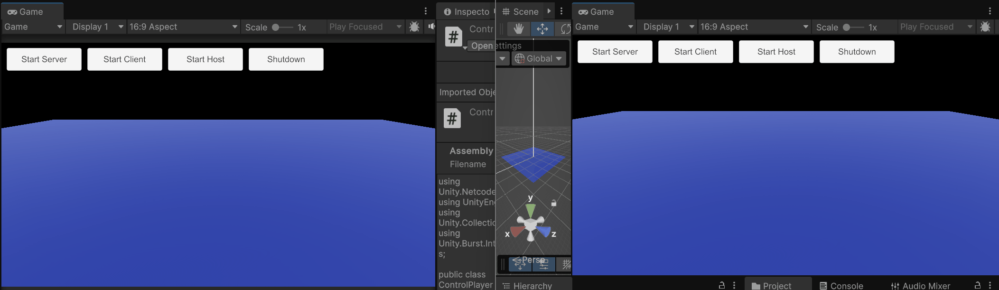

现在我们可以发现虽然Player已经可以正常被玩家控制移动了，但是Player的运动并没有被同步到其他玩家的游戏界面中，这是因为我们对Player的位置和姿态的变换都是在本地执行的，并没有告知其他客户端。解决这个问题有一下两个方法

**方案一：手动同步**

每个客户端使用Network Variable来上传位置信息到服务器，再由服务器通知给所有除了自己以外的客户端，自己的Player的位置和姿态变化，让它们接受后及时更新。

```c#
using UnityEngine;
using Unity.Netcode;

public class PlayerSyncByHand : NetworkBehaviour
{
    public float move_speed = 20f;
    public float rotate_speed = 180f;
    private Rigidbody rb;

    private NetworkVariable<Vector3> network_player_position = new NetworkVariable<Vector3>(Vector3.zero);
    private NetworkVariable<Quaternion> network_player_rotation = new NetworkVariable<Quaternion>(Quaternion.identity);
    // Start is called once before the first execution of Update after the MonoBehaviour is created
    void Start()
    {
        rb = GetComponent<Rigidbody>();
        // Place this client'player in random position and rotation
        if(this.IsClient && this.IsOwner)
        {
            transform.position = new Vector3(Random.Range(-5,5), 0.5f, Random.Range(-5,5));
            transform.rotation = Quaternion.identity;
        }
    }

    // Update is called once per frame
    void Update()
    {
        // if this player is client own, move and rotate it by input. if not, refresh its position and rotation from server
        if(this.IsClient && this.IsOwner)
        {
            // Get user's Input
            float v = Input.GetAxis("Vertical");
            float h = Input.GetAxis("Horizontal");
            if(Input.GetKey(KeyCode.LeftShift))
            {
                v = v * 2;
            }

            Vector3 target_position = GetTargetPosition(v);
            Quaternion target_rotation = GetTargetRotation(h);
            // Control player to move
            Move(target_position);
            // Control player to rotate
            Turn(target_rotation);

            UpdatePosAndRotServerRpc(target_position, target_rotation);
        }
        else
        {
            Move(network_player_position.Value);
            Turn(network_player_rotation.Value);
        }
    }

    // Sync this Client's Player's position and rotation to Server use ServerRpc tag
    [ServerRpc]
    public void UpdatePosAndRotServerRpc(Vector3 pos, Quaternion rot)
    {
        network_player_position.Value = pos;
        network_player_rotation.Value = rot;
    }

        private Vector3 GetTargetPosition(float v)
    {
        Vector3 delta_pos = transform.forward * v * move_speed * Time.deltaTime;
        Vector3 target_position = rb.position + delta_pos;
        return target_position;
    }


    // Get the rotation that player should rotate to by user's horizional input
    private Quaternion GetTargetRotation(float h)
    {
        Quaternion delta_rot = Quaternion.Euler(0, h * rotate_speed * Time.deltaTime, 0);
        Quaternion rotation = rb.rotation * delta_rot;
        return rotation;
    }

    // Move player
    public void Move(Vector3 position)
    {
        rb.MovePosition(position);
    }

    // Rotate Player
    public void Turn(Quaternion rotation)
    {
        rb.MoveRotation(rotation);
    }
}
```

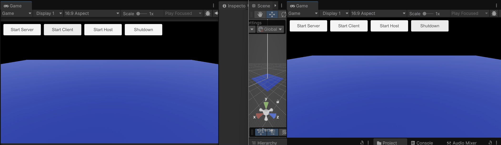

**方案2：使用Network Transform自动同步**

为Player预制件添加Network Transform组件，并注释上面使用Network Variable的代码

注意需要将Network Transform组件的`Authority Mode`设置为Owner

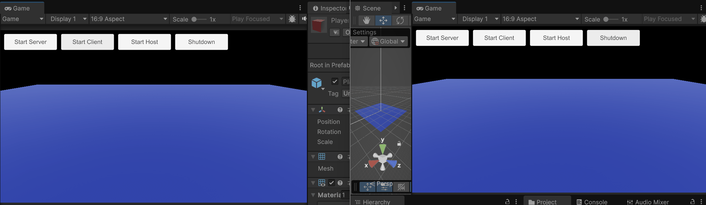

会发现这种方法虽然简便，但是延迟也要高一些

#### Coin(NPC和游戏物体)的创建和同步

接下来我们在服务器端开启时生成大量Coin，我们修改Game Manager脚本

```c#
using Unity.Netcode;
using UnityEngine;

public class GameManager2 : MonoBehaviour
{
    private int coin_num = 5;
    public GameObject coin_prefab;
    // Start is called once before the first execution of Update after the MonoBehaviour is created
    void Start()
    {
        // When the server starts (triggered by the OnServerStarted event), the CreateCoins() method will be called.
        NetworkManager.Singleton.OnServerStarted += () =>
        {
            Debug.Log("Server strated");
            CreateCoins();
        };
    }

    private void CreateCoins()
    {
        for (int i = 0; i < coin_num; i++)
        {
            GameObject ob = GameObject.Instantiate(coin_prefab, new Vector3(Random.Range(-10,10), 5f, 
                        Random.Range(-10,10)), Quaternion.Euler(90, 0, 0));
            ob.GetComponent<NetworkObject>().Spawn();
        }
    }
    public void OnStartServerButtonClick()
    {
        if(NetworkManager.Singleton.StartServer())
        {
            Debug.Log("Start server successfully.");
        }
        else
        {
            Debug.Log("Failed to start server.");
        }
    }

    public void OnStartClientButtonClick()
    {
        if(NetworkManager.Singleton.StartClient())
        {
            Debug.Log("Start client success.");
        }
        else
        {
            Debug.Log("Failed to start client.");
        }
    }

    public void OnStartHostButtonClick()
    {
        if(NetworkManager.Singleton.StartHost())
        {
            Debug.Log("Start host success.");
        }
        else
        {
            Debug.Log("Failed to start host.");
        }
    }

    public void OnShutdownButtonClick()
    {
        NetworkManager.Singleton.Shutdown();
        Debug.Log("Shutdown network.");
    }
}
```

为了使金币可以同步到每一个客户端上，需要为Coin预制体挂载Network Object脚本，并使用NetworkObject().Spawn()方法来创建Coin实例。

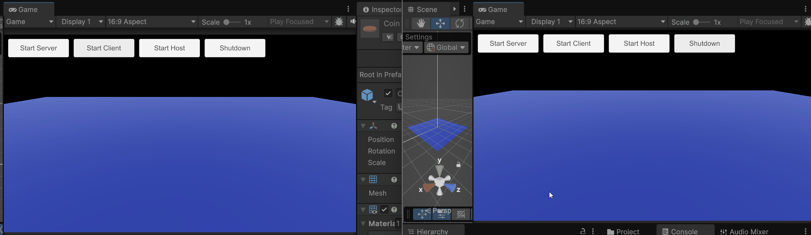

给Coin预制体挂载挂载Network Transform组件和Network Rigidbody组件，同步Coin的相关属性

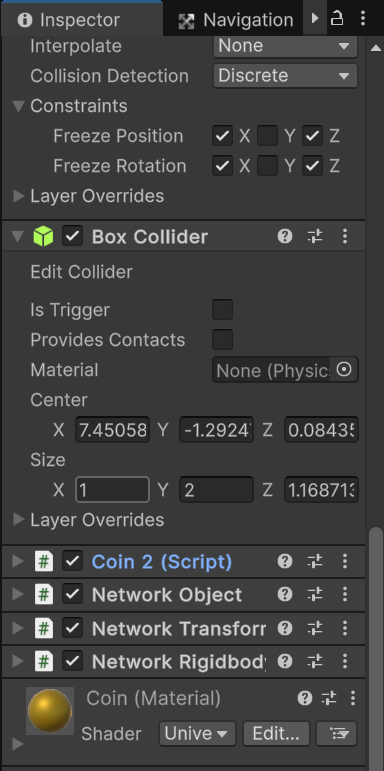

#### 实现Player和Coin的交互

当玩家碰到金币时，可以隐藏金币并增加玩家的得分。我们可以将玩家的碰撞体设置为**Trigger**，当玩家的碰撞体与金币的碰撞体发生接触时，在`OnTriggerEnter`函数中将金币的`Active`属性设置为`false`，从而实现隐藏金币的效果。为了防止多次触发**Trigger**，每个客户端应该只关注自己的Player是否发生碰撞（或者全部交由服务器处理），为了让金币的状态同步，我们可以新建一个Network Variable来同步金币的可见性

修改Coin脚本

```c#
using UnityEngine;
using Unity.Netcode;

public class Coin2 : NetworkBehaviour
{   private Rigidbody rb;
    public float rot_speed = 10f;

    private NetworkVariable<bool> network_is_active = new NetworkVariable<bool>(true);

    // Called before Start() methond
    public override void OnNetworkSpawn()
    {
        // when join the game set set coin active or not by network_is_active.Value
        this.gameObject.SetActive(network_is_active.Value);
        
        // Rigister callback method to set coin active or not
        network_is_active.OnValueChanged += (pre_value, new_value) =>
        {
            this.gameObject.SetActive(new_value);
        };
    }


    // Update network_is_active's value 
    public void SetNetworkActiveValue(bool active)
    {
        if(IsServer)
        {
            network_is_active.Value = active;
        }
        else if(IsClient)
        {
            setActiveServerRpc(active);
        }
    }
    [ServerRpc(RequireOwnership = false)]
    public void setActiveServerRpc(bool active)
    {
        network_is_active.Value = active;
    }
    
    // Start is called once before the first execution of Update after the MonoBehaviour is created
    void Start()
    {
        rb = GetComponent<Rigidbody>();
    }

    // Update is called once per frame
    void Update()
    {
        Quaternion tar_rot = rb.rotation * Quaternion.Euler(0, 0, rot_speed * Time.deltaTime);
        Turn(tar_rot);
    }

    public void Turn(Quaternion rotation)
    {
        rb.MoveRotation(rotation);
    }
}
```

修改Player脚本，增添Trigger响应函数，并新建Network Variable来同步Player的ID和得分

```C#
using UnityEngine;
using Unity.Netcode;
using UnityEngine.UI;

public class PlayerSyncByHand : NetworkBehaviour
{
    public float move_speed = 20f;
    public float rotate_speed = 180f;
    public Color[] player_colors  = {Color.red, Color.green, Color.blue, Color.white, Color.yellow};
    public Text id_label;
    public Text score_label;
    private Rigidbody rb;
    private Renderer player_renderer;
    private NetworkVariable<Vector3> network_player_position = new NetworkVariable<Vector3>(Vector3.zero);
    private NetworkVariable<Quaternion> network_player_rotation = new NetworkVariable<Quaternion>(Quaternion.identity);
    private NetworkVariable<int> client_id = new NetworkVariable<int>();
    private NetworkVariable<int> client_score = new NetworkVariable<int>(0);

    // OnNetworkSpawn is called before Start() methond
    public override void OnNetworkSpawn()
    {
        if(this.IsServer)
        {
            client_id.Value = (int)this.OwnerClientId;
        }

        // When client_score change, Update score label
        client_score.OnValueChanged += (pre_value, new_value) =>
        {
            score_label.text = "Score: " + new_value;
        };
    }

    // Start is called once before the first execution of Update after the MonoBehaviour is created
    void Start()
    {
        rb = GetComponent<Rigidbody>();
        // Label player's id
        id_label.text = "ID: " + client_id.Value;
        score_label.text = "Score: " + client_score.Value;

        // Set Player's color by its id
        player_renderer = GetComponent<Renderer>();
        player_renderer.material.color = player_colors[client_id.Value % player_colors.Length];

        // Place this client'player in random position and rotation
        if(this.IsClient && this.IsOwner)
        {
            transform.position = new Vector3(Random.Range(-5,5), 0.5f, Random.Range(-5,5));
            transform.rotation = Quaternion.identity;
        }
    }

    // Update is called once per frame
    void Update()
    {
        // if this player is client own, move and rotate it by input. if not, refresh its position and rotation from server
        if(this.IsClient && this.IsOwner)
        {
            // Get user's Input
            float v = Input.GetAxis("Vertical");
            float h = Input.GetAxis("Horizontal");
            if(Input.GetKey(KeyCode.LeftShift))
            {
                v = v * 2;
            }

            Vector3 target_position = GetTargetPosition(v);
            Quaternion target_rotation = GetTargetRotation(h);
            // Control player to move
            Move(target_position);
            // Control player to rotate
            Turn(target_rotation);

            UpdatePosAndRotServerRpc(target_position, target_rotation);
        }
        else
        {
            Move(network_player_position.Value);
            Turn(network_player_rotation.Value);
        }

    }

    // Sync this Client's Player's position and rotation to Server use ServerRpc tag
    [ServerRpc]
    public void UpdatePosAndRotServerRpc(Vector3 pos, Quaternion rot)
    {
        network_player_position.Value = pos;
        network_player_rotation.Value = rot;
    }

        private Vector3 GetTargetPosition(float v)
    {
        Vector3 delta_pos = transform.forward * v * move_speed * Time.deltaTime;
        Vector3 target_position = rb.position + delta_pos;
        return target_position;
    }


    // Get the rotation that player should rotate to by user's horizional input
    private Quaternion GetTargetRotation(float h)
    {
        Quaternion delta_rot = Quaternion.Euler(0, h * rotate_speed * Time.deltaTime, 0);
        Quaternion rotation = rb.rotation * delta_rot;
        return rotation;
    }

    // Move player
    public void Move(Vector3 position)
    {
        rb.MovePosition(position);
    }

    // Rotate Player
    public void Turn(Quaternion rotation)
    {
        rb.MoveRotation(rotation);
    }

        private void OnTriggerEnter(Collider other)
    {
        if(other.gameObject.CompareTag("Coin"))
        {
            // only this client's player hit the coin, update its score
            if(IsOwner&&IsClient)
            {
                Debug.Log("I hit the " + other.gameObject.tag + "! Score now: " + (client_score.Value + 1).ToString());
                UpdateScoreServerRpc(client_score.Value + 1);       
                other.gameObject.GetComponent<Coin2>().SetActive(false);
            }
        }
    }

        // Update client's score to server
    [ServerRpc]
    public void UpdateScoreServerRpc(int score)
    {
        client_score.Value = score;
    }
}

```


#### 使用ClientRPC点对点通知

有些游戏场景下，Player不只是和游戏中的NPC和游戏物体交互，还有可能和其他客户端的Player交互，在处理这种玩家间交互时，并不需要将信息广播给所有的客户端，可以使用ClientRPC点对点通知进行两个玩家间的信息传递

我们需要对Player脚本进行修改，通过构造`ClientRpcParams`对象，设置目标客户端ID为`to`，以确保通知只发送给特定的目标客户端。

```c#
    // ...existing code...
    
        private void OnTriggerEnter(Collider other)
    {
        if(other.gameObject.CompareTag("Coin"))
        {
            // only this client's player hit the coin, update its score
            if(IsOwner&&IsClient)
            {
                Debug.Log("I hit the " + other.gameObject.tag + "! Score now: " + (client_score.Value + 1).ToString());
                UpdateScoreServerRpc(client_score.Value + 1);       
                other.gameObject.GetComponent<Coin2>().SetActive(false);
            }
            else if(other.gameObject.CompareTag("Player"))
            {
                // if i am a client and hit someone else
                if(IsOwner&&IsClient)
                {
                    ulong other_client_id = other.GetComponent<NetworkObject>().OwnerClientId;
                    UpdatePlayerMeetServerRpc(this.NetworkObject.OwnerClientId, other_client_id);
                }
            }
        }
    }

    // Update client's score to server
    [ServerRpc]
    public void UpdateScoreServerRpc(int score)
    {
        client_score.Value = score;
    }

    // Send Params inlcudes target client Id to Server
    [ServerRpc]
    public void UpdatePlayerMeetServerRpc(ulong from, ulong to)
    {
        ClientRpcParams p = new ClientRpcParams
        {
            Send = new ClientRpcSendParams
            {
                TargetClientIds = new ulong[] {to}
            }
        };
        NotifyPlayerMeetClientRpc(from, p);
    }
    // Execute on the target client.
    [ClientRpc]
    public void NotifyPlayerMeetClientRpc(ulong from, ClientRpcParams p)
    {
        if(!this.IsOwner)
        {
            Debug.Log("Meet by player:" + from);
        }
    }

    // ...existing code...
```


#### 动画的同步

当前我们的Player只是一个简单的立方体，接下来我们将它替换为一个带有骨骼的小人（小人资源：），并给它添加一个包含idle和走路、跑步动画的Animator

修改Player脚本，增加控制动画随着行进速度切换的代码

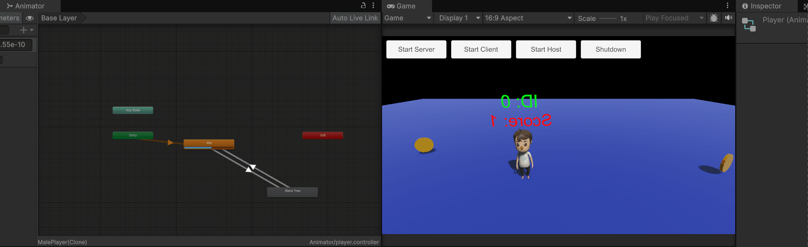

因为我们是在本地切换动画，所以服务器和其他客户端是无法同时切换对应的Player的动画状态


像Player的Transform一样，同步Player的动画同样有两种方法

**方案一：手动同步**

每个客户端使用Network Variable来上传当前的运动状态和归一化速度到服务器，再由服务器通知给所有除了自己以外的客户端，让它们接受后及时更新动画。

```c#
using UnityEngine;
using Unity.Netcode;
using UnityEngine.UI;

public class PlayerSyncByHand : NetworkBehaviour
{
    public float move_speed = 20f;
    public float rotate_speed = 180f;
    // public Color[] player_colors  = {Color.red, Color.green, Color.blue, Color.white, Color.yellow};
    public Text id_label;
    public Text score_label;
    private Rigidbody rb;
    private Animator animator;
    // private Renderer player_renderer;
    private NetworkVariable<Vector3> network_player_position = new NetworkVariable<Vector3>(Vector3.zero);
    private NetworkVariable<Quaternion> network_player_rotation = new NetworkVariable<Quaternion>(Quaternion.identity);
    private NetworkVariable<int> client_id = new NetworkVariable<int>();
    private NetworkVariable<int> client_score = new NetworkVariable<int>(0);
    private NetworkVariable<bool> network_walk_state = new NetworkVariable<bool>();
    private NetworkVariable<float> network_walk_speed_normalized = new NetworkVariable<float>();


    // OnNetworkSpawn is called before Start() methond
    public override void OnNetworkSpawn()
    {
        if(this.IsServer)
        {
            client_id.Value = (int)this.OwnerClientId;
        }

        // When client_score change, Update score label
        client_score.OnValueChanged += (pre_value, new_value) =>
        {
            score_label.text = "Score: " + new_value;
        };
    }

    // Start is called once before the first execution of Update after the MonoBehaviour is created
    void Start()
    {
        rb = GetComponent<Rigidbody>();
        animator = GetComponent<Animator>();
        // Label player's id
        id_label.text = "ID: " + client_id.Value;
        score_label.text = "Score: " + client_score.Value;

        // // Set Player's color by its id
        // player_renderer = GetComponent<Renderer>();
        // player_renderer.material.color = player_colors[client_id.Value % player_colors.Length];

        // Place this client'player in random position and rotation
        if(this.IsClient && this.IsOwner)
        {
            transform.position = new Vector3(Random.Range(-5,5), 0.0f, Random.Range(-5,5));
            transform.rotation = Quaternion.identity;
        }
    }

    // Update is called once per frame
    void Update()
    {
        // if this player is client own, move and rotate it by input. if not, refresh its position and rotation from server
        if(this.IsClient && this.IsOwner)
        {
            // Get user's Input
            float v = Input.GetAxis("Vertical");
            float h = Input.GetAxis("Horizontal");
            if(Input.GetKey(KeyCode.LeftShift))
            {
                v = v * 2;
            }

            // handle movement and rotation
            Vector3 target_position = GetTargetPosition(v);
            Quaternion target_rotation = GetTargetRotation(h);
            // Control player to move
            Move(target_position);
            // Control player to rotate
            Turn(target_rotation);
            UpdatePosAndRotServerRpc(target_position, target_rotation);

            //handle animation
            bool walk_state = v < -0.1 || v > 0.1;
            animator.SetBool("is_walk", walk_state);
            animator.SetFloat("move_speed", v, 0.1f, Time.deltaTime);
            UpdateWalkStateAndSpeedServerRpc(walk_state, v);
        }
        else
        {   // Sync movement and rotation
            Move(network_player_position.Value);
            Turn(network_player_rotation.Value);

            // Sync animation
            animator.SetBool("is_walk", network_walk_state.Value);
            animator.SetFloat("move_speed", network_walk_speed_normalized.Value, 0.1f, Time.deltaTime);
        }

    }

    // // Sync this Client's Player's walk state and speed to Server use ServerRpc tag
    [ServerRpc]
    public void UpdateWalkStateAndSpeedServerRpc(bool walk_state, float v)
    {
        network_walk_state.Value = walk_state;
        network_walk_speed_normalized.Value = v;
    }

    // Sync this Client's Player's position and rotation to Server use ServerRpc tag
    [ServerRpc]
    public void UpdatePosAndRotServerRpc(Vector3 pos, Quaternion rot)
    {
        network_player_position.Value = pos;
        network_player_rotation.Value = rot;
    }

        private Vector3 GetTargetPosition(float v)
    {
        Vector3 delta_pos = transform.forward * v * move_speed * Time.deltaTime;
        Vector3 target_position = rb.position + delta_pos;
        return target_position;
    }


    // Get the rotation that player should rotate to by user's horizional input
    private Quaternion GetTargetRotation(float h)
    {
        Quaternion delta_rot = Quaternion.Euler(0, h * rotate_speed * Time.deltaTime, 0);
        Quaternion rotation = rb.rotation * delta_rot;
        return rotation;
    }

    // Move player
    public void Move(Vector3 position)
    {
        rb.MovePosition(position);
    }

    // Rotate Player
    public void Turn(Quaternion rotation)
    {
        rb.MoveRotation(rotation);
    }

        private void OnTriggerEnter(Collider other)
    {
        if(other.gameObject.CompareTag("Coin"))
        {
            // only this client's player hit the coin, update its score
            if(IsOwner&&IsClient)
            {
                Debug.Log("I hit the " + other.gameObject.tag + "! Score now: " + (client_score.Value + 1).ToString());
                UpdateScoreServerRpc(client_score.Value + 1);       
                other.gameObject.GetComponent<Coin2>().SetActive(false);
            }

        }
        else if(other.gameObject.CompareTag("Player"))
        {
            // if i am a client and hit someone else
            if(IsOwner&&IsClient)
            {
                ulong other_client_id = other.GetComponent<NetworkObject>().OwnerClientId;
                UpdatePlayerMeetServerRpc(this.NetworkObject.OwnerClientId, other_client_id);
            }
        }
    }

    // Update client's score to server
    [ServerRpc]
    public void UpdateScoreServerRpc(int score)
    {
        client_score.Value = score;
    }

    // Send Params inlcudes target client Id to Server
    [ServerRpc]
    public void UpdatePlayerMeetServerRpc(ulong from, ulong to)
    {
        ClientRpcParams p = new ClientRpcParams
        {
            Send = new ClientRpcSendParams
            {
                TargetClientIds = new ulong[] {to}
            }
        };
        NotifyPlayerMeetClientRpc(from, p);
    }
    // Executed on the target client.
    [ClientRpc]
    public void NotifyPlayerMeetClientRpc(ulong from, ClientRpcParams p)
    {
        if(!this.IsOwner)
        {
            Debug.Log("Meet by player:" + from);
        }
    }
}
```


**方案2：使用Network Animator自动同步**

为Player预制件添加Network Animator组件，将Player的Animator拖拽给Network Animator组件的Animator参数，并注释上面使用Network Variable同步运动状态和归一化速度的代码

注意：直接为Player预制件添加Network Animator组件会导致客户端的动画无法同步至其他客户端，主机端的动画同步正常，解决方法是使用下面继承自NetworkAnimator类的脚本

```c#
using Unity.Netcode.Components;
using UnityEngine;

public class ClientNetworkAnimator : NetworkAnimator
{
    protected override bool OnIsServerAuthoritative()
    {
        return false;
    }
}
```

