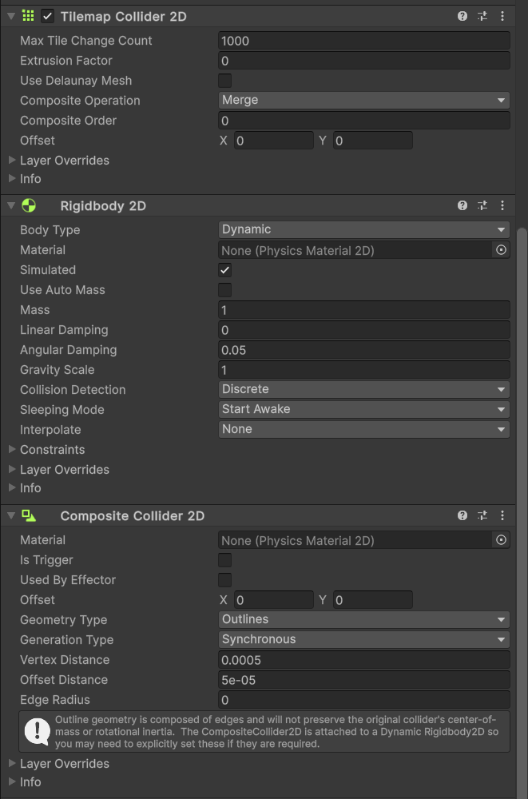
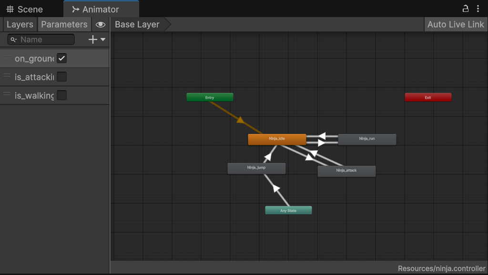
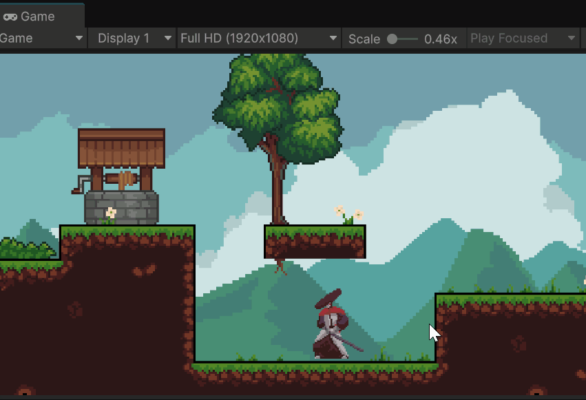

# 二维游戏开发

### 1.精灵 Sprites

#### 精灵

精灵（Sprites）是可以在Unity工程中使用的一种2D资产。如果在3D场景中使用精灵，精灵基本上与标准的纹理（textures）相同，除了在开发过程中为了提高效率，有一些特殊的技术用于组合和管理精灵纹理

二维的游戏角色或其他移动物体、鼠标指针、屏幕字符等都是精灵 


#### 布告板 Billboard

- 布告板资产 Billboard asset

  布告板资产是一组预渲染的网格图片的合集，可以结合使用布告板渲染器来在较低的细节级别 (LOD) 下渲染与摄像机相距一定距离的对象，从而节省渲染时间。生成公告牌资源的最常用方法是在 [SpeedTree Modeler](https://store.speedtree.com/store/speedtree-modeler-for-unity/) 中创建文件，然后将这些文件导入 Unity。

- 布告板渲染器 

  布告板渲染器可以渲染布告板资产。布告板是一种以更简单的方式绘制远离摄像机的复杂 3D 网格的细节级别 (LOD) 方法。网格远离摄像机时，网格在屏幕上的尺寸很小，这意味着无需全面详细绘制网格。实际上，可以将复杂的 3D 网格替换为 2D 布告板表示形式。

- 布告板的应用
  - 粒子系统（比如火、烟等）
  - 无需详细绘制三维物体（一般是小物体、小植物（草丛））
  - 角色的某些HUD（比如游戏中出现的血量扣减）
  - 早期三维游戏的可拾取物品（早期我的世界好多物品）

#### 在Unity游戏引擎中使用精灵

Unity Assets Store上有很多现成的2D资源可以下载，这里我们下载这款地牢游戏资源并导入Unity工程


将资产中的精灵直接拖入到Hierarchy窗口中，Unity编辑器会自动帮我们挂载Sprite Renderer组件


如果精灵是一张有多个小图片组成的大图片，我们可以在该精灵的Inspector窗口选择Sprite Mode为Multiple，精灵编辑器会根据设置的小图片的数量将精灵“分割”成多个独立的小精灵


可以通过Sorting Layer和Order in Layer选项来控制2D游戏中的层级关系，数字越大越在上面


可以将一系列相同角色的精灵拖入到动画窗口中创建关键帧动画


Unity编辑器会为我们自动生成动画状态机


接下来我们使用脚本实现Player自动发射子弹消灭敌人的效果

我们需要一个挂载在子弹预制体上的Bullet脚本

```
using UnityEngine;

[RequireComponent(typeof(Rigidbody2D))]
[RequireComponent(typeof(BoxCollider2D))]

public class Bullet : MonoBehaviour
{
    Rigidbody2D rb;
    // Start is called once before the first execution of Update after the MonoBehaviour is created
    void Start()
    {
        rb = this.GetComponent<Rigidbody2D>();
    }

    // When the bullet hits enemy, destory both of them
    private void OnCollisionEnter2D(Collision2D collision)
    {
        if(collision.gameObject.CompareTag("Enemy"))
        {
            Destroy(collision.gameObject);
            Destroy(gameObject);
        }
    }
}

```

和一个挂载在角色子物体枪上的Shoot脚本


```
using UnityEngine;
using UnityEngine.InputSystem;

public class Shoot : MonoBehaviour
{
    public GameObject bullet;
    public GameObject player;
    public float bullet_force = 4f;

    private Animator animator;
    // Start is called once before the first execution of Update after the MonoBehaviour is created
    void Start()
    {
        animator = player.GetComponent<Animator>();
    }

    // Update is called once per frame
    void Update()
    {
        if(Input.GetMouseButtonDown(0))
        {
            animator.SetBool("is_attack", true);
            Vector3 mouse_world_position = Camera.main.ScreenToWorldPoint(Input.mousePosition);
            ShootBullet(mouse_world_position);
        }
        if(Input.GetMouseButtonUp(0))
        {
            animator.SetBool("is_attack", false);
        }

    }

    private void ShootBullet(Vector3 pos)
    {
        Vector3 direction = pos - transform.position;
        float angle = Mathf.Atan2(direction.y, direction.x) * Mathf.Rad2Deg;
        GameObject new_bullet = Instantiate(bullet, transform.position, Quaternion.Euler(0, 0, angle));
        new_bullet.GetComponent<Rigidbody2D>().AddForce(new_bullet.transform.right * bullet_force);
    }
}
```

实现效果参考


### 2.瓦片地图

#### 瓦片地图 Tilemap

瓦片地图将瓦片tile按照特定方式排列起来构成地图，常用于用于构造2D关卡，可以模拟顶视角、斜视角。


瓦片地图还可以斜向排列，以等距透视视图模拟构建3D场景，等距透视是一种平行透视，摄像机处于游戏场景的斜上方并向下转动一定角度（比如45°）来观察游戏场景


#### 在Unity游戏引擎中构建瓦片地图

在Hierarchy窗口中点击右键，选择2D Object - Tilemap即可选择创建各种Tilemap，这里以Rectangular为例


然后点击Window - 2D - Tile Platte打开Tile Palette窗口，点击Create a New Tile Palette新建一个新的Tile Palette，将你构建瓦片地图需要用到的所有精灵拖拽到窗口中


选择想将要绘制的Tilemap，选择顶部的笔刷工具即可以开始在Scene中绘制地图，其他的工具如相皮可以删除已经创建的瓦片，大家可以自行探索


为了让游戏角色和地图能互动，我们可以使用Tilemap Collider 2D组件为瓦片地图添加碰撞体


但是我们会发现每一个小瓦片都是一个独立的碰撞体，这样在编写处理碰撞事件的脚本时会很麻烦，我们可以继续为瓦片地图添加Composite Collider 2D组件，并将Rigidbody 2D组件中的Body Type设为Static，在Tilemap Collider 2D选择合适的Composite Operation




### 3.二维游戏角色

#### 如何实现二维游戏角色

二维游戏与和三维游戏角色类似，都可以使用骨架、动画、物理组件等。与三维游戏角色使用3D模型实现不同的是，二维游戏角色使用精灵图片来实现

#### 使用Unity游戏引擎实现一个二维游戏角色

接下来我们将使用已经学过的内容实现一个二维游戏角色：忍者，我们需要实现它的移动和攻击、以及相应的动画（可以用精灵保存的动作序列帧来实现，也可以通过绑定骨架制作动画来实现）

首先我们先使用Tilemap搭建一个简单的二维游戏场景，给地面瓦片地图并添加Tilemap Collider 2D组件、Composite Collider 2D组件，并将Rigidbody 2D组件中的Body Type设为Static。


接着我们导入忍者游戏角色的精灵资产，将忍者的第一个idle精灵拖入Hierarchy窗口，将新建的游戏物体重命名为Ninja


使用精灵保存的动作序列帧制作动画


建立一个可以根据参数值切换不同动画状态机的动画层



接下来我们编写一个挂载到Ninja上的脚本来控制角色的移动和攻击、以及相应的动画的切换

```c#
using UnityEngine;


public class Ninja : MonoBehaviour
{
    public GameObject detect_ground_sensor;
    public float detect_radius = 0.1f;
    public float max_speed = 10f;
    public float m_jump_force = 100f;
    public int m_jump_max_times = 2;
    private bool m_on_ground;
    private bool m_is_walking = false;
    private bool m_is_jumping = false;
    private bool m_is_attacking = false;
    private bool m_is_facing_right = true;
    private int jump_counter = 0;
    private Animator animator;
    private Rigidbody2D rb;
    // Start is called once before the first execution of Update after the MonoBehaviour is created
    void Start()
    {
        animator = GetComponent<Animator>();
        rb = GetComponent<Rigidbody2D>();
    }

    // Update is called once per frame
    void Update()
    {
        if(Input.GetKeyDown(KeyCode.Space))
            m_is_jumping = true;

        if(Input.GetKeyDown(KeyCode.L))
            m_is_attacking = true;
    }

    void FixedUpdate()
    {
        m_on_ground = GroundDetection(detect_ground_sensor.transform);

        // handle the movement
        float h = Input.GetAxis("Horizontal");
        if(Mathf.Abs(h) > 0.02)
        {
            m_is_walking = true;
        }
        else
        {
            m_is_walking = false;
        }


        HandleMovement(h);

        if(m_is_facing_right && h < 0 || !m_is_facing_right && h > 0)
        {
            Flip();
            m_is_facing_right = !m_is_facing_right;
        }

        UpateAnimation();
        m_is_attacking = false;
    }

    private void HandleMovement(float h)
    {
        Move(h);
        if(m_is_jumping)
        {
            if(jump_counter < m_jump_max_times)
            {
                Jump(m_jump_force);
                jump_counter++;
            }
            else if(m_on_ground)
            {
                jump_counter = 0;
            }
            m_is_jumping = false;
        }
    }

    private void Move(float h)
    {
        rb.linearVelocityX = h * max_speed;
    }

    private void Jump(float force)
    {
        rb.AddForce(new Vector2(0, force));
    }

    private void Flip()
    {
        Vector2 scale = transform.localScale;
        scale.x = scale.x * -1;
        transform.localScale = scale;
    }

    private bool GroundDetection(Transform detect_ground_sensor)
    {
        bool m_on_ground = false;
        // Ground detection: Check if character is touching any object (not itself) within a circular area below the character, and update animator accordingly
        Collider2D[] collider = Physics2D.OverlapCircleAll(detect_ground_sensor.position, detect_radius);
        for (int i = 0; i < collider.Length; i++)
        {
            if(collider[i].gameObject != gameObject)
            {
                m_on_ground = true;
            }
        }
        return m_on_ground;
    }

    private void UpateAnimation()
    {
        animator.SetBool("is_walking", m_is_walking);
        animator.SetBool("is_attacking", m_is_attacking);
        animator.SetBool("on_ground", m_on_ground);
    }
}
```

实现效果


如果想要实现游戏角色从平台底下跳到平台上的效果，我们可以为Tilemap挂载一个Platform Effector 2D组件，并将


实现效果：



### 3.二维游戏角色骨架系统

#### 传统关键帧动画的问题

二维游戏角色与三维游戏角色的关键帧动画的问题相同：

- 需要保存大量的数据（二维游戏角色的每一个关键帧都是一个Sprite图片）
- 和游戏环境交互较少

#### 在Unity游戏引擎中制作二维游戏角色的骨架动画

Unity引擎允许我们制作和使用二维游戏角色的骨架动画，接下来我们以一张静态的Sprite图为例，尝试制作二维游戏角色的骨架动画

在Package Manager窗口的Unity Register的搜索框中搜索2D Animation包并将它解锁


打开一张精灵图片的Inspector窗口，点击Open Sprite Editor打开精灵编辑器


选择左上角下拉菜单选择Skinning Editor


点击Edit Bone选项可以绘制骨骼，点击Auto Geometry可以自动生成网格，点击Auto Weights可以自动生成网格权重，即某一网格受那个骨骼控制更多。最后保存精灵图片。


将绘制好骨骼的精灵图片拖拽进Hierarchy窗口，为精灵图片生成的游戏物体添加Sprite Skin组件，点击Create Bones即可将刚才绘制的骨骼导入。


然后点击精灵图片生成的游戏物体，打开Animation窗口，点击录制按钮，为游戏角色创建关键帧动画。


效果如图：

