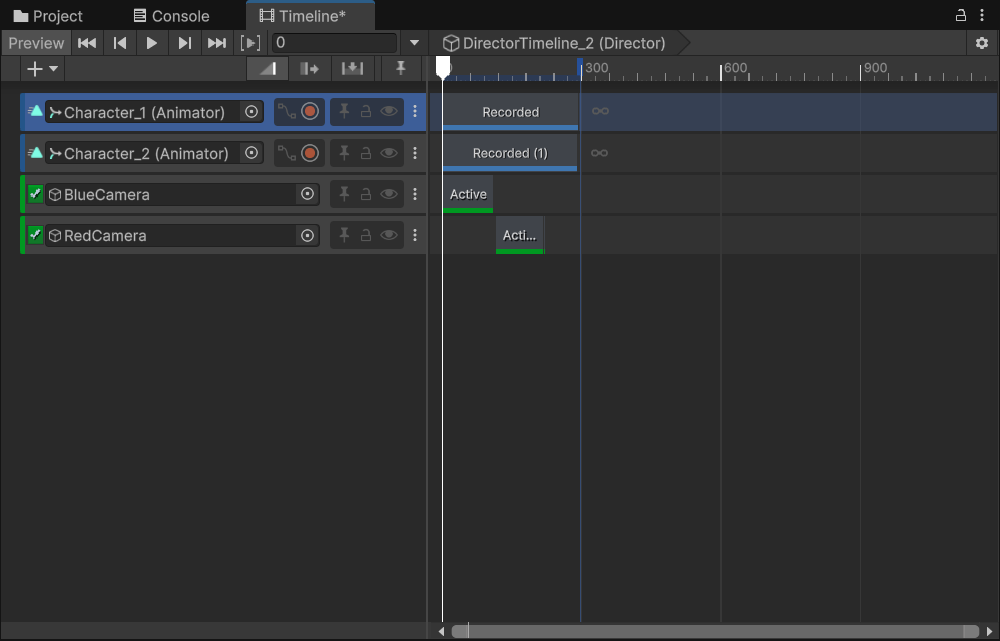
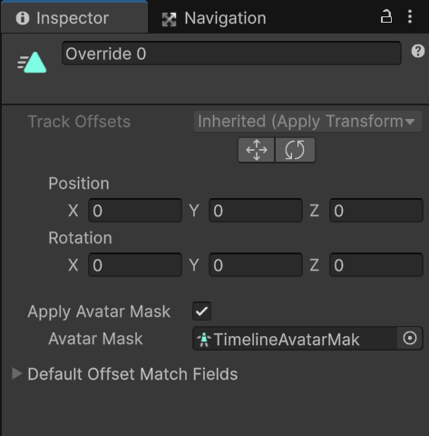
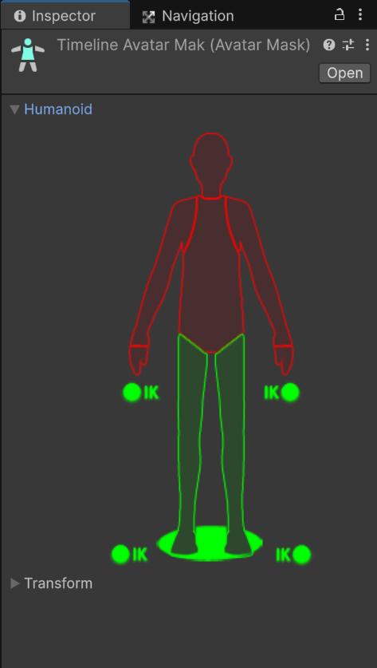
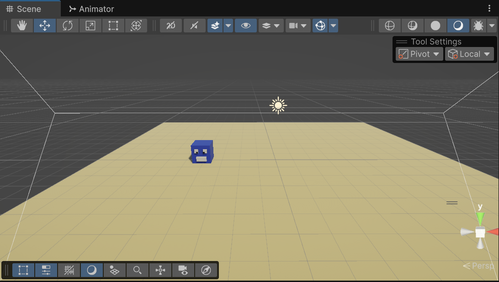
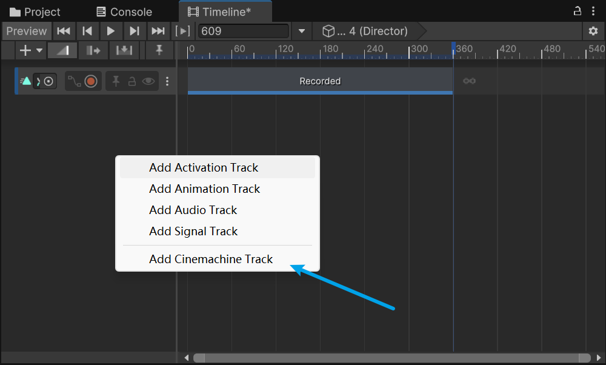

# 影视内容创作

### 1.时间轴 Timeline

#### 实时动画创作

游戏引擎又被称为内容创作引擎，其因为具有实时真实感的光照效果、实时物理等特效的仿真功能，而成为实时动画创作者友好、灵活的创作工具。

#### 时间轴(Timeline)和动画控制(Animation)的区别

-  动画控制(Animation)只能控制单个物体，而时间轴(Timeline)可以使得多个物体协同运动
- 在时间轴(Timeline)中可以有多个轨道，每个轨道上面也可以包含多个片段
-  时间轴(Timeline)功能加入Unity的时间要晚于动画控制(Animation)

#### 在Unity游戏引擎中使用时间轴

我们可以点击Window-Sequencing-Timeline打开时间轴窗口


如上图所示时间轴需要挂载在一个游戏物体上，我们新建一个空物体命名为Director，在Hierarchy窗口选中Director新建一个时间轴资源并保存


此时我们就可以将其他游戏物体作为拖到时间轴窗口，点击Add Animation Track，使其成为时间轴的一条动画轨道


我们可以为每个动画轨道添加不同的Animation Clip


在这里我们为角色1添加一段走路动画，为角色2先添加一段挥手动画，等待一段时间后，再添加一段跑步动画


点击播放按钮，效果如图：


将同一条轨道上的两个动画片段重叠可以使动画与动画之间的过渡更加自然


### 2.时间间简单动画

#### 时间轴的工作流

1. 创建时间轴资源和时间轴实例
2. 进行动画录制
3. 将录制好的动画转为动画片段(Animation Clip)

#### 在Unity游戏引擎中制作简单动画

首先我们需要搭建一个包含两个动画角色的简单场景


接下来我们新建一个空物体命名为Director，在Hierarchy窗口选中Director新建一个时间轴资源并保存，我们将两个动画角色拖到时间轴窗口，点击Add Animation Track添加两个新的动画轨道


点击轨道上的红色录制按钮，为两个角色分别录制不同的动画，录制完成后单击右键选择


点击播放按钮，效果如图：


接下来我们新建两个Camera，分别对准两个角色。将两个Camera也拖入到时间轴窗口，点击Add Activation Track，添加激活轨道，并调整两个Camera激活的时机



这样就可以模拟多个摄像机位置录制了


### 3.时间轴角色动画

使用时间轴 Timeline除了可以进行简单的关键帧动画控制之外，还可以进行角色动画的控制

#### 角色动画的特殊性

- 角色动画多使用使用骨架动画
- 角色动画在动画片段之间容易产生问题，如前一个动画末尾角色的位置和后一个动画开始角色的位置姿态不相同
- 角色动画可以使用一些特殊效果，如可以使用动画遮罩来嫁接不同身体部位的动画

#### 在Unity游戏引擎中制作角色动画时间轴

首先我们需要搭建一个包含一个带有骨骼的游戏角色的简单场景，新建一个空物体命名为Director，在Hierarchy窗口选中Director新建一个时间轴资源并保存


因为我们要使用时间轴来控制角色动画。所以我们需要移除游戏角色的两个控制脚本和Rigidbody组件、Collider组件，并确保Animator组件上的Apply Root Motion选项被勾选


接下来将我们将动画角色拖到时间轴窗口，点击Add Animation Track添加一个新的动画轨道，并添加一些动画片段Animation Clip


播放效果如图


我们可以发现当从上一个动画片段转换到下一个动画片段时，动画角色会回到初始位置。我们可以在动画片段上点击鼠标选择Match Offsets To Previous Clip使下一个动画片段开始时动画角色位置与上一动画片段结束时相同


而对于时间轴的第一个动画片段，我们可以点击平移图标，手动修改动画角色位置


修改后效果如图：


可以发现现在动画片段之间的切换有些生硬，我们可以在时间轴中将后一动画片段向前一动画片段移动，来添加动画融合的过渡效果，如果对过渡效果仍然不满意，可以点击平移图标来进行微调


修改后效果如图：


接下来我们使用动画遮罩 Mask来实现动画角色僵尸行走

首先我们将动画角色在场景中复制一份，将新的动画角色拖到时间轴窗口，点击Add Animation Track添加一个新的动画轨道，并添加弯腰走路的动画片段


然后在新的动画角色的动画轨道上新建一个Override Track，在Override Track上添加正常走路的动画片段


然后点击Override Track，在Inspector窗口中添加一个覆盖下半身的Avatar Mask





这样我们保留了新的动画角色的主轨道的动画片段上半身的动作，并使用了Override Track上动画片段的下半身的动作


### 4.使用脚本控制时间轴动画

#### Timeline Track

- Animation Track:：游戏物体的动画控制
- Audio Track：可以控制音频，添加声音在上面
- Activation Track： 控制物体的激活与否
- Control Track：本质上，Control Track是以轨道形式附在一个TimeLine上的另一个Timeline
- Playable Track
  - 允许用户自定义相关动画效果
  - 可以根据自己的需要进行定制化开发
  - 在代码中继承PlayableBehaviour和PlayableAsset两个类，在其中完成自定义的动画功能

#### 在Unity游戏引擎中使用脚本控制时间轴动画

此处我们使用第三节的游戏场景

1.编写一个脚本使用空格键控制时间轴动画的播放

```c#
using UnityEngine;
using UnityEngine.Events;
public class ControlTimelinePlay : MonoBehaviour
{
    [SerializeField]
    public UnityEvent timeline_event;

    // Start is called once before the first execution of Update after the MonoBehaviour is created
    void Start()
    {
        
    }

    // Update is called once per frame
    void Update()
    {
        if(Input.GetKeyDown(KeyCode.Space))
        {
            Debug.Log("Have pressed Space.");
            timeline_event.Invoke();
        }
    }
}
```

将Director上的Playable Director组件的Play On Awake选项取消勾选，将Director拖拽给脚本，选择Play()函数，


效果如图：


2.实现一个可以添加到Playable Track上的PlayableAsset

下面的代码实现了一个PlayableAsset，这个组件控制一个UI Text，在动画播放过程中包含这个组件的时间端显示Playing，其余时间显示EndPlaying

```c#
using UnityEngine;
using UnityEngine.Playables;  // Required for Timeline integration
using UnityEngine.UI;         // Required for UI Text component

// Custom PlayableAsset that can be added to a Timeline
public class MyPlayableTrackAsset : PlayableAsset
{
    // ExposedReference allows you to assign a UI Text component in the Timeline editor
    // This will be the Text component we want to control during playback
    public ExposedReference<Text> my_text;
    
    // Required method that creates and returns a Playable when the Timeline runs
    // This connects our asset to the actual runtime behavior
    public override Playable CreatePlayable(PlayableGraph graph, GameObject owner)
    {
        // Create a ScriptPlayable containing our MyPlayableBehaviour
        var Playable = ScriptPlayable<MyPlayableBehaviour>.Create(graph);
        
        // Resolve the reference to the Text component and assign it to our behavior
        Playable.GetBehaviour().status = my_text.Resolve(graph.GetResolver());
        
        return Playable;
    }
}

// The behavior class that defines what happens during Timeline playback
public class MyPlayableBehaviour : PlayableBehaviour
{
    // Reference to the Text component we want to control
    public Text status;
    
    // Called when this track starts playing in the Timeline
    public override void OnBehaviourPlay(Playable playable, FrameData info)
    {
        // Always call the base implementation first
        base.OnBehaviourPlay(playable, info);
        
        // Make sure we have a valid Text component
        if(status != null)
        {
            // Make the Text game object visible
            status.gameObject.SetActive(true);
            
            // Set the text to "Playing"
            status.text = "Playing";
        }
    }

    // Called when this track stops playing in the Timeline
    public override void OnBehaviourPause(Playable playable, FrameData info)
    {
        // Always call the base implementation first
        base.OnBehaviourPause(playable, info);
        
        // Make sure we have a valid Text component
        if(status != null)
        {
            // Change the text to "EndPlaying" when the track stops
            status.text = "EndPlaying";
        }
    }
}
```


效果如下：


### 5.Cinemachine

#### Cinemachine

Cinemachine 是一套用于控制 Unity 摄像机的模块。Cinemachine 解决了跟踪目标、合成、混合和镜头之间剪辑的复杂数学和逻辑问题。它旨在显著减少开发过程中耗时的手动操作和脚本修改的次数。

#### 使用Cinemachine的便利性

Cinemachine 可与其他 Unity 工具配合使用，是时间轴、动画和后处理资源的强大补充。

Cinemachine 可在所有类型的游戏中实时运行，包括FPS, third person, 2D, side-scroller, top down, and RTS。它支持场景中需要的任意数量的镜头。它的模块化系统允许您编写复杂的行为。

### 在Unity游戏引擎中使用Cinemachine

首先我们需要搭建一个包含一个动画角色的简单场景



接下来我们新建一个空物体命名为Director，在Hierarchy窗口选中Director新建一个时间轴资源并保存，我们将两个动画角色拖到时间轴窗口，点击Add Animation Track添加一个新的动画轨道，并为动画角色新建一个简单的关键帧动画


在Package Manager窗口中的Unity Registry中搜索Cinemachine包，点击安装。


接下来我们新建一个FreeLook Camera，并将它的CinemachineFreeLook组件的Follow和Look At都设置为动画角色


将Main Camera拖入Timeline窗口左侧，选择add Cinemachine Track



将FreeFreeLook Camera拖入Main Camera轨道中


效果如下


接下来我们新建一个Dolly Camera with Track，会自动生成两个游戏物体：Dolly Track和Virtual Camera，调整Dolly Track的位置并将Virtual Camera的CinemechineVirtualCamera组件的Follow和Look At都设置为动画角色


勾选Virtual Camera的CinemechineVirtualCamera组件Auto Dolly选项


将Virtual Camera拖入Main Camera轨道中


效果如下：


