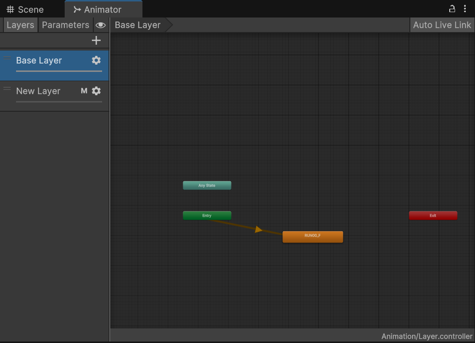

# 动画系统

## 场景动画/关键帧动画

游戏中的动画主要分为两种类型：场景动画和角色动画

场景动画又可以称为关键帧动画，在游戏当中任何可变的的属性都可以成为场景动画的变化元素。


### eg: 创建关键帧动画的简单示例

1.选择一个游戏物体，点击Window菜单选择Animation-Animation-create新建一个动画文件并命名


2.添加想要变化的属性，点击红色的按钮，选择时间位置改变属性插入关键帧，游戏引擎会自动插值补全中间帧的游戏物体的状态


3.可以点击Animator Controller设置多段动画播放的先后顺序，点击动画文件可以选择是否循环播放。


## 骨骼动画

### 关键帧动画存在一些问题

当游戏对象模型由很复杂的网格组成时，需要保存大量的数据

和游戏环境交互较少

难于控制

### 骨骼动画的原理

因为其动画数据和模型网格数据是分离的，骨骼动画也叫做隐式动画

骨骼动画文件保存的是每一帧骨架的姿态，而非网格信息，因此保存的数据较少

在播放阶段时

1.利用骨骼结构以及每帧的骨架信息可以得到角色的姿态

2.再利用骨骼和网格顶点的关系可以将模型按照这种姿态绘制出来

### 骨骼动画优势

利用骨骼这一特殊结构来保存角色姿态

只需要很少的数据量就可以表示角色的动画

控制灵活

容易和环境交互

 能够得到实时计算的姿态

由于脊柱动物天然就是用骨架来支撑身体，所以很适合用骨架来模拟运动

### 骨骼动画的重定向

骨骼动画可以实现动画数据的重新利用，一个骨骼动画可以驱动不同骨架相同的角色的运动

### eg1: 初步尝试骨骼动画

1.选绑定好骨骼的人物拖入场景中

2.新建一个Animator Controller拖到人物的Animator组件上


3.双击打开Animator Controller添加两个简单的等待和行走的动画并连起来，新建一个Trigger，用于从静止切换的行走


4.新建一个使用空格键切换运动状态的C#脚本

```c#
using UnityEngine;

public class move : MonoBehaviour
{
    private Animator anima;
    void Start()
    {
        anima = GetComponent<Animator>();  // 获取animator组件
    }

    void Update()
    {
        if(Input.GetKeyDown(KeyCode.Space))
        {
            anima.SetTrigger("WAIT_to_WALK");
            Debug.Log("ok");
        }
    }
}
```

效果如图：默认动作为等待，按下空格键后变为行走


### eg2: 骨骼动画的重定向

1.拖拽同类型骨架的Animator Controller到该人物

2.将控制人物移动的C#脚本拖入

效果如图：


## 动画曲线 Animation Curve

### 动画曲线的用途

可以在动画片段上增加额外的运动数据

可以基于动画状态来控制其他物体，例如控制角色在冷天气的呼气

### eg：使用动画曲线

1.新建一个Animator Controller，拖拽到游戏角色inspector窗口

2.在Animator Controller中打开动画的inspector窗口，创建动画曲线命名为CurveValue


3.在Animator窗口的Parameter列表中新建一个float参数,命名为CurveValue（需与2中同名）


4.创建脚本使用CurveValue参数控制一个球体的缩放

```c#
using UnityEngine;

public class Curve : MonoBehaviour
{
    public Transform bubble;
    public Vector3 original_scale;
    void Start()
    {
        original_scale = bubble.localScale;
    }

    void Update()
    {
        var Curve = GetComponent<Animator>().GetFloat("CurveValue");
        bubble.localScale = new Vector3(original_scale.x + Curve, original_scale.y + Curve, original_scale.z + Curve);
    }
}
```

效果如图：


## 动画层 Animation Layer

### 动画层的作用

为游戏角色不同身体部位使用不同的动作，比如下半身是跑步，而上半身在射击

在不同层间复用动画状态机，比如角色受伤之后所有运动变化，但动画逻辑不变

走路，跑步，空闲（idle）等动作之间切换的逻辑，称为动画状态机（State Machine）

### 遮罩 Mask

可以为动画层设定受该层动画影响的部位，其中绿色代表受影响，红色是不受影响。


### eg: 动画层和Avatar Mask的初步尝试

1.新建一个Animator Controller命名为Layer，拖拽到游戏角色Inspector窗口

2.拖拽一个动画到Base Layer中



3.新建一个动画层，并拖拽一个动画到该动画层中


4.点击设置按钮，调整第二个动画层的权重，当权重为0时，仅播放第一个动画层的动作，当权重为1时，仅播放第二个动画层的动作，当权重为0到1之间时，播放两个动作融合后的动作


5.在Assets中新建一个Avatar Mask将双腿点为红色，表示为应用该Avatar Mask的动画层的动画只影响游戏角色的上半身


6.点击设置按钮，将该Avatar Mask应用到第二个动画层，并编写一个用鼠标左键改变第二个动画层权重的C#脚本


```c#
using UnityEngine;

public class NewMonoBehaviourScript : MonoBehaviour
{
    Animator anima  = null;
    public float speed = 1;

    void Start()
    {
        anima = GetComponent<Animator>();
    }

    void Update()
    {
        if(Input.GetMouseButton(0))
        {
            float w = anima.GetLayerWeight(1) > 1 ? 1 : anima.GetLayerWeight(1) + speed * Time.deltaTime;
            anima.SetLayerWeight(1,w);
        }
        else
        {
            float w = anima.GetLayerWeight(1) < 0 ? 0 : anima.GetLayerWeight(1) - speed * Time.deltaTime;
            anima.SetLayerWeight(1,w);
        }
            
    }
```

效果如图：


## 逆向运动学

### 正向运动学

正向运动学是从根节点开始（人体一般是髋骨）然后将变换逐层传递 给子孙节点一种运动计算过程，它是实现骨骼动画最简单的方法，当在骨骼上绑定物体的时候使用正向运动学会比较方便，例如：游戏中角色射出弓箭，要求弓箭射中敌人后要粘到敌人身上


### 逆向运动学 Inverse kinematics

逆向运动学计算骨骼链中每个骨骼的角度，使得末端骨骼可 以达到一个特定位置，它可以用于游戏人物与周围环境的交互，逆向运动学从终端节点（比如手部）开始计算，然后逐层往上计算其他父节点的信息

### 求解逆向运动学问题

因为使用逆向运动学时会明确终端骨骼位置和姿态，但是其他关节的位置和姿态都是未知的，所以解决逆向运动学问题，通常有不止一种解法。


### eg: 在Unity使用逆向运动学功能

使用鼠标光标控制游戏角色朝向

1.新建一个animator controller命名为IK，拖拽到游戏角色inspector窗口，添加一个idle动画作为默认动作


2.新建一个使用鼠标控制游戏角色朝向的C#脚本，拖给游戏角色

```c#
using UnityEngine;

public class IK1 : MonoBehaviour
{
    protected Animator animator;
    void Start()
    {
        animator = GetComponent<Animator>();// 获取附加在当前对象上的 Animator 组件
    }
    /*OnAnimatorIK() 是一个 Unity 提供的回调方法，它会在 Animator 更新时调用，并允许开发者在 IK (逆向运动学) 中自定义动画的行为。*/
    private void OnAnimatorIK(int layerIndex)
    {
        Ray ray = Camera.main.ScreenPointToRay(Input.mousePosition); // 创建了一条射线 (Ray)，射线的起点是主摄像机 (Camera.main) 和鼠标位置 (Input.mousePosition) 之间的投射。
        float enter = 0f; // 用来记录射线与平面的交点。
        Plane plane = new Plane(Vector3.up, transform.position); // 定义了一个位置与当前对象的坐标相同，法向是世界坐标系y轴正方向的平面
        Vector3 target;
        /*使用 plane.Raycast() 来检测射线是否与平面相交。*/
        if(plane.Raycast(ray, out enter))
        {
            target = ray.GetPoint(enter);
            animator.SetLookAtWeight(0.5f, 0.3f, 0.8f, 1);
            animator.SetLookAtPosition(target);
        }
    }
}
```

效果如图：


接下来实现游戏角色的四肢触碰物体

3.新建一个实现游戏角色的四肢触碰物体，拖给游戏角色

```c#
using UnityEngine;

public class IK2 : MonoBehaviour
{
    private Animator animator;
    public Transform target;
    public Transform hint;
    public bool is_hand = true;

    void Start()
    {
        animator  = GetComponent<Animator>();
    }

    private void OnAnimatorIK(int layerIndex)
    {
        AvatarIKGoal g = is_hand ? AvatarIKGoal.RightHand : AvatarIKGoal.RightFoot;
        AvatarIKHint h = is_hand ? AvatarIKHint.RightElbow : AvatarIKHint.RightKnee;

        animator.SetIKPositionWeight(g, 1f);
        animator.SetIKPosition(g, target.position);
        animator.SetIKRotationWeight(g, 1f);
        animator.SetIKRotation(g, target.rotation);

        animator.SetIKHintPositionWeight(h, 1f);
        animator.SetIKHintPosition(h, hint.position);
    }
}
```

4.在场景中新建一个球体，并在球体下新建一个空物体，将球体和空物体分别拖到脚本开放的target和hint变量上


效果如图：


通过hint物体的约束，可以使游戏角色的动作更像人的动作


## 子状态

角色的动画控制是由角色的状态机（State Machine）来控制的, 当动作过多时就会会使得动画控制系统变得庞大，不好管理

我们可以考虑将一系列动作组成的复合动作看做成一个子状态，融入到角色的状态机里，便于管理

### eg：在Unity中使用子状态

1.新建一个animator controller命名为SubState，拖拽到游戏角色inspector窗口，添加一个idle动画作为默认动作

2.在Base Layer上创建一个子状态机


3.打开子状态机添加系列动画，并最后返回Base Layer。


4.新建一个Trigger命名为start，新建一个从idle到子状态机的有条件的转换


5.新建一个使用空格控制start Trigger的C#脚本

```c#
using UnityEngine;

public class SubState : MonoBehaviour
{
    void Update()
    {
        if(Input.GetKeyDown(KeyCode.Space))
        {
            GetComponent<Animator>().SetTrigger("start");
        }
    }
}
```

效果如图：


## 融合树 Blend Tree

融合树可以对两个或者多个相似运动进行融合，进而得到一个新的运动

例如随着角色的速度变化，角色可以处于走路和跑步之间的状态，或者是运动时的倾斜动作由正常运动动作和倾斜姿态融合而来

### 融合树 Blend Tree和动画过渡 Transition的异同

两者都可以通过多个动画叠加出平滑的动画

动画的过渡 Transition主要用于在一定的时间内平滑地从一个动画状态过渡至另一个状态这个目的

- 从一个动作过渡到完全不同的另一个动作 
- 如果在短时间内完成效果可以接受

融合树 Blend Tree允许多动画平滑混合成新的动画

- 多个动作同时对生成的动作产生影响 

- 依靠参数控制不同动作的权重

### eg: 在Unity中使用三维角色动画系统的融合树

1.新建一个animator controller命名为BlendTree，拖拽到游戏角色Inspector窗口

2.在Base Layer中点击鼠标右键新建一个Blend Tree，并双击打开它


3.选择一维的融合方式，拖拽三个动画到Blend Tree的Inspector窗口的motion栏中， 注意可以拖入的是Animation Clip。


现在可以通过调整blend参数的数值使角色在三个动画之间进行过渡变化，效果如图：


4.也可以选择Direct的融合方式，新建三个float类型的参数来分别控制三个动画的状态进行融合

效果如图：


