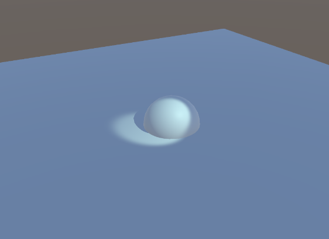

# 渲染系统

### 3.1渲染路径

#### 3.1.1渲染(Render)

**渲染**[[1\]](https://zh.wikipedia.org/zh-cn/渲染#cite_note-1)[[2\]](https://zh.wikipedia.org/zh-cn/渲染#cite_note-2)（英语：render，rendering）又称**彩现**、**绘制**[[3\]](https://zh.wikipedia.org/zh-cn/渲染#cite_note-3)[[4\]](https://zh.wikipedia.org/zh-cn/渲染#cite_note-4)、**算绘**，在[电脑绘图](https://zh.wikipedia.org/wiki/電腦繪圖)中，是指以[软件](https://zh.wikipedia.org/wiki/软件)由[模型](https://zh.wikipedia.org/wiki/三維模型)生成[图像](https://zh.wikipedia.org/wiki/图像)的过程。模型是用语言或者数据结构进行严格定义的三维物体或虚拟场景的描述，它包括几何、视点、[纹理](https://zh.wikipedia.org/wiki/紋理)、[照明](https://zh.wikipedia.org/wiki/照明)和[阴影](https://zh.wikipedia.org/wiki/陰影)等信息。图像是[数字图像](https://zh.wikipedia.org/wiki/数字图像)或者[位图](https://zh.wikipedia.org/wiki/位图)[图像](https://zh.wikipedia.org/wiki/图像)。渲染用于描述：计算视频编辑软件中的效果，以生成最终视频的输出过程。

#### 3.1.2图形渲染管线（The Graphics Rendering Pipeline）

它的主要功能是在给定一个虚拟相机、 三维物体、光源等等的情况下生成或渲染二维图像

实时渲染管线（Real-Time Rendering Pipeline）大致可以分为四个阶段

- 应用程序阶段（Application）
- 几何处理阶段（Geometry Processing）
- 光栅化阶段（Rasterization）
- 像素处理阶段（Pixel Processing

下图是实时渲染管线在GPU(graphics processing unit)中具体执行流程，主要通过各个阶段的着色器来完成这个过程的

#### 3.1.3着色器（Shader）

**着色器**（英语：**shader**）是一种[计算机程序](https://zh.wikipedia.org/wiki/计算机程序)，原本用于进行图像的[浓淡处理](https://zh.wikipedia.org/wiki/浓淡处理)（计算图像中的[光照](https://zh.wikipedia.org/wiki/光照)、[亮度](https://zh.wikipedia.org/wiki/黑暗)、[颜色](https://zh.wikipedia.org/wiki/颜色)等）

使用着色器在图形硬件上计算[渲染](https://zh.wikipedia.org/wiki/渲染)效果有很高的自由度。尽管不是硬性要求，但目前大多数着色器是针对[GPU](https://zh.wikipedia.org/wiki/GPU)开发的。GPU的可编程[绘图管线](https://zh.wikipedia.org/wiki/繪圖管線)已经全面取代传统的固定管线，可以使用着色器语言对其编程。构成最终图像的[像素](https://zh.wikipedia.org/wiki/像素)、[顶点](https://zh.wikipedia.org/wiki/頂點_(電腦圖學))、[纹理](https://zh.wikipedia.org/wiki/纹理贴图)，它们的位置、色相、饱和度、亮度、对比度也都可以利用着色器中定义的[算法](https://zh.wikipedia.org/wiki/算法)进行动态调整。调用着色器的外部程序，也可以利用它向着色器提供的外部[变量](https://zh.wikipedia.org/wiki/变量)、纹理来修改这些着色器中的参数。

#### 3.1.4渲染路径

渲染路径就是游戏引擎渲染系统的工作模式，主要可分为

-  传统的Forward（正向）渲染，一般在移动端游戏开发中使用
-  较新的Deferred（延迟）渲染，一般在PC或是Consoles主机开发中使用

#### 3.1.5Forward（正向）渲染

每个物体受每个灯光的影响，都会在各自的pass通道中被渲染, 

- 每个物体可能会被渲染多次，次数取决于影响物体的光源数目。
- 适合场景中光源数目可控的情况

- **优势**: 速度快，对于硬件要求低

- **劣势**: 对于光源较多的游戏，渲染效率将会受到影响

#### 3.1.6Deferred（延迟）渲染

将着色和光照计算放到最后来进行

- 物体经过一次pass之后，表面位置、法线和材质信息渲染到geometry buffer中

- 最后将这些纹理和光照pass进行合成

- **优势1**: 渲染开销取决于光照影响的像素数量，而非光源数量本身

- **优势2**: 对于场景中的光源数并无限制，这对于某些游戏比较关键
- **劣势**: 需要更强大的硬件支持，当前的手机平台并不支持

#### 3.1.7在Unity中切换Deferred（延迟）渲染和Forward（正向）渲染

点击Edit-Projec Settings-Graphics-Tier Settings，取消勾选Use Defaults，在Rendering Path下拉选型菜单中选择渲染路径

### 3.2颜色空间

渲染的最终目的就是将屏幕像素填充为特定的颜色，如何计算像素的颜色时十分重要的。

游戏引擎中有两种颜色控制方式：使用伽马颜色空间和使用线性颜色空间。

#### 3.2.1色彩空间

**色彩空间**（英语：Color space）是对[色彩](https://zh.wikipedia.org/wiki/色彩)的组织方式。借助色彩空间和针对物理设备的测试，可以得到色彩的固定[模拟](https://zh.wikipedia.org/wiki/模擬信號)和[数字](https://zh.wikipedia.org/wiki/数字信号)表示。色彩空间可以只通过任意挑选一些颜色来定义，比如像[彩通](https://zh.wikipedia.org/wiki/彩通)系统就只是把一组特定的颜色作为[样本](https://zh.wikipedia.org/wiki/調色盤_(電腦圖形學))，然后给每个颜色定义名字和代码；也可以是基于严谨的数学定义，比如 [Adobe RGB](https://zh.wikipedia.org/wiki/Adobe_RGB色彩空间)、[sRGB](https://zh.wikipedia.org/wiki/SRGB色彩空间)。

不同色彩空间的比较：

有关色彩空间的知识[@橙与青 | 色彩空间为什么那么空？色度系统、色度图、色域、伽马、白点…_哔哩哔哩_bilibili](https://www.bilibili.com/video/BV19e4y1y7Mo/?spm_id_from=333.337.search-card.all.click&vd_source=bf08880c4c4d8fdcca4d17ed2ee821fe)

#### 3.2.2使用伽马颜色空间渲染

由于人眼对暗色域的辨识度更强，所以图片存储时，会对图像中的每个像素做一次幂函数运算，保留更多的暗部存储空间，牺牲掉了一些不重要的亮部存储空间。在显示的时候，使用Gamma校正后，作指数运算，恢复像素颜色

##### 伽马颜色空间渲染的问题

- 像素颜色其实不是原来的颜色，而是幂函数

- 使用幂函数进行光照等计算显然是不正确的

- 最终的渲染结果有误

#### 3.2.3使用线性颜色空间渲染

- 直接使用像素的本来颜色

- 不进行幂函数运算 

- 在线性空间的运算结果是准确的

#### 3.2.4线性颜色空间渲染和伽马颜色空间渲染对比

#### 3.2.5在Unity中，对比使用两种颜色空间渲染

点击Edit-Projec Settings-Player-Other Settings-Rendering-Color Space的下拉选项菜单，切换渲染色彩空间

使用伽马颜色空间渲染小球

使用线性颜色空间渲染小球

### 3.3摄像机（Camera）

#### 3.3.1游戏引擎中的摄像机

游戏中的相机可以理解为与现实中的相机类似，可以捕获对应的游戏画面。Camera在游戏引擎中一般也会展示为现实中相机的模型，使用时有两种实现方式，一种以组件形式挂载在Character上，一种则是单独存在。通常来讲，我们会对相机主体的位置和角度进行操作，以达到不同的设计目的。**Unity中的相机是以组件形式挂载在Game Object上**

#### 3.3.2摄像机的类型

透视相机

- 类似于真实世界的相机，远小近大效果

正交相机

- 取消透视效果，适用于物体检视、特定类型游戏

#### 3.3.3摄像机组件的参数

可以在摄像机组件的Projection参数中切换摄像机的类型

### 3.4灯光

游戏中需要通过虚拟的灯光营造一定的游戏氛围

#### 3.4.1游戏引擎中的灯光类型

1. 点光源

- 点光源是最简单的光源，也称为泛光或全向光 
- 点光源没有方向只有位置、照射半径、光强

2. 聚光灯

- 模拟从无限小的点发出的光线 
- 光线集中于指定的锥形区域或者特 定方向的光束 
- 位置、光照半径、光锥角度、光强

3. 平行光

- 对于太阳光之类的光源，通常采用平行光来模拟 
- 照亮同一角度上的所有物体 
- 亮度与对象和光源的距离无关

4. 面积光

- 面光源是一种区域光，表现实际光源的发光尺寸 
- 发光区域越大，光照就越柔和 
- 目前并不直接支持实时面光源，需要预计算

#### 3.4.2使用Unity演示灯光设置

灯光组件的参数

点光源

聚光灯

平行光

### 3.5实时阴影

#### 3.5.1游戏中阴影的作用

- 可以反映物体在三维空间中的位置关系

- 阴影可以反映接收体的形状

- 阴影可以表现出当前视点看不到的信息

- 通过阴影可以判断出光源的数目

#### 3.5.2实时阴影的分类

软阴影

- 当光源具有一定大小的情况下，阴影的边缘可以产生模糊的效果，真实生活中软阴影居多。

- 软阴影边缘平滑，需要消耗很多计算量

硬阴影

- 硬阴影加载速度更快，适合计算性能比较低的平台

#### 3.5.3使用Unity设置实时阴影

1.可以在灯光组件中调整它所照射的物体的阴影的参数

2.在产生阴影的游戏物体的Mesh Render组件中也可以调整是否产生阴影

3.在阴影接受的游戏物体的Mesh Render组件中也可以调整是否接受阴影