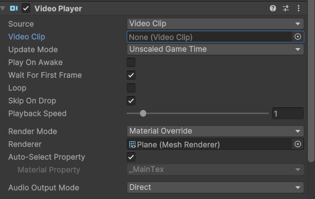
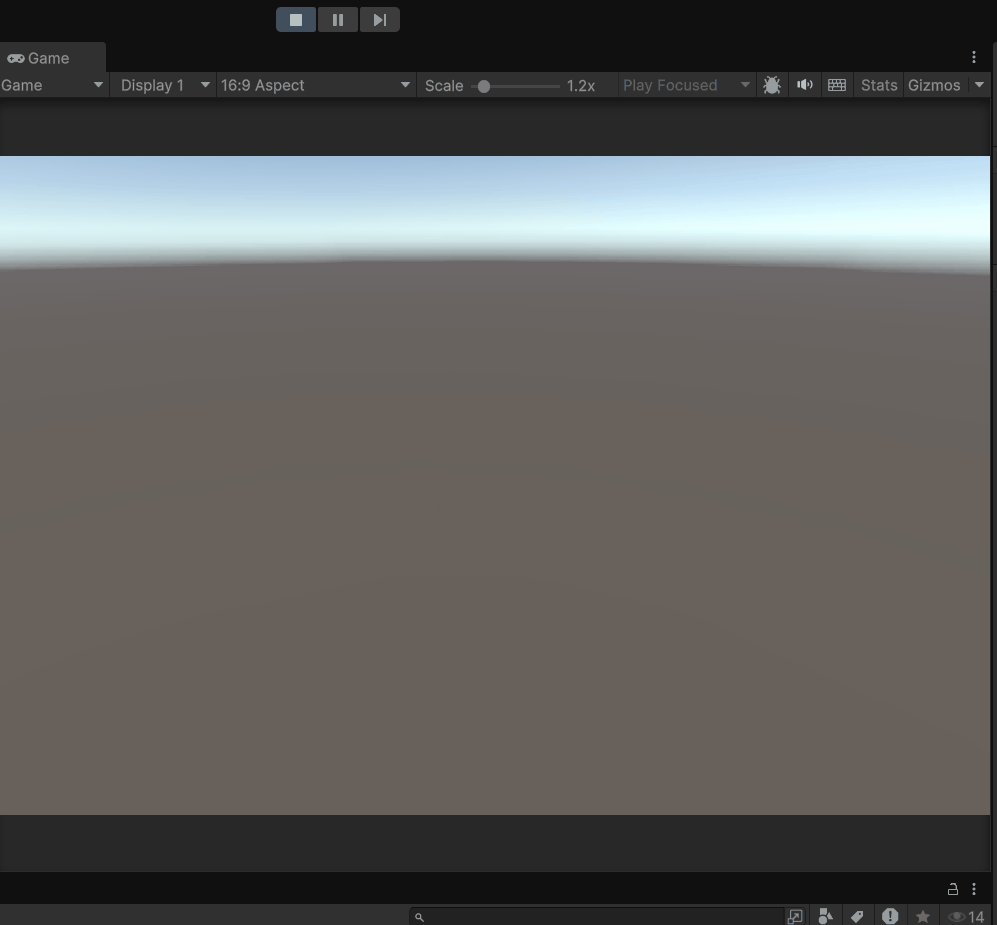
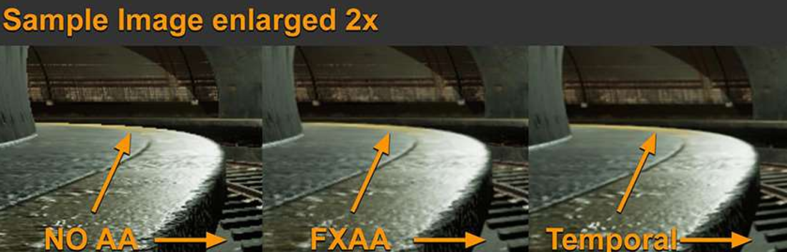
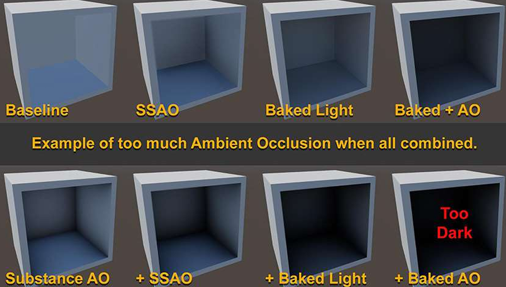
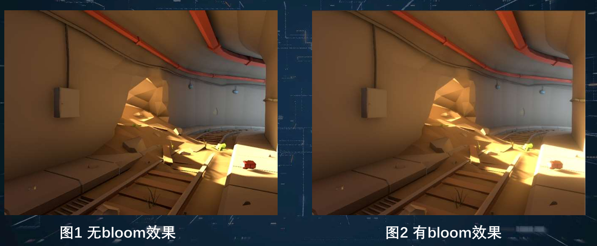
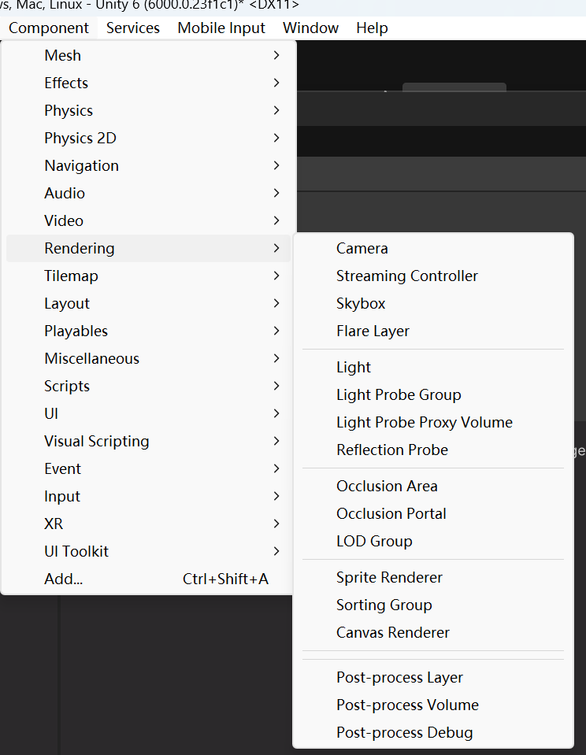
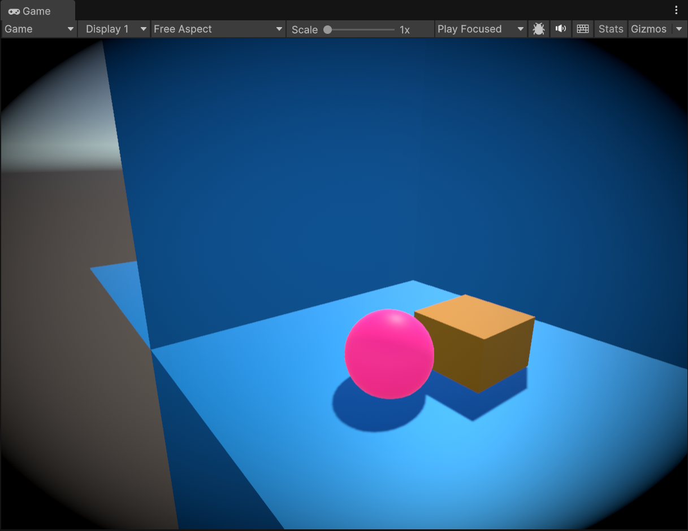
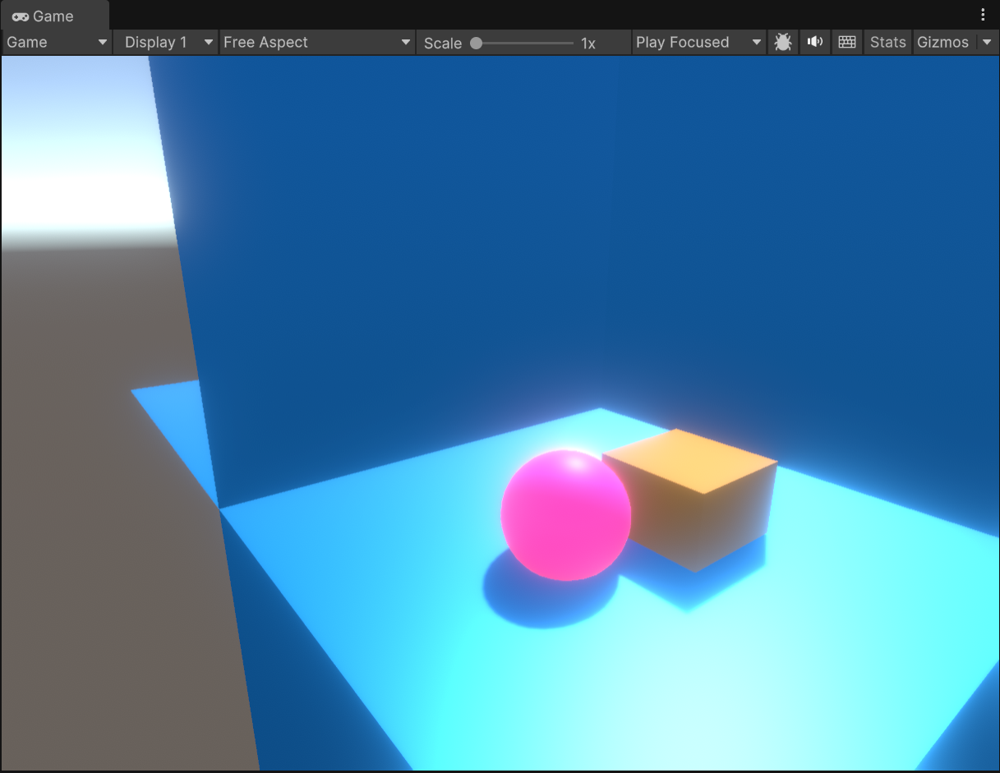
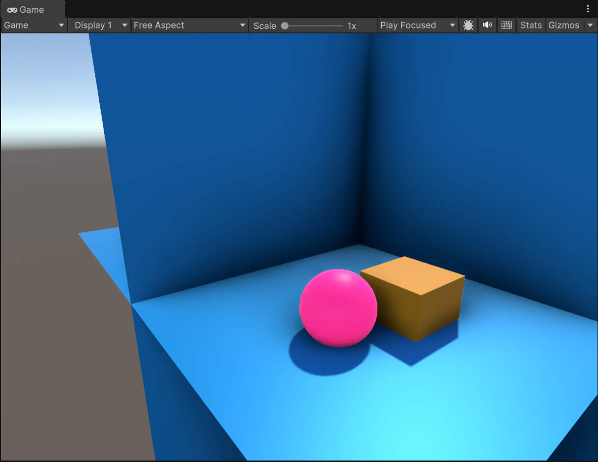

# 特效系统

使用一些特定的技术手段，来实现游戏当中想要表现的一些效果

### 4.1视频播放

#### 4.1.1在游戏中播放视频的作用

- 将视频融入到游戏场景中，使游戏场景更加丰富真实
- 可以降低渲染复杂度
- 可以使用游戏外部的视频的游戏资源

#### 4.1.2在游戏引擎中实现视频播放的原理

将视频渲染到物体表面的纹理上，包括普通纹理，摄像机的裁剪面，其他物体的纹理，渲染纹理（Render Texture）

#### 4.1.2在Unity中播放视频

在Unity中播放视频是通过Video Player组件来完成的
给想要使用其纹理播放视频的游戏对象添加Video Player组件，拖拽想要播放的视频片段到Video Clip即可。



视频默认开始时就播放，可以选择通过编写脚本的控制视频播放和暂停

```
void Update()
{
    if (Input.GetKeyDown(KeyCode.Space))
    {
        if(vp.isPlaying)
        {
            vp.Pause();
        }
        else
        {
            vp.Play();
        }
    }
}
```


### 4.2粒子系统

#### 4.2.1粒子系统的作用

粒子系统用于传统的动画或者渲染技术难以实现一些自然现象的模拟，使用大量个体来共同表现一个群体效果。
它可以用来模拟火、爆炸、烟、水流、火花、落叶、云、雾、雪、尘、流星尾迹和群体运动等。

#### 4.2.2粒子系统原理

粒子系统在三维空间中的位置与运动是由发射器控制的，而发射器由一组粒子行为参数以及空间位置所表示
粒子行为参数包括粒子生成速度（即单位时间粒子生成的数目）、粒子初始速 度向量、粒子寿命、粒子颜色，以及这些参数在粒子生命周期中的变化等（很多参数使用随机值而不是绝对值来表达）

#### 4.2.3粒子系统的更新循环

典型的粒子系统更新循环可以划分为两个不同的阶段：

- 参数更新和模拟阶段
- 渲染阶段

**参数更新和模拟阶段**

每个粒子根据发射器的位置及给定的生成区域在特定的三维空间位置生成，并且根据发射器的参数初始化每个粒子的速度、 颜色、生命周期等参数

模拟阶段，每个粒子超出生命周期就删除，否则就根据物理公式更新粒子的位置与特性

**渲染阶段**

在更新完成之后进入渲染阶段，通常每个粒子采用布告板（面向摄像机的图片）进行渲染

#### 4.2.4粒子参数

可以将粒子数据结构中的参数分为两类

-  和粒子行为相关的参数：用来建模粒子系统所模拟的动画，这些参数往往和物 理仿真相关
-  和粒子外观相关的参数：外观参数可以设定粒子的颜色、透明度、大小和纹理等信息

#### 4.2.4在Unity中使用粒子系统实现火焰效果

经验总结：粒子系统组件中有很多的参数可调节，我们应该多尝试调整参数以获取我们想要模拟的视觉效果



### 4.3后处理效果

#### 4.3.1后处理效果

所有的渲染已经完成后加入的一个图片处理过程,这个过程类似于使用Photoshop处理图片，为画面添加滤镜，不需要对场景做改变就可以提升场景表现力。

#### 4.3.2主要后处理效果的类型

- 抗锯齿Anti-aliasing：减轻由于像素化带来的锯齿问题
- 环境遮蔽Ambient occlusion (AO)：使用屏幕空间信息来获得环境遮蔽效果（描绘物体之间由于遮挡而产生的阴影）
- Bloom 辉光：现实世界中辉光的形成是由于镜头导致的光线汇聚不正确，在游戏场景中使用辉光可以赋予场景朦胧感。

#### 4.3.2在Unity中使用后处理效果

截至目前（Unity版本6000.0.23f1c1），后处理组件并不是Unity引擎的一部分，需要从Package Manager中搜索`Post Processing`进行安装，当看到Component-Rendering下拉菜单有相关后处理的组件后，表明已经安装完成



Post-process Layer需要挂在在Camera对象上，是这个摄像机渲染的画面产生后处理效果

Post-process Volume用来让用户配置更多的后处理效果，如果不勾选is global选项，则只有进入挂在它的游戏对象内的摄像机才能产生其配置后处理效果

画面暗角效果（Vignette）



辉光效果



环境光遮蔽效果

