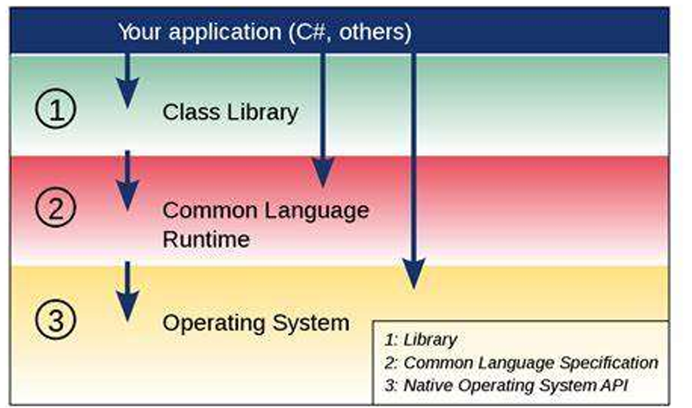
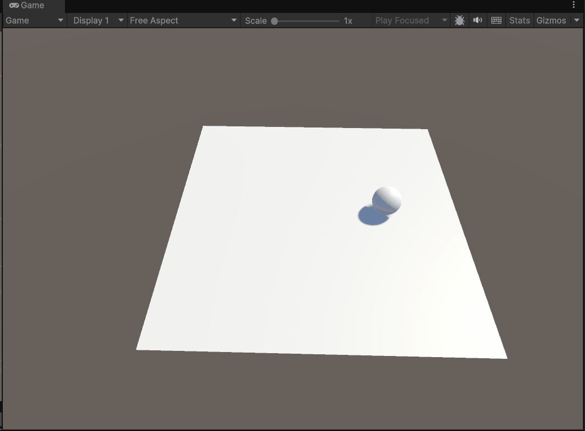
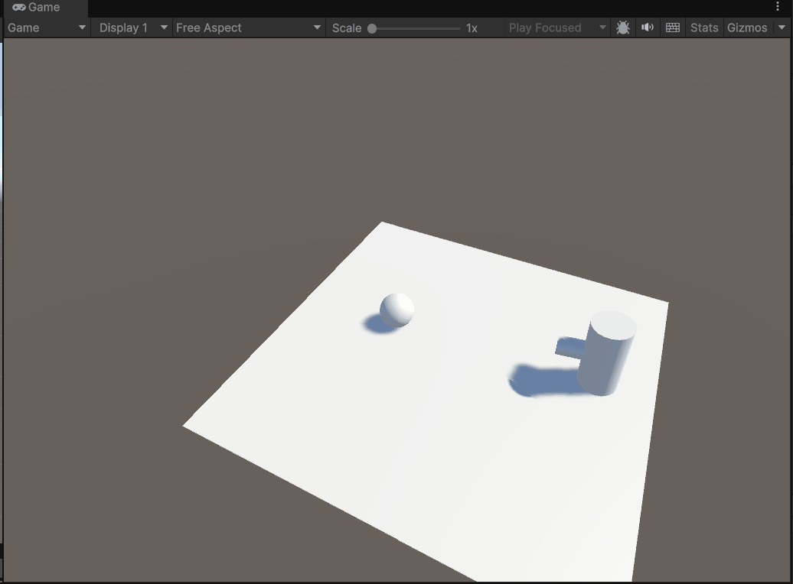
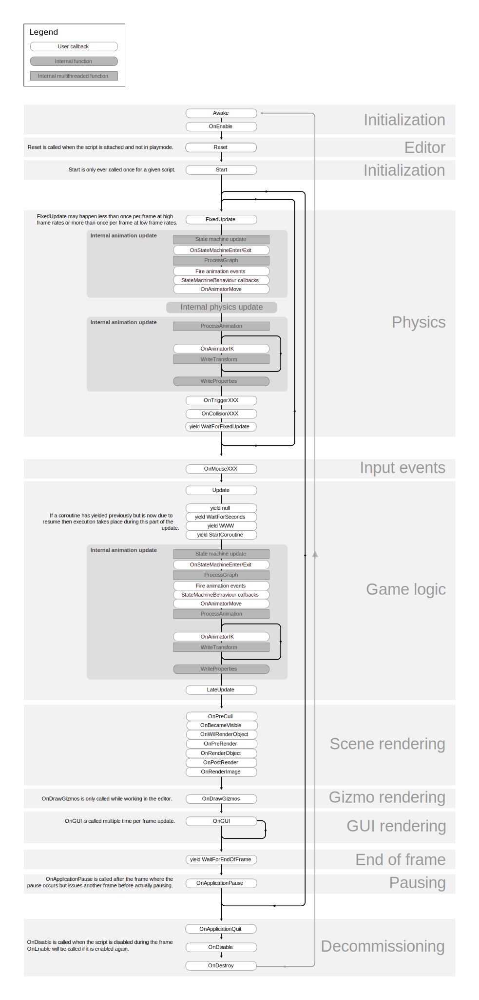
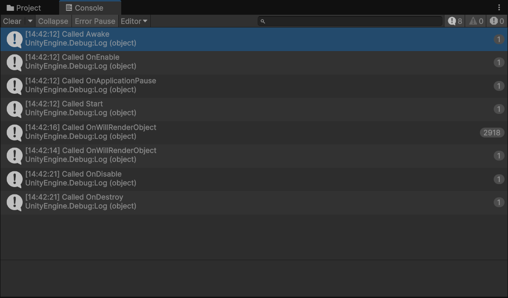
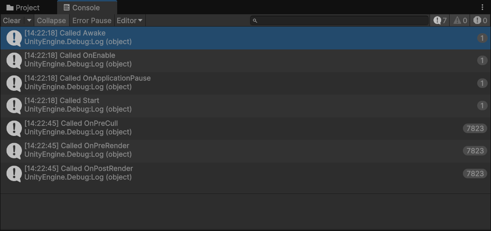
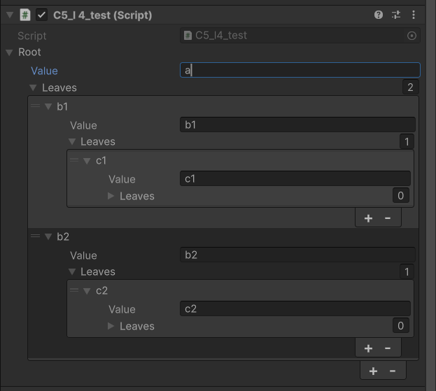
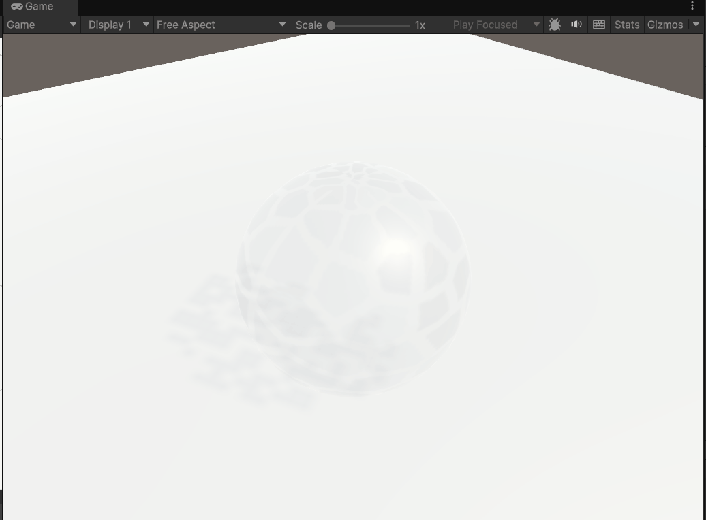

# 脚本编程

### 5.1组件和脚本

#### 脚本语言的特点

脚本语言是一种[解释型语言](https://zh.wikipedia.org/zh-cn/%E7%9B%B4%E8%AD%AF%E8%AA%9E%E8%A8%80)，它有着使用简单，语法宽松，跨平台等特性，所以很适合应用于游戏引擎当中来进行游戏逻辑的编写

Unity使用的C#脚本就运行于[Mono](https://zh.wikipedia.org/zh-cn/Mono)框架下，其最大的优点就是跨平台



#### 组件和脚本的关系

- 脚本使用代码来实现具体功能
- 组件本质上是游戏引擎已经提前写好的脚本，所以脚本作为组件挂接到游戏物体上 
- 脚本中的某些参数可以通过组件来开放给开发人员，便于可视化修改

#### 使用Unity编写一个简单的控制小球移动的脚本

```c#
// 按下w键使小球向前移动
using UnityEngine;

public class C5_test : MonoBehaviour  // 继承于MonoBehaviour基类
{
    public int speed = 60;
    void Update()
    {
        if(Input.GetKeyDown(KeyCode.W))
        {
            transform.Translate(Vector3.forward * speed * Time.deltaTime);
        }
    }
}
```



### 5.2重要的函数和类

#### Transform类

对象的位置、旋转和缩放

场景中的每个对象都有一个变换。 它用于存储和操作对象的位置、旋转和缩放。 每个变换都可以有一个父级，能够使开发人员分层应用位置、旋转和缩放。

#### 更新函数

看似连续游戏画面实则是由许多离散的帧构成，每一帧显示在屏幕上之前需要进行大量的计算，更新游戏内容，重新绘制游戏场景。

刷新率指的就是游戏的帧刷新重绘的频率，单位是Hz。

**Void Upate()**

在刷新每一帧时都会执行

在渲染和计算动画前执行

**Void FixedUpdate()**

在物理引擎更新时执行

执行频率是固定的，不同于渲染更新

给予物理体的操作可以写在这个函数里

**Void LateUpdate()**

执行次序是在上述两个Update和FixedUpdate之后

应用于需要确保需要最后更新的场合：例如要使摄像机一直朝向某一场景中的物体，需要等场景中的物体运动计算完成后再改变摄像机朝向

#### 初始化函数

**Void Awake()**

相当于类构造函数

**Void Start()**

在物体执行第一帧时被调用

#### 物理相关函数

碰撞触发相应函数

其他实现多种游戏性的函数

#### 时间类函数

**应用于按照物理公式来进行计算**

计算位移时要乘以时间，不应该直接使用基于帧的计算

#### 射线查询功能

**用于查询场景信息**

发射的光线击中的场景物体

**实现游戏的功能**

想着鼠标点击方向发射物体

**射线投射的类型**

图形式：用于UI功能实现中

物理式： 可以用于二维或者三维的物理体查寻中

#### 在Unity中使用更新和Transform类实现摄像头和物体的跟随

```C#
using UnityEngine;

public class C5_L2_Test : MonoBehaviour
{
    public GameObject target;
    public float drive_force = 10;

    void Update()
    {
        transform.LookAt(target.transform);
    }

    private void LateUpdate()
    {
        Camera.main.transform.LookAt(target.transform);
    }
}
```



### 5.3函数执行顺序

#### 了解函数执行顺序的重要性

 游戏物体之间可能存在依赖关系

程序操作可能依赖于执行先后关系

#### 函数执行顺序



#### 使用Unity引擎观察函数的调用顺序

```c#
using UnityEngine;

public class C5_l3_test : MonoBehaviour
{
    void Start()
    {
        Debug.Log("Called Start");
    }

    private void Awake()
    {
        Debug.Log("Called Awake");
    }

    private void OnEnable() //脚本首次激活时调用
    {
        Debug.Log("Called OnEnable");
    }

    private void OnApplicationPause(bool pause) // 当游戏暂停时执行
    {
        Debug.Log("Called OnApplicationPause");
    }

    private void OnPreCull() // 在摄像机剔除（Culling）操作开始之前调用
    {
        Debug.Log("Called OnPreCull");
    }
    private void OnWillRenderObject()
    {
        Debug.Log("Called OnWillRenderObject"); // 当前物体马上要被渲染时执行
    }

    private void OnPreRender() // 摄像机渲染完成前调用
    {
        Debug.Log("Called OnPreRender");
    }

    private void OnPostRender()  // 摄像机渲染完成后调用
    {
        Debug.Log("Called OnPostRender");
    }

    private void OnDestroy() // 游戏物体被销毁时
    {
        
    }

    private void OnApplicationQuit() // 游戏退出时
    {
        
    }

    private void OnDisable() // 脚本禁用时（对象失活或 enabled 设为 false）执行
    {
        
    }
}

```

当在摄像机视野中的cube挂在该脚本



当摄像机挂载该脚本



### 5.4序列化

#### 什么是序列化？

序列化是转化数据结构或者是游戏对象状态成Unity可以储存和之后重构的格式的自动化过程

Unity 的一些内置功能会使用序列化，比如保存和加载、Inspector 窗口、实例化和预制件等功能。

#### 序列化规则

**要使用字段序列化，必须确保其：**

- 为 `public`，或具有 [SerializeField](https://docs.unity.cn/cn/2020.3/ScriptReference/SerializeField.html) 属性
- 非 `static`
- 非 `const`
- 非 `readonly`
- 具有可序列化的 `fieldtype`。
- 可序列化的简单字段类型
  - 原始数据类型 (int, float, double, bool, string, etc.)
  - Enum types (32 bits或者更小)
  - Fixed-size buffers
  - Unity built-in types, for example, Vector2, Vector3, Rect, Matrix4x4, Color, AnimationCurve
  - Custom structs with the Serializable attribute
  - References to objects that derive from [UnityEngine.Object](https://docs.unity3d.com/6000.0/Documentation/ScriptReference/Object.html)
  - Custom classes with the Serializable attribute. (Refer to [Serialization of custom classes](https://docs.unity3d.com/6000.0/Documentation/Manual/script-serialization-rules.html#CustomClasses)).
  - 可序列化的简单字段类型的数组
  - 可序列化的简单字段类型的 `List<T>`

**如何确保自定义类可序列化**

确保其符合以下条件：

- 具有 [Serializable](https://docs.unity.cn/cn/2020.3/ScriptReference/Serializable.html) 属性
- 非抽象
- 非静态
- 非泛型（但可继承自泛型类）

要确保自定义类或结构的字段被序列化，请参阅上面的[如何确保脚本中的字段被序列化](https://docs.unity.cn/cn/2020.3/Manual/script-Serialization.html#FieldSerliaized1)。

[其他参见Unity手册]([Unity - Manual: Serialization rules](https://docs.unity3d.com/6000.0/Documentation/Manual/script-serialization-rules.html))

#### 尝试使用Unity编写可以被序列化的自定义类

```c#
using System;
using System.Collections.Generic;
using UnityEngine;

public class C5_l4_test : MonoBehaviour
{
    [Serializable]
    public class node
    {
        public string value;
        public List<node> leaves = new List<node>();
    }

    public node root;
}
```



### 5.5协程Coroutine

#### 协程和普通函数的区别

调用函数时。函数运行会运行可以运行到的所有部分，然后返回。这实际上意味着函数中发生的所有动作都必须在单帧更新内发生；函数的调用不能用于包含程序性动画或者随时间推移的一系列事件。

例如假设设计一个函数实现一个渐隐特效，需要逐渐减少对象的Alpha值，直至对象完全不可见。为了使淡入淡出过程可见，必须通过一系列帧降低 Alpha 以显示正在渲染的中间值。

```C#
void Fade()
{
    Color c = renderer.material.color;
    for (float alpha = 1f; alpha >= 0; alpha -= 0.1f)
    {
        c.a = alpha;
        renderer.material.color = c;
    }
}
```

就目前而言，Fade 函数不会产生期望的效果。但是，该函数将完全在单个帧更新中执行。这种情况下，永远不会看到中间值，对象会立即消失。

可以通过向 Update 函数添加代码（此代码逐帧执行淡入淡出）来处理此类情况。但是，使用协程来执行此类任务通常会更方便。

#### 使用协程

协程就像一个函数，能够暂停执行并将控制权返还给 Unity，然后在下一帧继续执行，类似于Python语言中的生成器。在 C# 中，声明协程的方式如下：

```C#
IEnumerator Fade()
{
    Color c = renderer.material.color;
    for (float alpha = 1f; alpha >= 0; alpha -= 0.1f)
    {
        c.a = alpha;
        renderer.material.color = c;
        yield return null;
    }
}
```

此协程本质上是一个用返回类型 IEnumerator 声明的函数，并在主体中的某个位置包含 yield return 语句。yield return null 行是暂停执行并随后在下一帧恢复的点。要将协程设置为运行状态，必须使用 [StartCoroutine](https://docs.unity.cn/cn/2021.1/ScriptReference/MonoBehaviour.StartCoroutine.html) 函数：

```
StartCoroutine(Fade());
```

 Fade 函数中的循环计数器能够在协程的生命周期内保持正确值。实际上，在 yield 语句之间可以正确保留任何变量或参数。

默认情况下，协程将在执行 yield 后的帧上恢复，但也可以使用 [WaitForSeconds](https://docs.unity.cn/cn/2021.1/ScriptReference/WaitForSeconds.html) 来引入时间延迟：

```C#
IEnumerator Fade()
{
    Color c = renderer.material.color;
    for (float alpha = 1f; alpha >= 0; alpha -= 0.1f)
    {
        c.a = alpha;
        renderer.material.color = c;
        yield return new WaitForSeconds(0.1f);
    }
}
```

实现效果如下



要停止协程可以使用 [StopCoroutine](https://docs.unity.cn/cn/2021.1/ScriptReference/MonoBehaviour.StopCoroutine.html) 和 [StopAllCoroutines](https://docs.unity.cn/cn/2021.1/ScriptReference/MonoBehaviour.StopAllCoroutines.html)

```
StopCoroutine(Fade());
// 或者
StopAllCoroutines();
```

### 5.6预制件Prefab

#### 预制件

Unity 的**预制件**系统允许创建、配置和存储游戏对象及其所有组件、属性值和子游戏对象作为可重用资源。

预制件资源充当模板，在此模板的基础之上可以在场景中创建新的预制件实例。

对预制件资源所做的任何编辑都会自动反映在该预制件的实例中，因此可以轻松地对整个项目进行广泛的更改，而无需对资源的每个副本重复进行相同的编辑。

#### 使用预制件的一些常见示例

- 环境资源 - 例如，在一个关卡附近多次使用的某种树（如上面的截屏所示）。
- 非玩家角色 (NPC) - 例如，某种类型的机器人可能会在游戏的多个关卡之间多次出现。它们的移动速度或声音可能不同（使用*覆盖*）。
- 飞弹 - 例如，海盗的大炮可能会在每次射击时实例化炮弹预制件。
- 玩家主角 - 玩家预制件可能被放置在游戏每个关卡（不同场景）的起点。

#### 在Unity引擎中使用预制件

将设置好的游戏对象拖到项目页面的资产文件夹里，该游戏对象会自动变为预制件