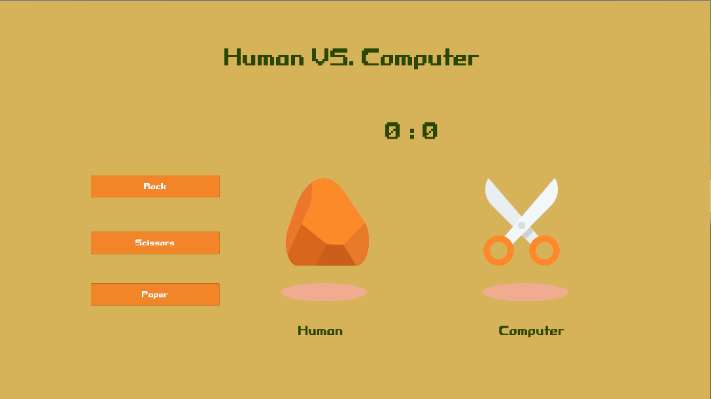

# 用户界面 User  Interface

### 6.1控件

#### WIMP模式

 WIMP是图形界面计算机所采用的标准，最早由美国施乐公司发明，它奠定了视窗操作系统的基础：如微软的Windows和苹果的Mac OS

 WIMP是由“视窗”（Window）、“图标”（Icon）、“菜单”（Menu）以及“指针”（Pointer）所组成的缩写， 其命名方式也指明了它所依赖的四大互动元件

#### 游戏图形用户界面中常用的控件

- Text: 用于显示文字
- Button: 按钮控件，用于接收用户“按下”操作
- Toggle: 开关，决定用户选择与否
- DropDown: 下拉式菜单选择空间
- Slider: 滑动条，适用于控制一些连续数值的场合

#### 控件布局

需要考虑适配不同设备的屏幕，以及保证功能性和美观性

在Unity中可以通过调整游戏对象锚点相对于UI画布的固定方式和距离来实现适配不同设备的屏幕


同时也可以在Canvas游戏对象的Canvas Scaler组件中调整目标分辨率和画布缩放方式


#### 在Unity中体验使用UI控件


### 6.2界面功能的实现

#### 控件与其相应的功能

**文字输入区**

用来接收用户输入，可以读取到用户输入的文字，用户输入结束也会触发相应的消息


**按钮**

主要是实现点击功能，点击按钮会触发特定的事件


**开关**

用于用户是否选定该选项，用户选择的话，对应的数值会改变

可以构造一组开关，实现单选功能


**下拉菜单**

主要是实现用户选择下拉菜单项功能，选定特定的菜单项会导致特定数值变化


**滑动条**

主要是实现用户滑动滑块功能，滑动滑块会导致特定数值的改变


#### 使用Unity引擎中的界面控件制作一个“石头剪刀布”小游戏

“石头剪刀布”小游戏的游戏逻辑脚本如下

```c#
using UnityEngine;
using UnityEngine.UI;
public class RockScissorsPaper : MonoBehaviour
{
    // The needed Sprites 
    public Sprite rock;
    public Sprite scissors;
    public Sprite paper;
    
    int human_score; // Using to store human score
    int computer_score; // Using to store Computer score
    public Text score_board; // Using to show scores on canvas
    
    // The two Image instances showing the call of player and computers 
    public Image image;
    public Image computer_image;

    // three methods representing the call of player should be bound to buttons 
    public void call_rock()
    {
        round(1);
    }

    public void call_scissors()
    {
        round(2);
    }
    public void call_paper()
    {
        round(3);
    }
    
    // The main logic of the game
    private void round(int i)
    {
        int computer_call = Random.Range(1,4);
        Debug.Log(computer_call.ToString() + "and" + i.ToString());
        number2img(i, image);
        number2img(computer_call, computer_image);
        if(i == 1)
        {
            if(computer_call == 2)
                human_score++;
            if(computer_call == 3)
                computer_score++;
        }
        else if(i == 2)
        {
            if(computer_call == 3)
                human_score++;
            if(computer_call == 1)
                computer_score++;
        }
        else if(i == 3)
        {
            if(computer_call == 1)
                human_score++;
            if(computer_call == 2)
                computer_score++;
        }
        score_board.text = human_score.ToString() + ":" + computer_score.ToString();
    }

    // modify sprite of Input Image instance by number
    private void number2img(int i, Image image)
    {
        if(i == 1)
        {
            image.sprite = rock;
        }
        else if(i == 2)
        {
            image.sprite = scissors;
        }
        else if(i == 3)
        {
            image.sprite = paper;
        }
    }
}
```

实现效果



### 6.3界面美化

#### 游戏界面的设计原则

游戏界面应该简洁明快、布局合理、易于使用、美观大方，并且应该贴合游戏的美术风格及游戏故事背景。

**提高自然性和效率性**

- 当界面设计具有效率性时，玩家在熟练操作后，会凝神于思考和选择，从而忘记界面的存在
- 图标和按钮的图形要易于识别，大小适中而且排列有序
- 图标的造型语义要一目了然
  - 例如，垃圾桶代表删除，摩擦条代表可以拖动，把手代表可以旋转， 斜十字代表可以关闭
- 增加快捷键可以大幅度提高玩家的操作效率


**保持玩家的沉浸**

- 包括减少无关的联想、干扰和打断
- 菜单、按钮和图标的设计需要避免出现提示现实世界的形象
  - 尽量与软件、操作系统、知名网站等拉开距离
  - 否则玩家就会联想到与游戏无关的事物，影响沉浸的深入。
- 游戏中弹出的菜单会打断玩家
  - 最好将其融于游戏情景之中，比如，“The Sims”（虚拟人生）中的邮件菜单激活之后，在角色头像四周出现各种选项，十分类似于凝神思考时的自我体验


**减少界面的存在**

- 利用场景本身来传递信息
  - 例如人物的表情、动作，物品的状态、反馈等
- 如果界面的出现不可避免，则需要尽量隐藏和弱化
  - 在FPS、A-AVG等第一人称视角的游戏中，界面一般被设计成透明色，这样游戏界面不会干扰到主观视角，而且保留了必要的信息


**保持一致的风格**

- 界面与游戏风格保持一致有助于增加佯信度
  - 例如，在“帝国时代”游戏中，如果玩家选择不同的民族， 界面的装饰纹样会随之变化。而且每个民族的开场音乐都极具地域特色，游戏人物也只讲本民族的语言 
  - 在“星际争霸”游戏中，也有类似的设计。这些设计都加深 了游戏的佯信基础


#### 在Unity游戏引擎中使用组件来美化界面

**Layout Group组件**

 布局组件，有水平、垂直和网格三种，可以根据设置自动调整子物体的排布和尺寸。


例如：在画面中心排列一个3*3的方形按钮矩阵

添加组件前


添加组件并调整参数后


**Content Size Fitter组件**

内容尺寸适应器，可以自动调节UI大小以适配其内容大小


例如：对于Text，就可以使文本框的大小随着文字内容的大小动态变化

添加组件前


添加组件后


**Outline组件**

轮廓组件为图形组件（如文本或图像）添加简单的轮廓效果。必须与图形组件位于同一游戏对象上。


例如：给文字添加描边，似乎对于字号较大的字效果并不明显

