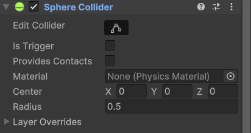
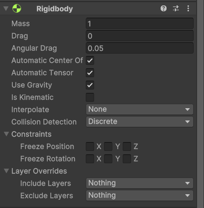
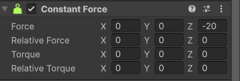
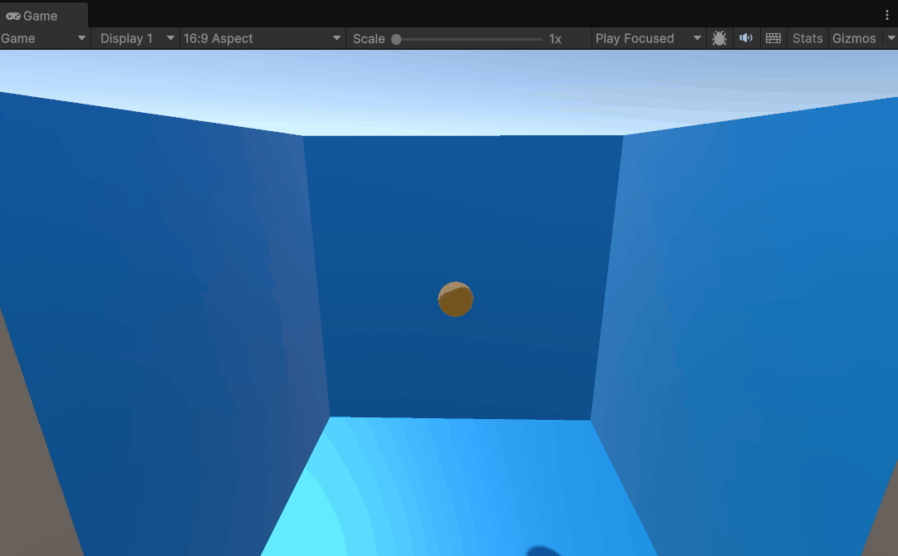
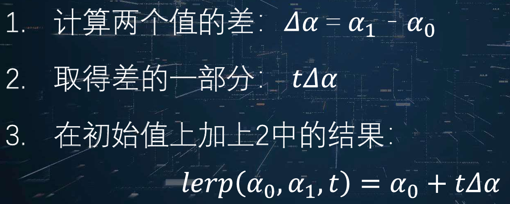
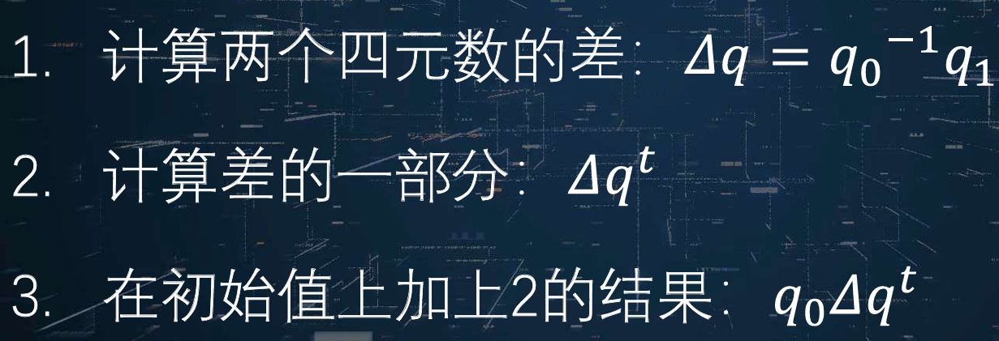
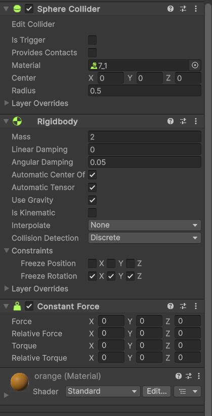
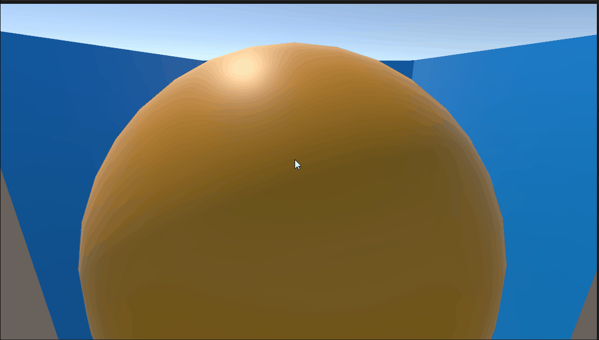

# 物理系统

### 7.1物理引擎基础

[什么是物理引擎？](https://zh.wikipedia.org/wiki/%E7%89%A9%E7%90%86%E5%BC%95%E6%93%8E)

#### 为什么需要物理引擎？

1.物理引擎可以使虚拟的游戏场景中的物体的运动符合真实世界的物理定律，从而使游戏画面变得更真实

2.物理引擎可以为需要进行物理运算的物理赋予一定的物理属性，在游戏运行阶段使用物理学公式计算物体的运动状态

3.物理引擎常用于计算刚体运动（[什么是刚体？](https://zh.wikipedia.org/wiki/%E5%88%9A%E4%BD%93)），很多物理引擎也支持非刚性体（如流体，柔体）的运动计算

4.物理引擎也可以计算由链接结构组成的复杂机械装置

**5.早期“简化”的物理引擎的缺点**

有些游戏并没有使用“物理引擎”，但物体仍具备交互反应，比如游戏中有一个易拉罐道具，当玩家碰到后，易拉罐会倒向一边。早期这种效果通常通过预置的脚本行为来实现： 判断玩家角色和易拉罐发生碰撞，易拉罐按照设计好的脚本做规定的动作。但是这种计算方式存在问题：易拉罐的动作是一成不变或者只有几种行为可供选择，无法按照所处的游戏环境做出物理真实的运动。

当引入真正的物理引擎后：当玩家碰到易拉罐以后，物理引擎会按照玩家的动量、易拉罐的质量、地面和易拉罐的摩擦力等物理属性计算易拉罐的运动。易拉罐可能仅仅是发生晃动，也可能被撞到很远的地方， 遇到墙壁还会反弹回来。相较于第一种简易的算法，使用物理引擎明显可以时游戏画面变得真实和丰富。

#### 物理引擎的主要功能

- 各种力的支持：比如重力、摩擦力、动力和浮力等
- 基本的物理体物理计算的支持
  - 简单的几何形体，比如长方体、球、圆柱和平面等
  - 三维网格模型，可以用简单几何体作为包围体来代替模型，也可以直接计算（一般计算量较大，适用于静态物体）
- 物体间的碰撞检测
  - 可以采用包围体的简单计算方式，也可以采用三维网格的精确碰撞（一般计算量较大，适用于静态物体）
  - CCD(连续碰撞检测)可以提供更高精度的碰撞响应
- 碰撞反应
  - 碰撞之后，物理引擎能够根据 碰撞发生的具体情况，按照物理规律计算物体的碰撞反应： 物体可能反弹，或者被破坏，或者发生由开发者自定义的效果
- 粒子系统的实现
  - 粒子系统的计算过程就是物理仿真的过程， 使用物理引擎可以较容易地实现粒子特效
- 其他功能
  - 如使用刚体以及刚体链接关系实现 布娃娃系统
  - 布料、可变性物体及可破坏物体等的计算

#### 在Unity游戏引擎中使用物理引擎

**与物理引擎相关的组件**

碰撞体组件



刚体组件



恒力组件



**使一个小球像现实世界一样动起来**

自由落体运动



给小球施加一个沿全局坐标系Z轴的恒力


### 7.2典型物理效果模拟

#### 欧拉角和旋转

[欧拉角的定义](https://zh.wikipedia.org/wiki/%E6%AC%A7%E6%8B%89%E8%A7%92)

欧拉角常用于表示三维物体的旋转


#### 四元数

单位[四元数](https://zh.wikipedia.org/wiki/四元數)，又称**欧拉参数**，提供另外一种方法来表述三维旋转。四元数方法用在大多数的演算会比较快捷，概念上比较容易理解，并能避免一些技术上的问题，如[万向锁](https://zh.wikipedia.org/wiki/萬向鎖)现象。因为这些原因，许多高速度三维图形程式制作都使用四元数。

使用四元数表示旋转的一个最大好处就是可以实现SLERP插值（spherical linear interpolation，球面线性插值）

**SLERP插值的原理**

普通线性插值的计算方法：



四元数中的球面线性插值:



**四元数在游戏中的应用**

四元数方法用在大多数的演算会比较快捷，并能避免欧拉角自锁现象，所以四元数常用来用来替代欧拉角来参与旋转计算。但是因为欧拉角表示旋转更加直接，所以游戏中仍然常用欧拉角表示旋转

### 在Unity引擎中实现一个典型的物理效果

实现朝着鼠标点击方向发射小球的小果

将下面的脚本挂载在相机上

```c#
using UnityEngine;

public class BallFire : MonoBehaviour
{
    public GameObject ball;
    float pressed_time = 0f;
    void Update()
    {
        Debug.Log("ok");
        if(Input.GetButton("Fire1"))
        {
            pressed_time = pressed_time + Time.deltaTime;
        }
        if(Input.GetButtonUp("Fire1"))
        {
            Ray ray = Camera.main.ScreenPointToRay(Input.mousePosition);
            GameObject new_ball = Instantiate(ball, ray.origin, Quaternion.LookRotation(ray.direction));
            new_ball.GetComponent<ConstantForce>().relativeForce = new Vector3(0,0,pressed_time * 100);
            pressed_time = 0;
        }
    }
}
```

新建一个挂载着刚体组件和恒力组件的小球预制件，并将其传给脚本开放的GameObject ball



实现效果如下：

