### 7.1物理引擎基础

[什么是物理引擎？](https://zh.wikipedia.org/wiki/%E7%89%A9%E7%90%86%E5%BC%95%E6%93%8E)

#### 为什么需要物理引擎？

1.物理引擎可以使虚拟的游戏场景中的物体的运动符合真实世界的物理定律，从而使游戏画面变得更真实

2.物理引擎可以为需要进行物理运算的物理赋予一定的物理属性，在游戏运行阶段使用物理学公式计算物体的运动状态

3.物理引擎常用于计算刚体运动（[什么是刚体？](https://zh.wikipedia.org/wiki/%E5%88%9A%E4%BD%93)），很多物理引擎也支持非刚性体（如流体，柔体）的运动计算

4.物理引擎也可以计算由链接结构组成的复杂机械装置

**5.早期“简化”的物理引擎的缺点**

有些游戏并没有使用“物理引擎”，但物体仍具备交互反应，比如游戏中有一个易拉罐道具，当玩家碰到后，易拉罐会倒向一边。早期这种效果通常通过预置的脚本行为来实现： 判断玩家角色和易拉罐发生碰撞，易拉罐按照设计好的脚本做规定的动作。但是这种计算方式存在问题：易拉罐的动作是一成不变或者只有几种行为可供选择，无法按照所处的游戏环境做出物理真实的运动。

当引入真正的物理引擎后：当玩家碰到易拉罐以后，物理引擎会按照玩家的动量、易拉罐的质量、地面和易拉罐的摩擦力等物理属性计算易拉罐的运动。易拉罐可能仅仅是发生晃动，也可能被撞到很远的地方， 遇到墙壁还会反弹回来。相较于第一种简易的算法，使用物理引擎明显可以时游戏画面变得真实和丰富。

#### 物理引擎的主要功能

- 各种力的支持：比如重力、摩擦力、动力和浮力等
- 基本的物理体物理计算的支持
  - 简单的几何形体，比如长方体、球、圆柱和平面等
  - 三维网格模型，可以用简单几何体作为包围体来代替模型，也可以直接计算（一般计算量较大，适用于静态物体）
- 物体间的碰撞检测
  - 可以采用包围体的简单计算方式，也可以采用三维网格的精确碰撞（一般计算量较大，适用于静态物体）
  - CCD(连续碰撞检测)可以提供更高精度的碰撞响应
- 碰撞反应
  - 碰撞之后，物理引擎能够根据 碰撞发生的具体情况，按照物理规律计算物体的碰撞反应： 物体可能反弹，或者被破坏，或者发生由开发者自定义的效果
- 粒子系统的实现
  - 粒子系统的计算过程就是物理仿真的过程， 使用物理引擎可以较容易地实现粒子特效
- 其他功能
  - 如使用刚体以及刚体链接关系实现 布娃娃系统
  - 布料、可变性物体及可破坏物体等的计算

#### 在Unity游戏引擎中使用物理引擎

**与物理引擎相关的组件**

碰撞体组件


刚体组件


恒力组件


**使一个小球像现实世界一样动起来**

自由落体运动


给小球施加一个沿全局坐标系Z轴的恒力


### 7.2典型物理效果模拟

#### 欧拉角和旋转

[欧拉角的定义](https://zh.wikipedia.org/wiki/%E6%AC%A7%E6%8B%89%E8%A7%92)

欧拉角常用于表示三维物体的旋转


#### 四元数

单位[四元数](https://zh.wikipedia.org/wiki/四元數)，又称**欧拉参数**，提供另外一种方法来表述三维旋转。四元数方法用在大多数的演算会比较快捷，概念上比较容易理解，并能避免一些技术上的问题，如[万向锁](https://zh.wikipedia.org/wiki/萬向鎖)现象。因为这些原因，许多高速度三维图形程式制作都使用四元数。

使用四元数表示旋转的一个最大好处就是可以实现SLERP插值（spherical linear interpolation，球面线性插值）

**SLERP插值的原理**

普通线性插值的计算方法：


四元数中的球面线性插值:


**四元数在游戏中的应用**

四元数方法用在大多数的演算会比较快捷，并能避免欧拉角自锁现象，所以四元数常用来用来替代欧拉角来参与旋转计算。但是因为欧拉角表示旋转更加直接，所以游戏中仍然常用欧拉角表示旋转

### 在Unity引擎中实现一个典型的物理效果

实现朝着鼠标点击方向发射小球的小果

将下面的脚本挂载在相机上

```c#
using UnityEngine;

public class BallFire : MonoBehaviour
{
    public GameObject ball;
    float pressed_time = 0f;
    void Update()
    {
        Debug.Log("ok");
        if(Input.GetButton("Fire1"))
        {
            pressed_time = pressed_time + Time.deltaTime;
        }
        if(Input.GetButtonUp("Fire1"))
        {
            Ray ray = Camera.main.ScreenPointToRay(Input.mousePosition);
            GameObject new_ball = Instantiate(ball, ray.origin, Quaternion.LookRotation(ray.direction));
            new_ball.GetComponent<ConstantForce>().relativeForce = new Vector3(0,0,pressed_time * 100);
            pressed_time = 0;
        }
    }
}
```

新建一个挂载着刚体组件和恒力组件的小球预制件，并将其传给脚本开放的GameObject ball


实现效果如下：


### 7.3链接结构

#### 链接结构Joint

铰链结构用来模拟现实世界中的关节结构（运动副）

**运动副**是两个机械[构件](https://zh.wikipedia.org/wiki/构件)之间通过直接接触而组成的可动连接。两个构件上参与接触而构成运动副的点、线、面等元素被称为运动副元素。

常见的链接结构有

**Character Joint 球形高副**

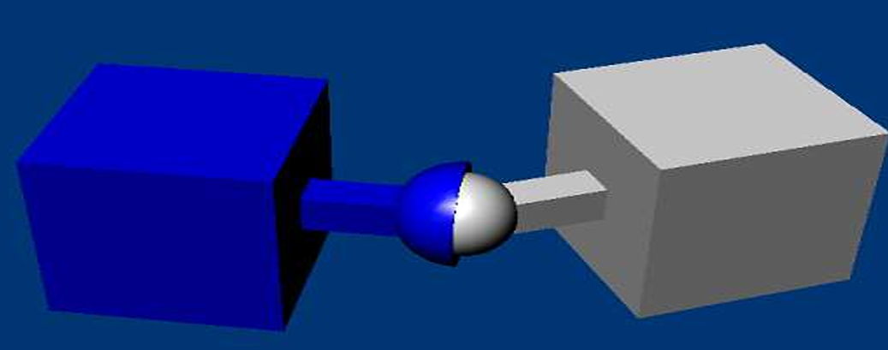

**Hinge Joint 旋转副**

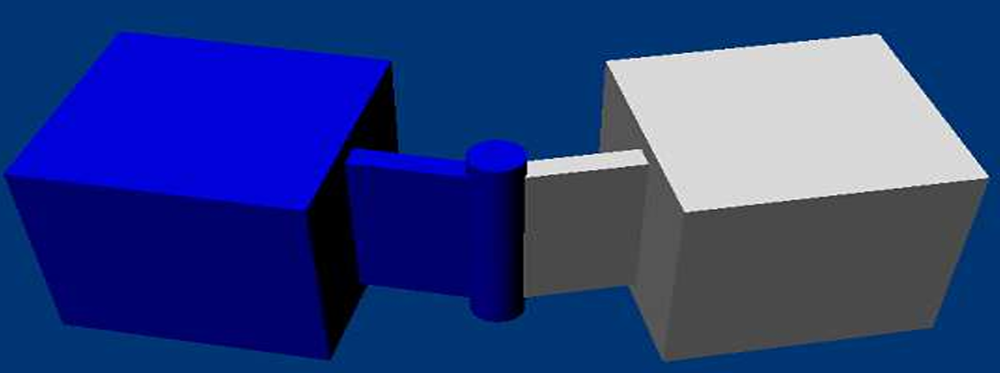

**Fixed Joint 固定关节**

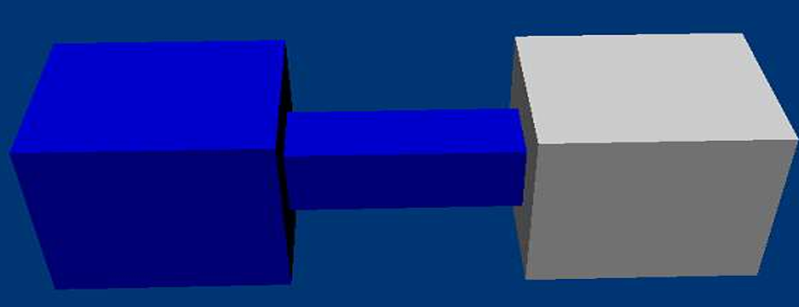

**Spring Joint 弹簧关节**

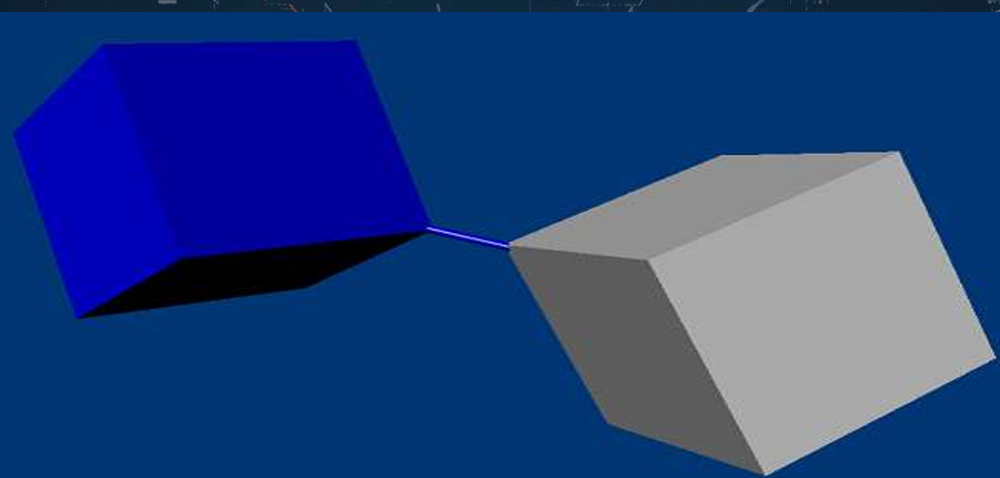

**Configurable Joint 可配置关节**

按照需要配置成需要的样式，可以用在布娃娃系统Ragdoll上

**可破坏关节**

当力或者力矩达到阈值的话，链接关系可以破坏。可破环关节可以用来实现一些游戏效果（当破坏发生时，使用触发函数）

#### 在Unity游戏引擎中演示链接结构

分别新建旋转副和弹簧关节（新建空物体，并在其上面附加一个相应的关节组件），并在各自连接一个方块的效果，如图所示

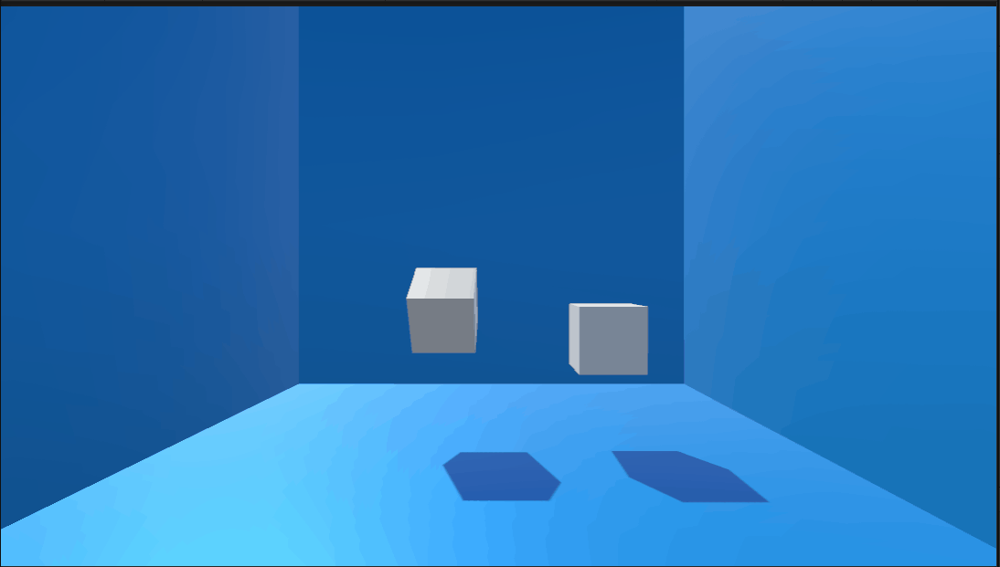

当在关节组件中设置破坏力矩或者破坏力的大小时，该关节成为**可破坏关节**

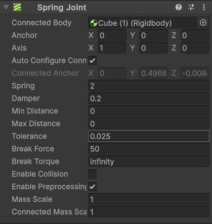

!

在关节被破坏时，系统会调用OnJointBreak这个回调函数。我们可以使用它对关节破坏事件的发生做出响应

简单在控制台打印出关节破坏的消息

```
using UnityEngine;

public class JointBreak : MonoBehaviour
{
    private void OnJointBreak(float breakForce)
    {
        Debug.Log(name + "关节已被破坏! 破坏力的大小为：" + breakForce);
        // 可以进一步根据关节破坏事件的发生做出响应
    }
}
```

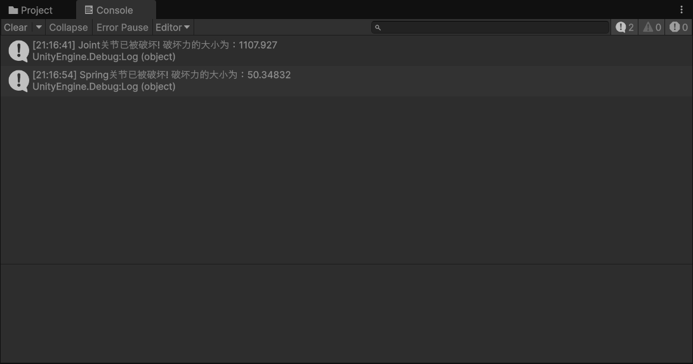

### 7.3碰撞事件

#### 碰撞事件的作用

游戏很多机制依赖于碰撞事件，如伤害判定、触发对话、人工智能、特效等。

#### 碰撞体

- 基础碰撞体

  规整的几何体，比如球、长方体、圆柱、胶囊等，可以通过基础碰撞体组合出较精确的复合碰撞体。

-  网格碰撞体

- 静态碰撞体

  应用于场景物体，不发生移动，利于做优化

#### 碰撞类型

游戏中的碰撞，有如下两种表现形式

- 碰撞体碰撞

  碰撞物体空间不能冲突，如两个球体碰撞后弹开

- 触发器碰撞

  碰撞物体空间可冲突，如某个物体落入进水池中

#### 碰撞体碰撞响应消息

碰撞检测消息响应

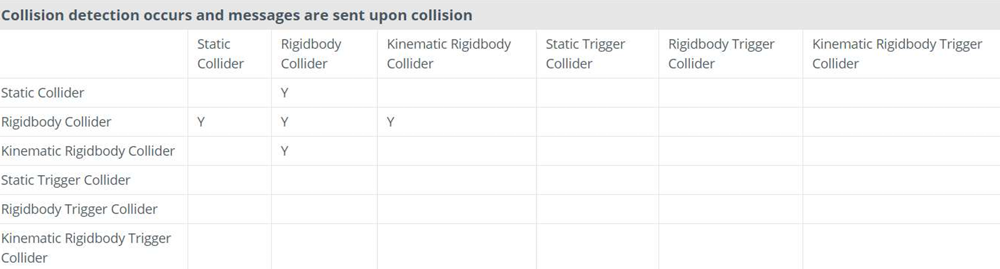

#### 触发器碰撞响应消息

触发器消息响应

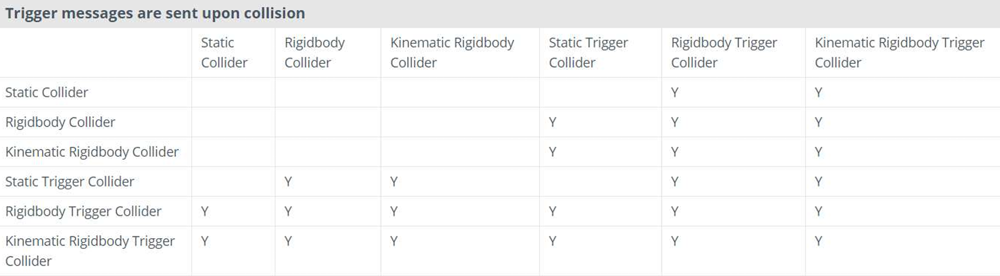

#### 在Unity游戏引擎中使用碰撞体碰撞响应函数和触发器碰撞响应函数

当带有tag为Bullet的游戏物体碰撞到挂载脚本的物体时会被销毁；当挂载脚本的物体的碰撞体组件的`Is Trigger`选项被勾选时，碰撞到挂载脚本的物体的游戏物体的重力会被取消（如果有刚体组件的话）

```c#
using UnityEngine;

public class C7_L4 : MonoBehaviour
{
    private void OnCollisionEnter(Collision collision) // 触发器碰撞响应回调函数
    {
        if(collision.gameObject.tag == "Bullet")
        {
            Destroy(collision.gameObject);
        }
    }

    private void OnTriggerEnter(Collider other) // 碰撞响应回调函数
    {
        var rb = other.GetComponent<Rigidbody>();
        if(rb != null)
        {
            rb.useGravity = false;
        }
    }
}
```

当将脚本挂载在墙壁和粉色透明方块上并勾选粉色透明方块的碰撞体组件的`Is Trigger`选项后，有Bullet标签的小球碰到粉色透明方块后失去重力，碰到墙壁后被销毁。

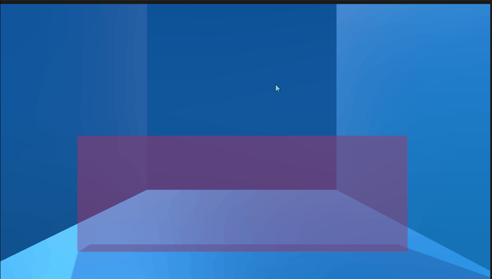

### 7.5浮力效果

#### 浮力效果的实现原理

使用触发器碰撞响应检测物体是否落入水中，当物体落入水中时，通过浮力公式计算物体受到的浮力，并施加给物体。

#### 在Unity游戏引擎中实现简单的浮力效果

我们可以根据阿基米德浮体原理来计算落入水中的物体受到的浮力
$$
F浮力=ρ流体×g×V排开流体
$$
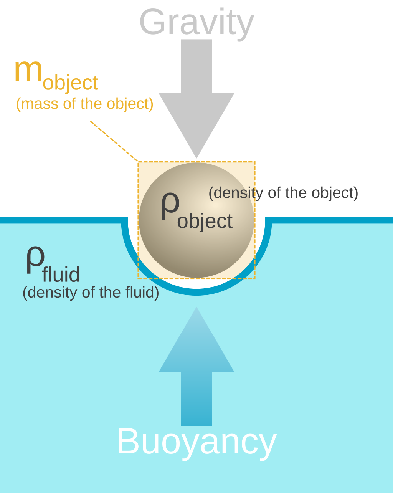

在浮力计算公式中，流体的密度和重力加速度都是已知量，排开液体的体积等于物体浸入流体的体积。因此我们可以使用触发器碰撞响应函数来检测物体是否进入水中，当物体进入水中时，计算出它浸入流体的体积，然后计算出它受到的浮力，通过恒力组件施加给物体。实现的代码如下：

需要挂载在水上的脚本

```
using UnityEngine;

public class Water : MonoBehaviour
{
    public const float density = 1f;
    private void OnTriggerEnter(Collider other)
    {
        if(other.gameObject.GetComponent<Buoyancy>())
        {
            other.gameObject.GetComponent<Buoyancy>().set_in_water(true);
        }
    }

    private void OnTriggerExit(Collider other)
    {
        if(other.gameObject.GetComponent<Buoyancy>())
        {
            other.gameObject.GetComponent<Buoyancy>().set_in_water(false);
        }
    }
}
```

需要挂载在需要施加浮力的物体上的脚本

```
using UnityEngine;

public class Buoyancy : MonoBehaviour
{
    public bool is_in_water = false;
    public float gravity = 9.8f;
    private GameObject water;
    private float water_level;
    private float water_density;

    void Start()
    {
        water = GameObject.FindGameObjectWithTag("Water");
    }

    void FixedUpdate()
    {
        if(is_in_water)
        {
            GetComponent<Rigidbody>().linearDamping = 5; // 模拟物体在水中受到的的流体阻力
            float buoyancy = cal_buoyancy(); 
            GetComponent<Rigidbody>().AddForce(0,buoyancy,0);
        }
    }

    private float cal_buoyancy()
    {
        water_level = water.transform.position.y + (water.transform.localScale.y / 2);
        water_density = Water.density;
        float volume = cal_volume_under_water(water_level);
        float buoyancy = water_density * gravity * volume;
        return buoyancy;
    }

    private float cal_volume_under_water(float water_top)
    {
        float volume;
        float h = water_top - (transform.position.y - (transform.localScale.y / 2)) > transform.localScale.y ? 
                transform.localScale.y : water_top - (transform.position.y - (transform.localScale.y / 2));
        volume = transform.localScale.x * transform.localScale.z * h;
        return volume;
    }
    
    public void set_in_water(bool in_water)
    {
        is_in_water = in_water;
    }
}
```

注意：目前使用的计算物体浸入水中的体积的方法是假设物体是轴对齐的，也就是物体的旋转不会影响体积计算。这样的计算方法适用于简单粗糙的场景。

实现效果如图：

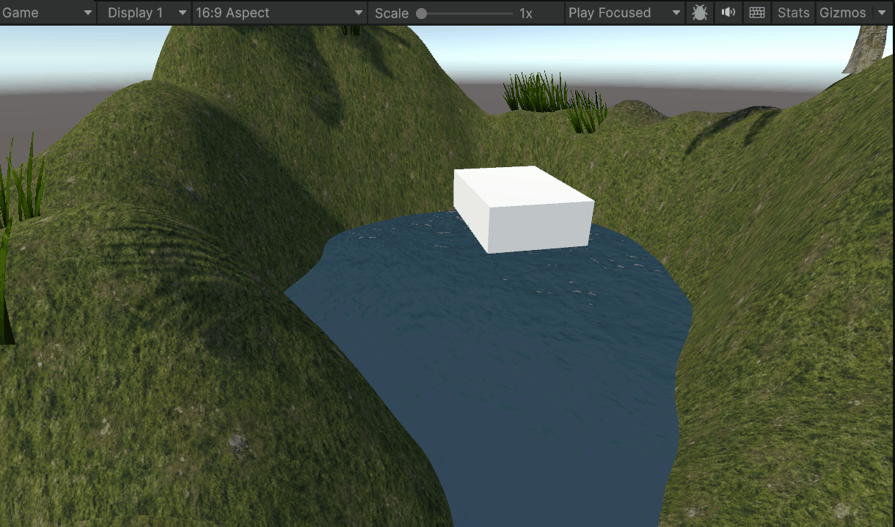