# 人工智能

### 8.1自动寻路

#### 游戏中的人工智能

在游戏中应用人工智能的目的是提升玩家的用户体验，尤其在非玩家角色（Non-Player Character，[缩写](https://zh.wikipedia.org/wiki/縮寫)：NPC）上应用比较多。

在游戏中非玩家角色的作用主要是协助玩家游戏或者是作为敌人和玩家对抗

#### 游戏中人工智能的原理

**有限状态机**

**有限状态机**（英语：finite-state machine，[缩写](https://zh.wikipedia.org/wiki/縮寫)：**FSM**）又称**有限状态自动机**（英语：finite-state automaton，[缩写](https://zh.wikipedia.org/wiki/縮寫)：**FSA**），简称**状态机**，是表示有限个[状态](https://zh.wikipedia.org/wiki/状态)以及在这些状态之间的转移和动作等行为的[数学计算模型](https://zh.wikipedia.org/wiki/计算模型_(数学))。

我们可以在游戏中为NPC添加有限状态机来实现简单的AI行为


**蒙特卡洛树搜索**

**蒙特卡洛树搜索**（英语：Monte Carlo tree search；简称：**MCTS**）是一种用于某些决策过程的[启发式](https://zh.wikipedia.org/w/index.php?title=启发式搜索&action=edit&redlink=1)[搜索算法](https://zh.wikipedia.org/wiki/搜索算法)，最引人注目的是在游戏中的使用。一个主要例子是[电脑围棋](https://zh.wikipedia.org/wiki/电脑围棋)程序[[1\]](https://zh.wikipedia.org/wiki/蒙特卡洛树搜索#cite_note-1)，它也用于其他[棋盘游戏](https://zh.wikipedia.org/wiki/棋盘游戏)、即时电子游戏以及不确定性游戏。

蒙特卡洛树搜索原理：

- 选择（Selection）：从根节点*R*开始，连续向下选择子节点至叶子节点*L*。下文将给出一种选择子节点的方法，让[游戏树](https://zh.wikipedia.org/wiki/遊戲樹)向最优的方向扩展，这是蒙特卡洛树搜索的精要所在。
- 扩展（Expansion）：除非任意一方的输赢使得游戏在L结束，否则创建一个或多个子节点并选取其中一个节点*C*。
- 仿真（Simulation）：再从节点*C*开始，用随机策略进行游戏，又称为playout或者rollout。
- 反向传播（Backpropagation）：使用随机游戏的结果，更新从*C*到*R*的路径上的节点信息。

每一个节点的内容代表*胜利次数/游戏次数*

.svg)

#### 游戏AI实践：自动寻路

自动寻路可以使NPC可以自动地在游戏世界中寻找到通路，并且如果遇到楼梯，障碍或者沟壑也可以使用不同的方式通过（如跳跃，绕行等）

下图为著名的A*算法自动寻路案例：


**与自动寻路相关的术语**

- NavMesh：描述场景中可通过区域的数据结构，可以被自动创建
- NavMesh Agent：待控制角色，在移动时可以自动躲避障碍物
- Off-Mesh Link： 可以将两个不可直接通过区域连接
- NavMesh Obstacle：可移动的障碍物，让agent能够在寻路时避开

#### 在Unity游戏引擎中使用自动寻路功能

Unity游戏引擎中自动寻路功能需要使用AI Navigation软件包，当已经安装好AI Navigation软件包时，打开Window下拉菜单可以看到AI-Navigation选项


点击该选项可以打开Navigation控制面板，在该控制面板里，我们可以调整Agent的参数和导航Areas的Name和Cost


为了实现自动寻路功能，我们需要搭建一个简单的地形，并将地型的各个组成部分都勾选Static，因为只有静态的物体才能被烘焙成导航网格

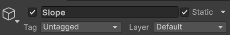

接下来我们新建一个空物体命名为NavMesh，挂载一个NavMesh Surface组件，点击Bake烘焙导航网格。注意：为了保证导航网格表面贴合游戏场景，此物体位置不应该被改变。（或者直接在组成地形的某一个游戏物体上挂载NavMesh Surface组件）

蓝色区域是Agent可以到达的区域，可以在Navigation控制面板调整Agent的参数来控制此区域的大小，形状等性质


接着我们新建一个游戏对象，挂载Nav Mesh Agent组件，作为将要被导航移动的游戏角色。在这里我们新建一个C#脚本，使玩家可以鼠标点击来导航游戏角色到达鼠标点击方向射线与地形相交的位置

```C#
using UnityEngine;
using UnityEngine.AI;

public class C8_L1 : MonoBehaviour
{
    private NavMeshAgent agent;
    void Start()
    {
        agent = GetComponent<NavMeshAgent>();
    }

    void Update()
    {
        if(Input.GetMouseButtonDown(0))
        {
            RaycastHit hit;
            if(Physics.Raycast(Camera.main.ScreenPointToRay(Input.mousePosition), out hit, 100))
            {
                agent.destination = hit.point;
            }
        }
    }
}
```

实现效果如下：


我们可以观察到平台上有蓝色的区域，意味着那里是可以到达的，但是那块区域与游戏角色所在的区域并不连接，这时我们还可以使用NavMesh Link组件来使用导航网格的两个位置（或者两个不同的导航网格表面）之间创建可导航的链接。有点类似与在两个位置搭建起一座桥梁。


添加可导航的链接前：


添加可导航的链接后：


当物体没有被烘焙成导航网格表面时，Agent会直接无视并直接穿过它们。如果需要在游戏场景中添加动态的障碍，需要在作为障碍的物体上添加Nav Mesh Obstacle组件


为物体上添加Nav Mesh Obstacle组件前：


为物体上添加Nav Mesh Obstacle组件后：


### 8.2巡逻

接下来的部分，我们尝试使用有限状态机来描述一个AI敌人


#### NPC巡逻的原理

在有些游戏场景中，我们需要让某些NPC沿着特定的路线重复运动，即巡逻

我们构造由一系列关键点组成的巡逻路径，然后使用自动寻路方式，让NPC移向目标点，到达目标点后，将目标点设置为下一个关键点，如此循环下去。

#### 在Unity游戏引擎中实现巡逻功能

实现的具体思路是在游戏场景中建造一组空物体作为巡逻路径的标记点，编写一个脚本读入这些标记点的顺序和位置，使用上一节课学习的自动寻路功能按顺序前往标记点，并当到达最后一个标记点后，更改下一个目的地为第一个标记点，如此循环下去。

```c#
using UnityEngine;
using UnityEngine.AI;

public class C8_L2 : MonoBehaviour
{
    public float patrol_speed = 2f;
    public float patrol_wait_time = 1f;
    public Transform patro_way_points;
    private NavMeshAgent agent;
    private float patro_timer;
    private int wat_point_index;
    void Start()
    {
        agent = GetComponent<NavMeshAgent>();
    }

    void Update()
    {
        Patrol();
    }

    private void Patrol()
    {
        agent.isStopped = false;
        agent.speed = patrol_speed;

        // 当游戏对象到达指定标记点
        if(agent.remainingDistance <=  agent.stoppingDistance)
        {
            patro_timer = patro_timer + Time.deltaTime;

            // 当游戏对象在标记点停留足够的时间后
            if(patro_timer >= patrol_wait_time)
            {
                if(wat_point_index == patro_way_points.childCount - 1)
                {
                    wat_point_index = 0;
                }
                else
                {
                    wat_point_index++; // 选择下一个标记点作为目的地
                }
                patro_timer = 0;
            }
        }

        agent.destination = patro_way_points.GetChild(wat_point_index).position;
    } 
}
```

实现效果：


相比与简单编写脚本让物体在四个点之间来回运动，使用自动寻路功能的巡逻物体可以躲避静态或者动态的障碍物：


### 8.3视野

#### NPC视野的原理

游戏中的NPC其实是没有像真正的人类一样的视觉，但是我们可以使用游戏引擎的组件和数学方法模拟NPC是否“看”到玩家角色

其中一种实现原理就是在NPC身上绑定一个作为Trigger的碰撞体。当玩家进入这个碰撞体时，NPC可以通过触发器碰撞响应消息获知玩家角色的存在，从而看到玩家角色。因为人的视野范围是有限的，为了使NPC行为更加真实，我们还需要使用利用数学方法计算玩家相对于NPC视线的偏离角度，以及两者之间是否有障碍物，从而判断NPC是否能“看”到玩家角色。

#### 在Unity游戏引擎中让NPC拥有视野

实现的脚本如下，注意：为了使玩家角色进入NPC视野时可以触发触发器碰撞，并调用相应的响应消息函数，玩家角色需要要挂载刚体组件，并勾选IsKinematic选项

```c#
using UnityEngine;

public class C8_L3 : MonoBehaviour
{
    public float field_of_view_angle = 90f;
    private bool play_in_sight = false;
    private Vector3 player_pos_last;
    public static Vector3 reset_pos = Vector3.back;
    BoxCollider boxCollider;
    GameObject player;
    // Start is called once before the first execution of Update after the MonoBehaviour is created
    void Start()
    {
        boxCollider = GetComponent<BoxCollider>();
        player = GameObject.FindGameObjectWithTag("Player");
        player_pos_last = reset_pos;
    }

    private void OnTriggerStay(Collider other)
    {
        if(other.gameObject == player)
        {
            Vector3 dirction = other.transform.position - transform.position;
            float angle = Vector3.Angle(dirction, transform.forward);
            // Debug.Log("angle" + angle.ToString());
            if(angle < field_of_view_angle * 0.5f)
            {
                RaycastHit hit;
                if(Physics.Raycast(transform.position, dirction.normalized, out hit, boxCollider.size.z))
                {
                    if(hit.collider.gameObject == player)
                    {
                        Debug.Log("I have seen you! Hahaha!");
                        play_in_sight = true;
                        player_pos_last = player.transform.position;
                    }
                }
            }
        }
    }

    private void OnTriggerExit(Collider other)
    {
        if(other.gameObject == player)
        {
            play_in_sight = false;
        }
    }
}
```

实现效果如下：


### 8.4自动攻击

#### 攻击状态

当敌人和玩家距离足够近触发攻击状态

攻击状态也可以有很多的子状态：如选择不同的攻击方式，根据玩家的反应来决定敌人的行为（躲避，退后等）

#### 在Unity游戏引擎中实现敌人自动攻击

我们在之前写的NPC巡逻的脚本上增加射击函数，当玩家在视野中时就转向玩家发射子弹，当玩家在视野外时就继续巡逻。这是修改后的挂载在敌人游戏对象上的脚本

```c#
using UnityEngine;
using UnityEngine.AI;

public class C8_L2 : MonoBehaviour
{
    public float patrol_speed = 2f;
    public float patrol_wait_time = 1f;
    public Transform patro_way_points;
    public float shoot_rotate_speed = 5f;
    public float shoot_freeze_time = 2f;
    private float shoot_wait_timer = 0f;
    private NavMeshAgent agent;
    private float patro_timer;
    private int wat_point_index;
    private C8_L3 enemy_sight;
    public Rigidbody bullet;
    private Transform player;
    public bool chase_player;
    public float bullet_force = 160f;
    void Start()
    {
        agent = GetComponent<NavMeshAgent>();
        enemy_sight = transform.Find("ViewRange").GetComponent<C8_L3>();
        player = GameObject.FindGameObjectWithTag("Player").transform;
    }

    void Update()
    {
        if(enemy_sight.play_in_sight && player != null)
        {
            Shoot();
            chase_player = true;
        }
        else
        {
            Patrol();
        }
    }

    private void Shoot()
    {
        Vector3 look_position = player.position;
        look_position.y = transform.position.y;

        Vector3 taget_direction = look_position - transform.position;
        transform.rotation = Quaternion.Slerp(transform.rotation, Quaternion.LookRotation(taget_direction), 
            Mathf.Min(1, Time.deltaTime * shoot_rotate_speed));
        agent.isStopped = true;
        if (Vector3.Angle(transform.forward, taget_direction) < 2)
        {
            if(shoot_wait_timer > shoot_freeze_time)
            {
                Vector3 gun_position =  transform.Find("Gun").transform.position;
                Rigidbody new_bullet = Instantiate(bullet, gun_position, Quaternion.LookRotation(player.position - gun_position));
                new_bullet.AddForce((player.position - gun_position).normalized * bullet_force);
                shoot_wait_timer = 0f;
            }
            shoot_wait_timer += Time.deltaTime;
        }
    }

    private void Chase()
    {

    }

    private void Patrol()
    {
        agent.isStopped = false;
        agent.speed = patrol_speed;

        // 当游戏对象到达指定标记点
        if(agent.remainingDistance <=  agent.stoppingDistance)
        {
            patro_timer = patro_timer + Time.deltaTime;

            // 当游戏对象在标记点停留足够的时间后
            if(patro_timer >= patrol_wait_time)
            {
                if(wat_point_index == patro_way_points.childCount - 1)
                {
                    wat_point_index = 0;
                }
                else
                {
                    wat_point_index++; // 选择下一个标记点作为目的地
                }
                patro_timer = 0;
            }
        }

        agent.destination = patro_way_points.GetChild(wat_point_index).position;
    } 
}
```

这是新建的挂载在子弹预制件上的脚本

```c#
using UnityEngine;

public class EnemyBullet : MonoBehaviour
{

    private void OnTriggerEnter(Collider other)
    {
        if(other.gameObject.tag == "Player")
        {
            Destroy(other.gameObject);
            Destroy(gameObject);
        }
    }
}
```

实现效果如下：


### 8.5追踪

#### 追踪玩家

当玩家在敌人视野范围内时激发追踪玩家状态，可以将玩家的位置设置为目标位置，然后使用自动寻路功能使敌人到达玩家位置完成追踪。

为了让追踪的行为更加真实，当玩家逃出视野时不应该立即停止追击，而是将玩家最后一次出现在视野中的位置设置为目标位置继续追踪，到达目标位置后在特定时间内未发现玩家则退出追踪状态。

#### 在Unity游戏引擎中实现追踪功能

我们在挂载在敌人游戏对象上的脚本中增添追踪函数，并在Update函数里完善有限状态机的逻辑：

```C#
using Unity.VisualScripting;
using UnityEngine;
using UnityEngine.AI;

public class C8_L2 : MonoBehaviour
{
    public float patrol_speed = 2f;
    public float patrol_wait_time = 1f;
    public Transform patro_way_points;
    public float shoot_rotate_speed = 5f;
    public float shoot_freeze_time = 1f;
    private float shoot_wait_timer = 0f;
    public float shoot_max_distance = 4.5f;
    private NavMeshAgent agent;
    private float patro_timer;
    private int wat_point_index;
    private C8_L3 enemy_sight;
    public Rigidbody bullet;
    private Transform player;
    private bool chase_sign = false;
    public  float chase_speed = 3f;
    public float chase_eixt_wait_time = 3f;
    private float chase_timer;
    public float sqr_player_dist = 3;
    public float bullet_force = 160f;
    void Start()
    {
        agent = GetComponent<NavMeshAgent>();
        enemy_sight = transform.Find("ViewRange").GetComponent<C8_L3>();
        player = GameObject.FindGameObjectWithTag("Player").transform;
    }

    void Update()
    {
        if(enemy_sight.play_in_sight && player != null)
        {
            chase_sign = true;
            if((player.position - transform.position).sqrMagnitude < (shoot_max_distance * shoot_max_distance))
            {
                Shoot();
            }
            else
            {
                Chase();
            }
        }
        else if(chase_sign == true)
        {
            Chase();
        }
        else
        {
            Patrol();
        }
    }

    private void Shoot()
    {
        Vector3 look_position = player.position;
        look_position.y = transform.position.y;

        Vector3 taget_direction = look_position - transform.position;
        transform.rotation = Quaternion.Slerp(transform.rotation, Quaternion.LookRotation(taget_direction), 
            Mathf.Min(1, Time.deltaTime * shoot_rotate_speed));
        agent.isStopped = true;
        if (Vector3.Angle(transform.forward, taget_direction) < 2)
        {
            if(shoot_wait_timer > shoot_freeze_time)
            {
                Vector3 gun_position =  transform.Find("Gun").transform.position;
                Rigidbody new_bullet = Instantiate(bullet, gun_position, Quaternion.LookRotation(player.position - gun_position));
                new_bullet.AddForce((player.position - gun_position).normalized * bullet_force);
                shoot_wait_timer = 0f;
            }
            shoot_wait_timer += Time.deltaTime;
        }
    }

    private void Chase()
    {
        agent.isStopped = false;
        agent.speed = chase_speed;
        Vector3 sight_Delta_pos = enemy_sight.player_pos_last - transform.position;
        if(sight_Delta_pos.sqrMagnitude > sqr_player_dist)
        {
            agent.destination = enemy_sight.player_pos_last;
        }
        if(agent.remainingDistance <= agent.stoppingDistance)
        {
            chase_timer = chase_timer + Time.deltaTime;
            if(chase_timer >= chase_eixt_wait_time)
            {
                chase_timer = 0;
                chase_sign = false;
            }
        }
    }

    private void Patrol()
    {
        agent.isStopped = false;
        agent.speed = patrol_speed;

        // 当游戏对象到达指定标记点附近一定范围
        if(agent.remainingDistance <=  agent.stoppingDistance)
        {
            patro_timer = patro_timer + Time.deltaTime;

            // 当游戏对象在标记点停留足够的时间后
            if(patro_timer >= patrol_wait_time)
            {
                if(wat_point_index == patro_way_points.childCount - 1)
                {
                    wat_point_index = 0;
                }
                else
                {
                    wat_point_index++; // 选择下一个标记点作为目的地
                }
                patro_timer = 0;
            }
        }

        agent.destination = patro_way_points.GetChild(wat_point_index).position;
    } 
}

```

现在我们已经使用有限状态机实现了一个比较聪明的敌人AI了：


### 8.6机器学习

#### 传统人工智能的不足

传统人工智能无法自动适应新的环境，无法进化，无法对不同对象采取不同策略等等

#### 机器学习Machine Learning

**无监督学习**

比如需要将玩家按照沉浸度分为两类任务，向非监督学习系统输入玩家的一系列已知的信息，比如游戏时间、内购情况和完成的关卡数量等等，设定分类为2，在没有标注玩家信息（如拥有什么样数据的玩家具有高沉浸度），直接对输入数据进行处理，尝试通过数据点之间的相似性或差异性来组织数据，从而对玩家进行分类。

**监督学习**

可以依据玩家属性直接将玩家映射为某种类型，监督学习系统需要人工对样本数据进行标注：除了游戏时间、内购情况和完成的关卡数量外，还标注出样本玩 家是否是高沉浸度玩家。系统将学习到哪些属性影响了玩家是否沉浸，从而可以用将学习到的模型用来预测新的玩家可能的状态。

**强化学习**

让智能体（agent）通过不断地尝试, 从错误中学习, 最后找到规律。类似于有一位虚拟的裁判，他给计算机的行为打分，智能体（agent）会尽量执行能够拿高分的行为, 并避免低分甚至负分的行为，从而获取最大化长期累积奖励。强化学习具有分数导向性，这种分数导向性类似于监督学习中的正确标签。


#### 在Unity引擎中使用机器学习

[Unity Machine Learning Agents (ML-Agents)](https://unity.cn/product/machine-learning-agents)是Unity官方开发的一个为游戏开发者提供机器学习功能的工具包。使用ML-Agents工具包，游戏开发者不再需要“编码”紧急行为，而是通过深度强化学习和模仿学习相结合的方式教授智能代理“学习”，让开发者创建更引人入胜的游戏玩法并增强游戏体验。

ML-Agents工具包文档：https://unity-technologies.github.io/ml-agents/

作者在写笔记时ML-Agents工具包的最新发布版本为：Release 22，下面的安装使用教程以此版本为例

注：发布版本会比直接克隆仓库中的正在开发的工程文件会更稳定

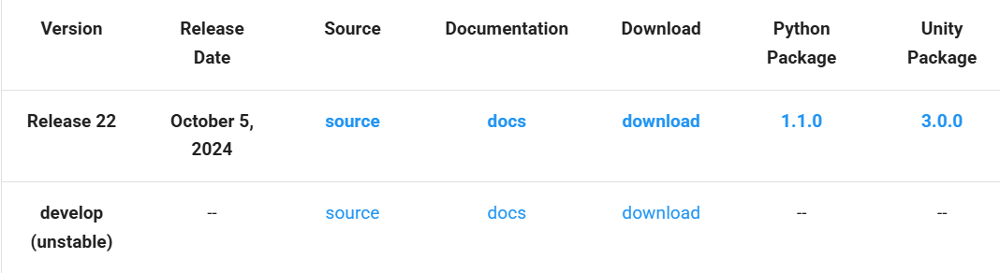

下面让我们来通过官方教程中的一个示例来学习如何安装和使用ML-Agents工具包

##### **安装Unity**

推荐安装2023.2或者更新的版本

作者当前使用的版本是：Unity 6（6000.0.43f1）

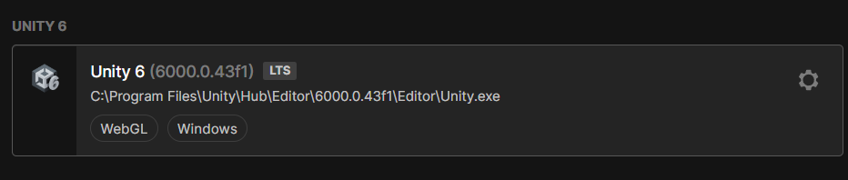

##### **安装Python**

 适用Python版本 (>= 3.10.1, <=3.10.12)，推荐安装**Python 3.10.12** 

因为接下来会安装pytorch和很多其他的python库，推荐使用虚拟环境。这里我是用的是Miniconda，可以根据自己电脑的系统选择合适的版本。下载网址：[Download Now | Anaconda](https://www.anaconda.com/download/success)

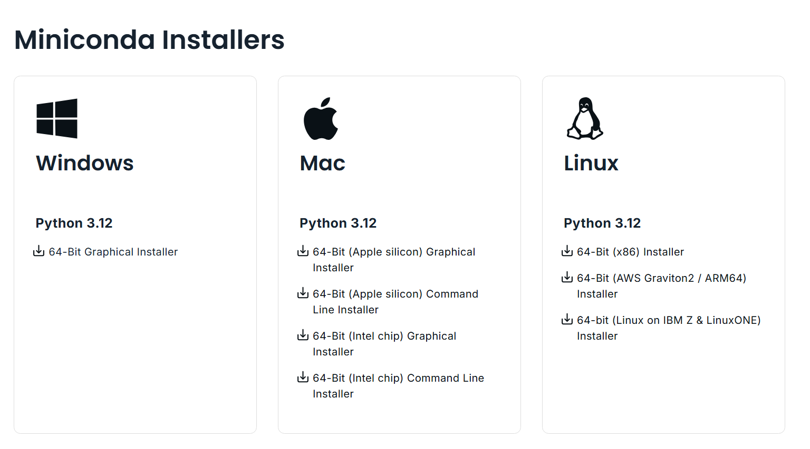

安装好Miniconda后，需要配置环境变量，使Miniconda的环境可以在系统环境中被访问到

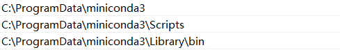

在cmd中输入conda -V回车，如果输出与下图类似，则证明环境变量配置成功

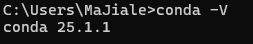

接下来在cmd中输入如下命令创建一个用于ML-Agents的虚拟环境，一直点y直到虚拟环境创建完成

注意：ml-agent是虚拟环境的名称，你可以自己选择合适的名称

```
conda cerate --name ml-agent python=3.10.12 
```

虚拟环境创建完成后输入下面的命令进入虚拟环境

```
conda activate ml-agent
```

或者

```
activate ml-agent
```

当看到出现（ml-agent）则说明已经进入python虚拟环境，在这个环境中安装的软件包都不会对主环境产生影响

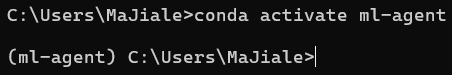

输入`python --version` 可以观察到当前python版本为3.10.12，这与我们创建时输入的版本相同

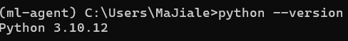

下面是一些非常有用的conda命令

```
退出虚拟环境
conda deactivate
查看虚拟环境列表
conda env list
删除某个虚拟环境
conda env remove --name yourenv
```

##### **克隆ML-Agents工具包到本地**

如果你的电脑上安装了git，可以使用git clone命令拉取最新的稳定发行版本到本地

```
git clone --branch release_22 https://github.com/Unity-Technologies/ml-agents.git
```

或者手动下载：https://github.com/Unity-Technologies/ml-agents/releases/tag/release_22

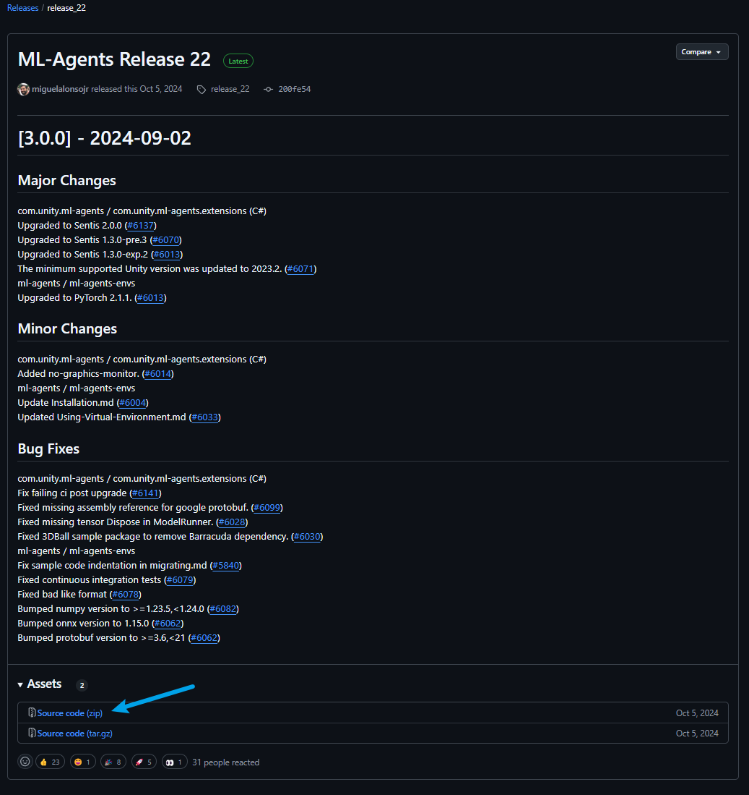

##### **安装`mlagents` Python 软件包**

**(Windows) 安装 PyTorch**

激活虚拟环境，在命令行中运行

```
pip3 install torch~=2.2.1 --index-url https://download.pytorch.org/whl/cu121
```

**(OS X)安装 GRPC库**

激活虚拟环境，在命令行中运行

```
pip3 install grpcio
```

**安装`mlagents` Python 软件包**

激活虚拟环境，在命令行中运行

```
将/path/to/ml-agents改为你的ml-agents工具包存储路径
cd /path/to/ml-agents
python -m pip install ./ml-agents-envs
python -m pip install ./ml-agents
```

##### **安装`com.unity.ml-agents` Unity 软件包**

新建或者打开一个已有的Unity工程文件（3D）

**从Package Manager registry安装**

1. 导航到菜单 `Window` -> `Package Manager`.
2. 在package manager 窗口点击Unity Registry然后搜索ML Agents
3. 点击安装即可

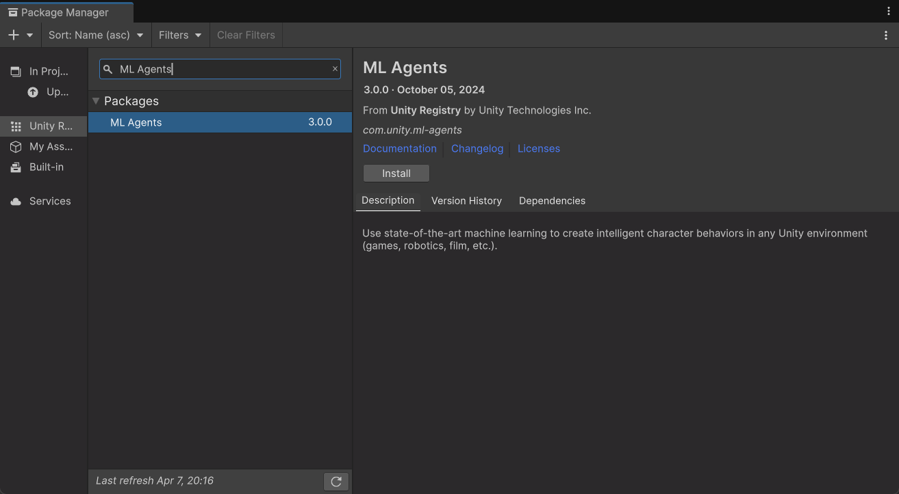

**从本地安装**

如果从Package Manager registry安装时遇到错误可以选择从本地安装

1. 导航到菜单 `Window` -> `Package Manager`.
2. 在package manager 窗口点击packages list左上角的 `+` button.
3. 选择 `Add package from disk...`
4. 导航到 `com.unity.ml-agents` 文件夹（在你下载的ML-Agent工具包里）.
5. 选择`package.json` 文件.

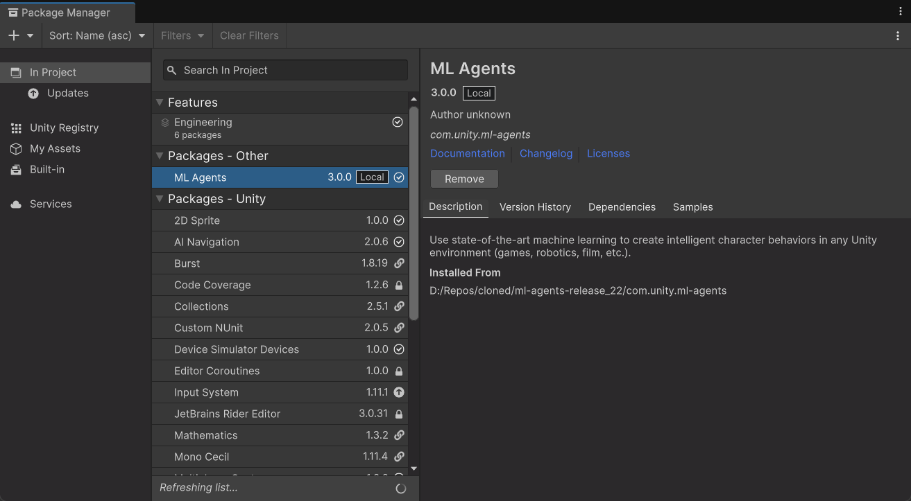

##### **通过3D Balance Ball案例学习使用和训练模型**

至此所有安装步骤全部结束，接下来我们将使用3D平衡球环境作为示例，该环境包含多个智能体立方体和球（它们都是彼此的副本）。每个智能体立方体通过水平或垂直旋转来保持其球不掉落。在这个环境中，立方体是一个智能体，它在每一步成功平衡球时获得奖励。如果球掉落，智能体会因而受到惩罚，获得负奖励。训练过程的目标是让智能体学会在它们的头上平衡球。

##### **打开示例环境的scene**

1. 通过菜单中的“Window -> Package Manager”打开包管理器窗口。
2. 找到ML-Agents包并点击它。
3. 找到3D Ball示例并点击导入。
4. 在项目窗口中，进入Assets/ML-Agents/Examples/3DBall/Scenes文件夹，并打开3DBall场景文件。

##### **运行预训练的模型**

在层级窗口中的每个3DBall下，每个Agent现在都包含了3DBall作为Behavior Parameters脚本组件中的模型。

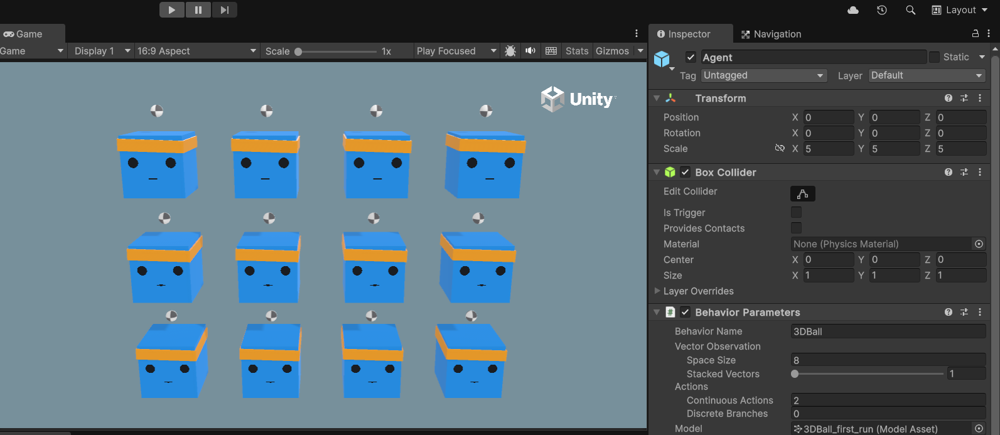

1. 将该模型的推理设备设置为使用CPU。
2. 点击Unity编辑器中的播放按钮，你将看到平台使用预训练模型来平衡小球。

运行效果：


##### **使用强化学习训练新模型**

1. 打开命令行或终端窗口。
2. 导航到你克隆的ml-agents仓库所在的文件夹。注意：如果你按照默认安装步骤进行操作，那么你应该可以在任何目录下运行`mlagents-learn`命令。
3. 运行以下命令：

```
mlagents-learn config/ppo/3DBall.yaml --run-id=first3DBallRun
```

4. `config/ppo/3DBall.yaml` 是我们提供的默认训练配置文件的路径。`config/ppo` 文件夹包含了所有示例环境的训练配置文件，包括3DBall。
5. `run-id` 是这次训练会话的唯一名称。
6. 当屏幕上显示“Start training by pressing the Play button in the Unity Editor”（通过点击Unity编辑器中的播放按钮开始训练）时，你可以在Unity中按下播放按钮开始在编辑器中训练。


如果`mlagents-learn`成功运行并且开始训练，你可以看到类似下面的信息：

```
 Version information:
  ml-agents: 1.1.0,
  ml-agents-envs: 1.1.0,
  Communicator API: 1.5.0,
  PyTorch: 2.2.2+cu121
[INFO] Listening on port 5004. Start training by pressing the Play button in the Unity Editor.
[INFO] Connected to Unity environment with package version 3.0.0 and communication version 1.5.0
[INFO] Connected new brain: 3DBall?team=0
[INFO] Hyperparameters for behavior name 3DBall:
        trainer_type:   ppo
        hyperparameters:
          batch_size:   64
          buffer_size:  12000
          learning_rate:        0.0003
          beta: 0.001
          epsilon:      0.2
          lambd:        0.99
          num_epoch:    3
          shared_critic:        False
          learning_rate_schedule:       linear
          beta_schedule:        linear
          epsilon_schedule:     linear
        checkpoint_interval:    500000
        network_settings:
          normalize:    True
          hidden_units: 128
          num_layers:   2
          vis_encode_type:      simple
          memory:       None
          goal_conditioning_type:       hyper
          deterministic:        False
        reward_signals:
          extrinsic:
            gamma:      0.99
            strength:   1.0
            network_settings:
              normalize:        False
              hidden_units:     128
              num_layers:       2
              vis_encode_type:  simple
              memory:   None
              goal_conditioning_type:   hyper
              deterministic:    False
        init_path:      None
        keep_checkpoints:       5
        even_checkpoints:       False
        max_steps:      500000
        time_horizon:   1000
        summary_freq:   12000
        threaded:       False
        self_play:      None
        behavioral_cloning:     None
[INFO] 3DBall. Step: 12000. Time Elapsed: 23.341 s. Mean Reward: 1.199. Std of Reward: 0.704. Training.
[INFO] 3DBall. Step: 24000. Time Elapsed: 39.346 s. Mean Reward: 1.379. Std of Reward: 0.831. Training.
[INFO] 3DBall. Step: 36000. Time Elapsed: 54.865 s. Mean Reward: 2.005. Std of Reward: 1.355. Training.
```

##### **观察训练过程**

当你按照上一节所述的方式使用`mlagents-learn`开始训练，ml-agents目录中将会生成一个results目录。为了更详细地观察训练过程，可以使用TensorBoard。

在ml-agent工具包目录下在命令行（虚拟环境）中运行：

```
tensorboard --logdir results
```

然后，在浏览器中导航到 `localhost:6006` 以查看TensorBoard的摘要统计信息，如下所示。对于示例的目的，最重要的统计数据是 **Environment/Cumulative Reward**，它应该在训练过程中不断增加，最终趋近于100，这是智能体可以积累的最大奖励。

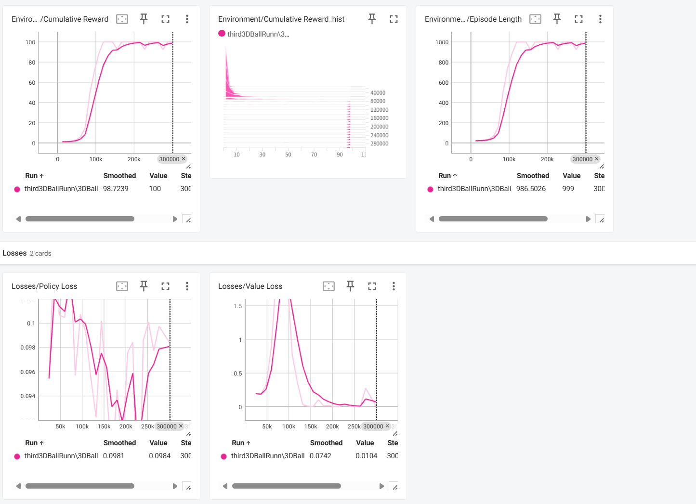

**在Unity环境中使用训练好的模型**

当训练过程完成后（或者使用Ctrl+C退出训练），并且训练过程保存了模型（通过“Saved Model”消息表示），我们就可以将模型添加到Unity项目中，给兼容的智能体使用了（即生成该模型的智能体）。

注意：在“Saved Model”消息出现后，不要直接关闭Unity窗口。请等待训练过程自动关闭窗口，或者在命令行提示符下按下Ctrl+C。如果你手动关闭窗口，包含训练模型的`.onnx`文件将不会被导出到ml-agents文件夹中。

如果你通过Ctrl+C提前退出了训练并且想要恢复训练，可以运行相同的命令，附加`--resume`标志：

```
mlagents-learn config/ppo/3DBall.yaml --run-id=first3DBallRun --resume
```

训练好的模型将保存在 `results/<run-identifier>/<behavior_name>.onnx` 路径下，其中 `<behavior_name>` 是与模型对应的Agent的行为名称。这个文件对应的是模型的最新检查点。可以通过以下步骤将这个训练好的模型嵌入到兼容的智能体中。

1. 将你的模型文件移到 `Project/Assets/ML-Agents/Examples/3DBall/TFModels/` 文件夹中。

   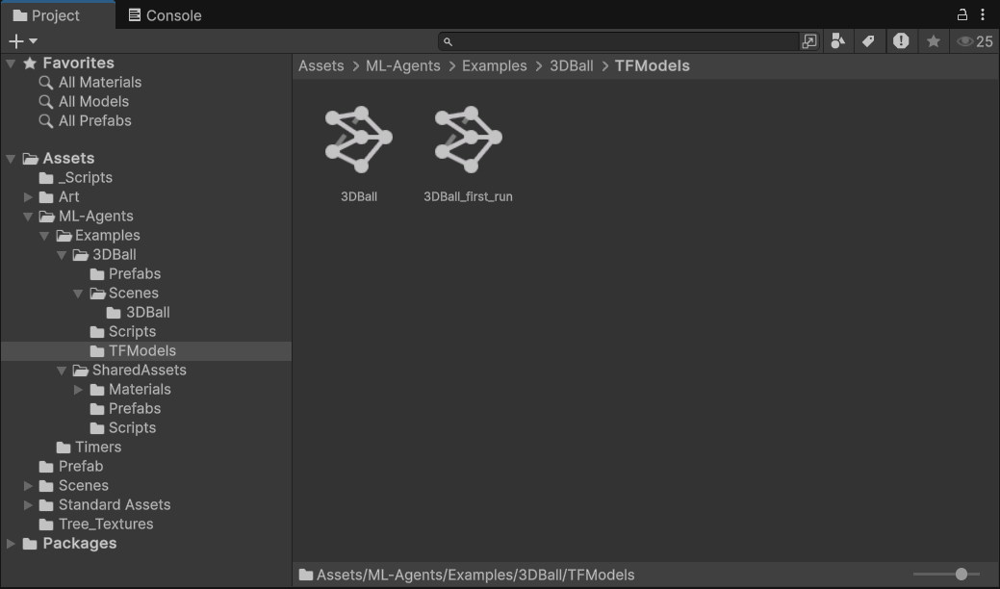

2. 打开Unity编辑器，并选择上述所描述的3DBall场景。

3. 选择3DBall智能体预制件对象。

4. 将 `<behavior_name>.onnx` 文件从编辑器的项目窗口拖动到Ball3DAgent检查器窗口中的Model占位符上。

   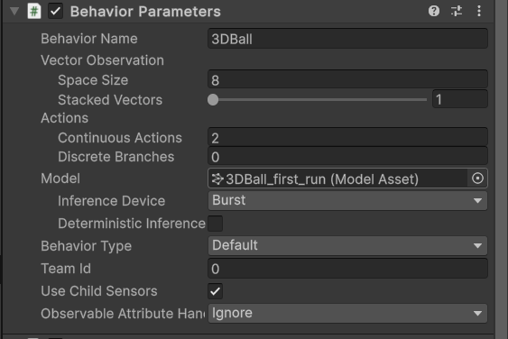

5. 点击编辑器顶部的播放按钮。

可以看到使用我们刚刚训练的模型的立方体也可以很好地控制平衡使小球稳定在其顶部了


