# 音频系统

### 9.1音频基础

#### 声音的物理性质

- **声音**是振动产生的[声波](https://zh.wikipedia.org/wiki/声波)，通过[介质](https://zh.wikipedia.org/wiki/介质)（[气体](https://zh.wikipedia.org/wiki/空氣)、[固体](https://zh.wikipedia.org/wiki/固體)、[液体](https://zh.wikipedia.org/wiki/液體)）传播并能被人或动物[听觉](https://zh.wikipedia.org/wiki/聽覺)[器官](https://zh.wikipedia.org/wiki/器官)所感知的[波动](https://zh.wikipedia.org/wiki/波動)现象。振动产生声波的物体叫做声源。
- 人耳可以听到的声音的频率范围在20到2万[赫兹](https://zh.wikipedia.org/wiki/赫兹)（Hz）之间。高于这个范围的波动称为[超声波](https://zh.wikipedia.org/wiki/超声波)，而低于这一范围的称为[次声波](https://zh.wikipedia.org/wiki/次声波)。

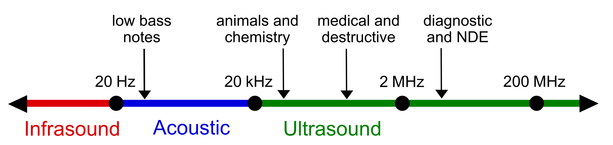

-  响度、音调、音色是乐音的三个主要特征，根据它们来区分声音
- 声音在一些介质中的传播速度如下：
  -  空气（15℃）:340米/秒
  - 空气（25℃）:346米/秒
  - 水（常温）：1500米/秒
  - 海水（25℃）1530米/秒
  - 钢材：5200米/秒

#### 多普勒效应

**多普勒效应**（英语：Doppler effect）是波源和观察者有相对[运动](https://zh.wikipedia.org/wiki/運動_(物理學))时，观察者接受到波的[频率](https://zh.wikipedia.org/wiki/頻率_(物理學))与波源发出的频率并不相同的现象。远方急驶过来的[火车](https://zh.wikipedia.org/wiki/鐵路列車)鸣笛声变得尖细（即频率变高，[波长](https://zh.wikipedia.org/wiki/波长)变短），而离我们而去的火车鸣笛声变得低沉（即频率变低，波长变长），就是多普勒效应的现象，同样现象也发生在[汽车](https://zh.wikipedia.org/wiki/汽车)鸣响与火车的敲钟声。

观察者（**O**bserver）和发射源（**S**ource）的频率关系为：

- 为观察到的频率；
- 为发射源于该介质中的原始发射频率；
- 为波在该介质中的行进速度；
- 为观察者相对于介质的移动速度，若接近发射源则前方运算符号为+号，反之则为−号；
- 为发射源相对于介质的移动速度，若接近观察者则前方运算符号为−号，反之则为+号。

为了使游戏中的音效更加真实，游戏引擎支持对多普勒效应的模拟

#### 游戏中音频内容的作用

音频由背景音乐（background music）和声效两部分构成，是现代数字游戏的重要组成部分之一。听觉上的享受也会触及玩家的内心，所以优秀的配乐往往会提高游戏的质量。

音乐可以表达、强化人类的感情（喜爱、失落、厌恶、害怕、成功等）

#### 背景音乐

背景音乐 background music, 简称BGM。真正意义上的BGM起源于欧洲的戏曲，自有声电影出现之后，BGM得以迅速发展。

数字游戏是多种学科相交融的艺术作品，需要依靠背景音乐来进行艺术表达。从最早的红白机时代到现在最新的数字游戏，背景音乐 一直作为游戏的重要组成部分。

#### 声效

声效的加入可以提高游戏的沉浸感和真实感。制作精良的游戏会添加各种声效（海浪声，风声，玻璃器皿破碎声，拖动物品的磨擦声）

#### 三维音效

日常生活中，人类的双耳可以定位声音来源的方向。人类的双耳是靠两个主要因素判定声音来源的方向的：声音传到两个耳朵的时间差（interaural time difference，简称ITD）和声级差（interaural level difference，简称ILD），后者代表声音大小的差别。

为了让人有身临其境的感觉，可以借助计算机处理数字化音频来模拟三维音效。

#### Unity游戏引擎支持的数字音频的格式

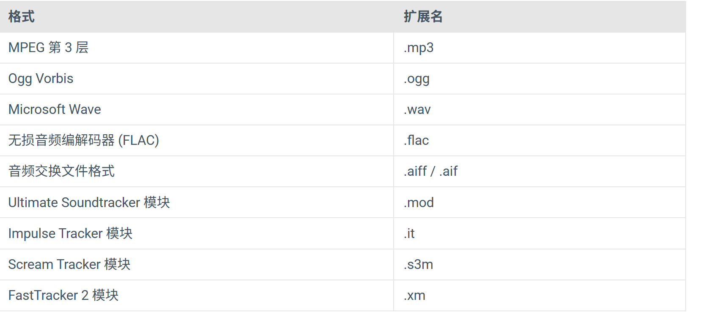

#### 使用Unity游戏引擎编辑音频

在Unity的Assets文件夹里点击音乐文件可以在Inspector窗口播放和查看波形图

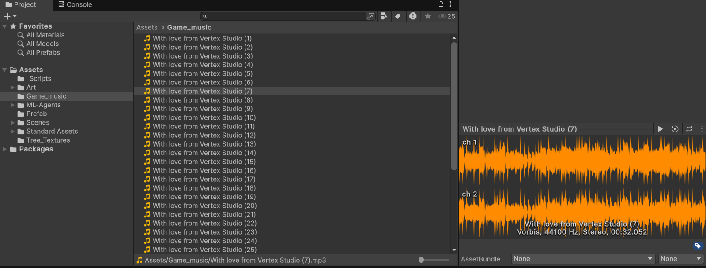

将音乐拖拽到场景中或者是Hierarchy窗口中后，Unity会为我们自动建立一个包含Audio Source组件的游戏物体

包含Audio Source组件的游戏物体可以看作是一个声音源

Audio Source组件有如下几个参数

- **Audio Clip**：参考将要播放的声音剪辑文件。
- **Mute**：如果启用此选项，则为静音。
- **Bypass Effects**：可快速“绕过”应用于音频源的滤波器效果。启用/停用效果的快捷方式。
- **Bypass Listener Effects**：这是快速启用/停用所有监听器的快捷方式。
- **Bypass Reverb Zones**：这是快速打开/关闭所有混响区的快捷方式。
- **Play On Awake**：如果启用此选项，声音将在场景启动时开始播放。如果禁用此选项，需要通过脚本使用 **Play()** 命令启用播放。
- **Loop**：启用此选项可循环播放**Audio Clip**。
- **Priority**：从场景中存在的所有音频源中确定此音频源的优先级。（Priority值为0 表示优先级最高。值为256， 表示优先级最低。默认值为 128）。对于音轨值应为 0，避免被意外擦除。
- **Volume**：声音的大小，与离Audio Listener的距离成正比，以米为世界单位。
- **Pitch**：由于**Audio Clip**的减速/加速导致的音高变化量。值 1 表示正常播放速度。
- **Stereo Pan**：设置 2D 声音的立体声位置。
- **Spatial Blend**：设置 3D 引擎对音频源的影响程度。
- **Reverb Zone Mix**：设置路由到混响区的输出信号量。该量是线性的，范围在 0 到 1 之间，但允许在 1到1.1 范围内进行 10dB 放大，这对于实现近场和远距离声音的效果很有用。
- **3D Sound Settings**：与 Spatial Blend 参数成正比应用的设置。
  - **Doppler Level**：确定将对此音频源应用多普勒效果的程度（如果设置为 0，则不应用任何效果）。
  - **Spread**：在发声空间中将扩散角度设置为 3D 立体声或多声道。
  - **Min Distance**：在 MinDistance 内，声音将保持可能的最大响度。在 MinDistance 之外，声音将开始减弱。增加声音的 MinDistance 属性可使声音在 3D 世界中“更响亮”，而降低此属性则可以让声音在 3D 世界中“更安静”。
  - **Max Distance**：声音停止衰减的距离。超过此距离之后，声音将保持与监听器之间距离 MaxDistance 单位时的音量，不再衰减。
  - **Volume  Rolloff**：声音衰减的速度模式。

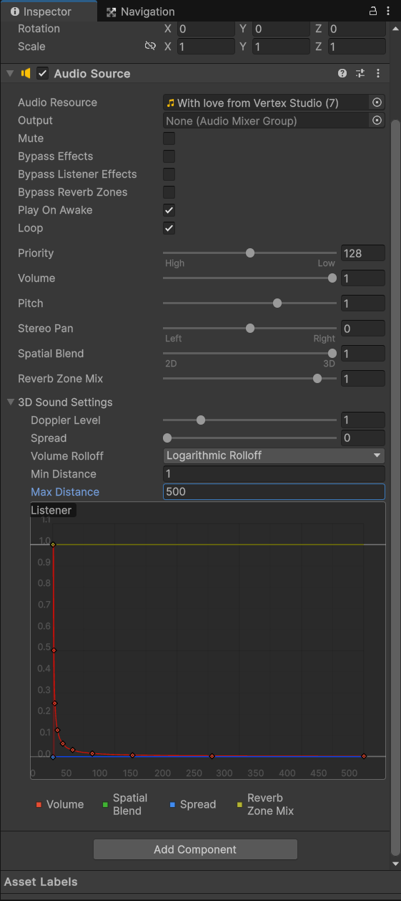

Camera游戏对象同时包含了一个Audio Listener组件，可以接受到声音源播放的声音

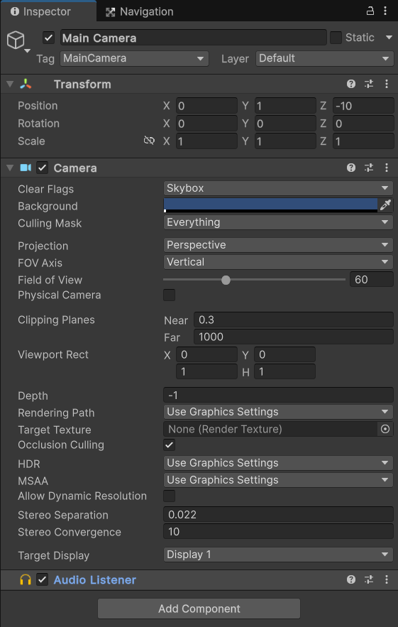

### 9.2混音器

#### 游戏中混音器的作用

声音接收器（Audio Listener）获得音源的声音有两种方式

- 声音源将声音直接传给接收器
- 声音源通过混音器将声音传给接收器

混音器可以对声音进行进一步加工

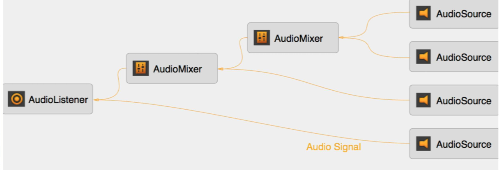

#### 为什么要对声音进行分类

对声音分类可以为不同类的声音使用不同的混音效果，而且不同分类的音乐可能互相影响，分类可以使得声音控制更加合理

#### 在Unity游戏引擎中使用混音器

在Project窗口下，点击鼠标右键，点击Create - Audio - Audio Mixer可以新建一个混音器

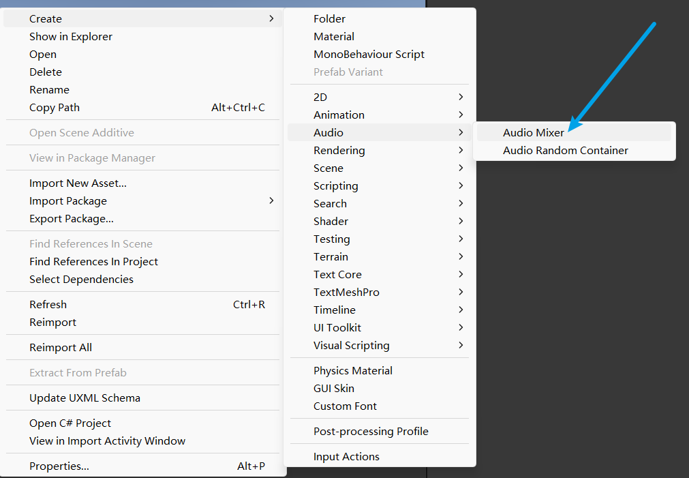

点击混音器可以打开混音器窗口

- Mixers菜单可以选择不同的混音器或者是新建混音器
- Snapshots菜单可以保存同一个混音器的不同的参数设置
- Groups菜单可以新建子混音器组
- Views菜单可以保存是否可见某些混音器

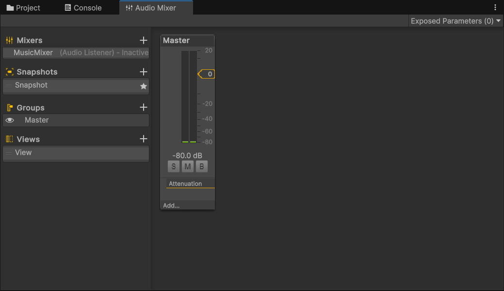

点击Edit in Play Mode按钮可以使在运行状态下的编辑被保存

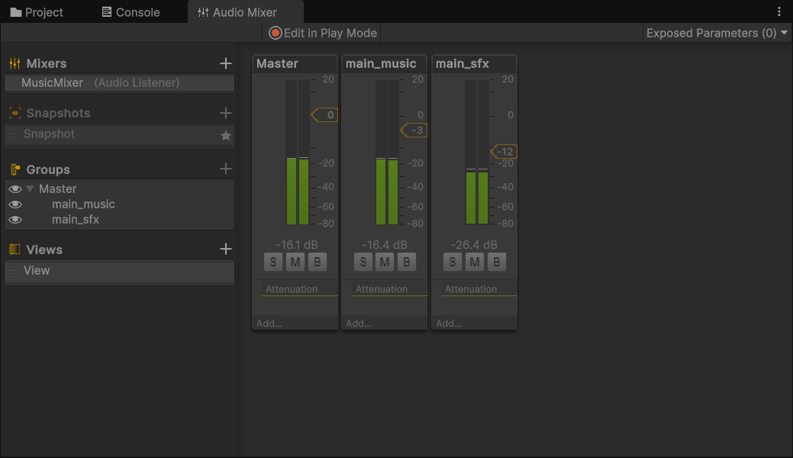

点击Audio Sources组件中的Output选项可以选择指定的混音器，将声音源通过混音器将声音再传给接收器

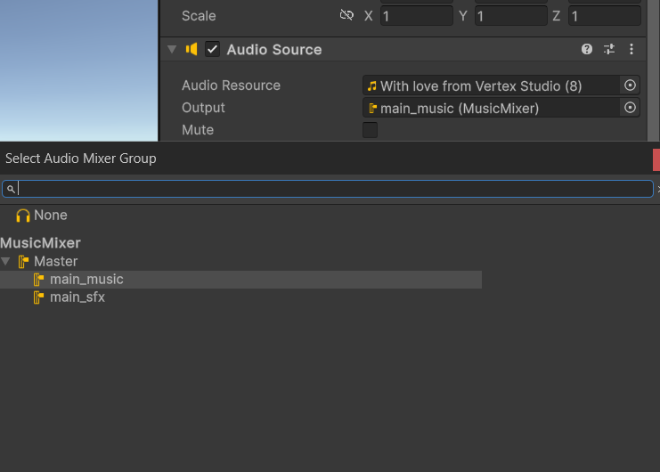

#### 使用脚本控制音频播放

```c#
using UnityEngine;

public class C9_L2 : MonoBehaviour
{
    public AudioSource shoot_snd;
    public AudioSource explode_snd;

    void Update()
    {
        if(Input.GetMouseButtonDown(0))
        {
            shoot_snd.Play();
        }
        if(Input.GetKeyDown(KeyCode.Space))
        {
            explode_snd.Play();
        }
    }
}
```

### 9.3声音特效

#### 常见的声音特效

- 为某一组环境音添加衰减音效
- 为水下环境添加低通滤波器
- 出现UI时，衰减除了菜单和交互外的所有的游戏音量
- 当与NPC交谈时，减弱环境音量

#### 声音信号分类建议

- 所有声音源放入master分组中
- 音乐、菜单声音和所有的游戏声音各为一个独立的子分组
- 游戏声音再分为NPC对话、环境音和其他声音

声音信号分类范例

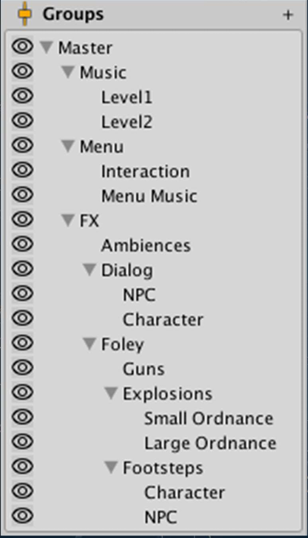

#### 混音器快照Snapshot

使用混音器快照功能可以保存同一个混音器的不同的参数设置，如音量Volume、音高Pitch、发送级别Send Level、湿混合 级别Wet Mix Level、音效参数Effect Parameters等

在游戏进行中切换不同混音器快照，可以得到不同的声音氛围

#### 在Unity游戏引擎中实现声音特效

在混音器界面中，点击混音器上的Add按钮可以添加声音特效

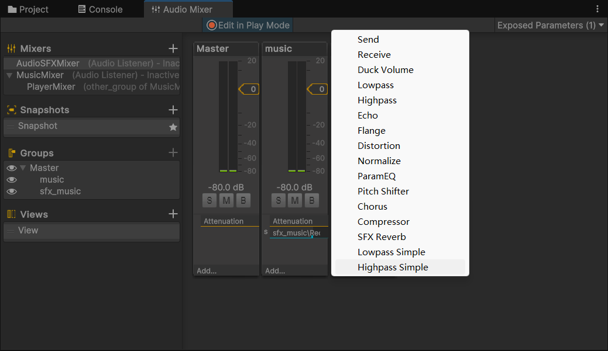

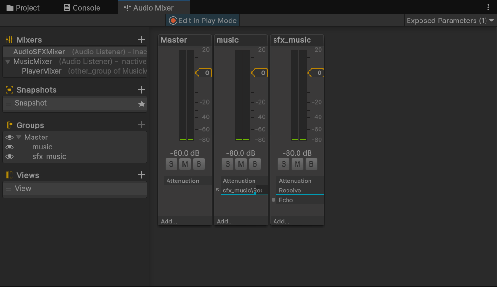

对混音器的参数点击右键，可以选择开放当前参数给脚本，从而可以在脚本中获取参数的值或者修改参数的值

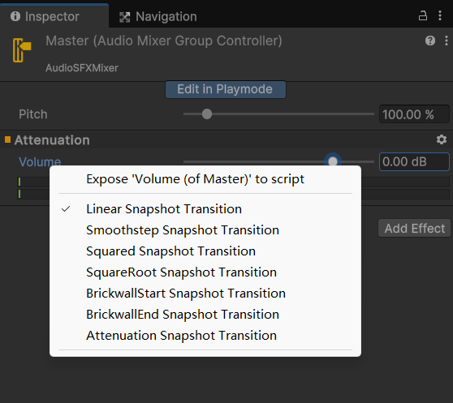

可以在下图处为参数重命名

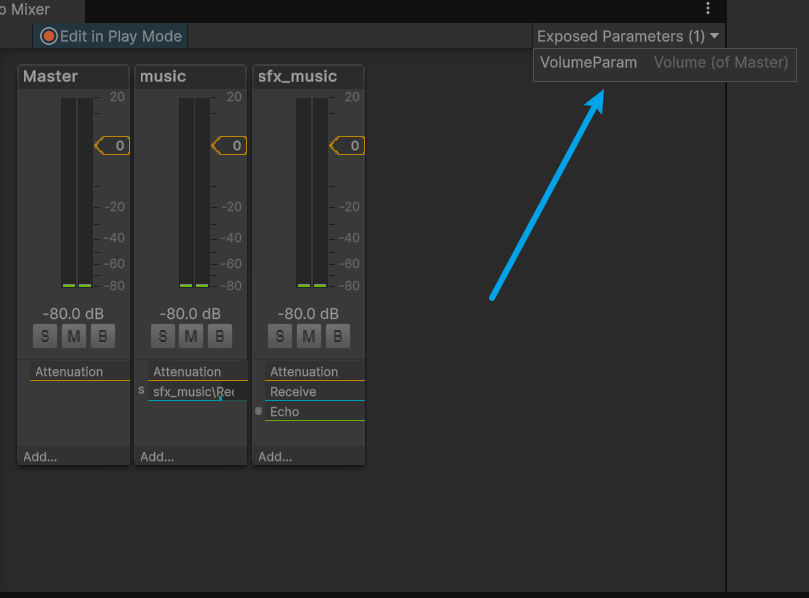

编写脚本使用上下箭头按键控制Master混音器的音量大小

```c#
using UnityEngine;
using UnityEngine.Audio;

public class C9_L3 : MonoBehaviour
{
    public AudioMixer audioMixer;
    // Update is called once per frame
    void Update()
    {
        float volume;
        audioMixer.GetFloat("VolumeParam", out volume);
        if(Input.GetKeyDown(KeyCode.UpArrow))
        {
            audioMixer.SetFloat("VolumeParam", volume + 1);
        }
        if(Input.GetKeyDown(KeyCode.DownArrow))
        {
            audioMixer.SetFloat("VolumeParam", volume - 1);
        }
    }
}
```

